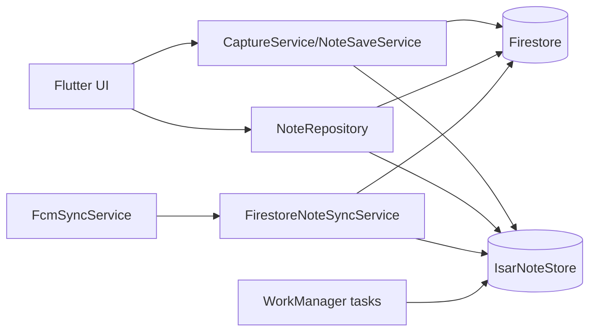
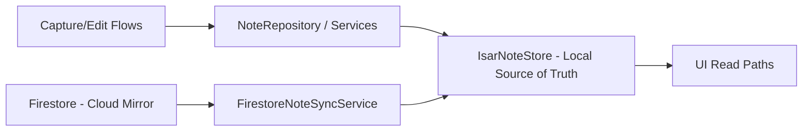
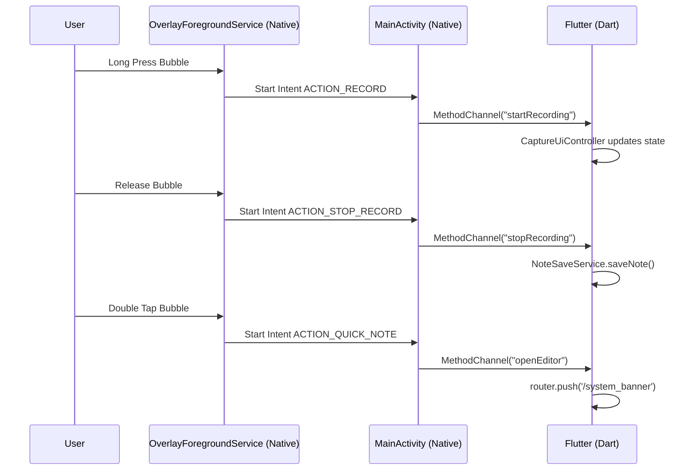
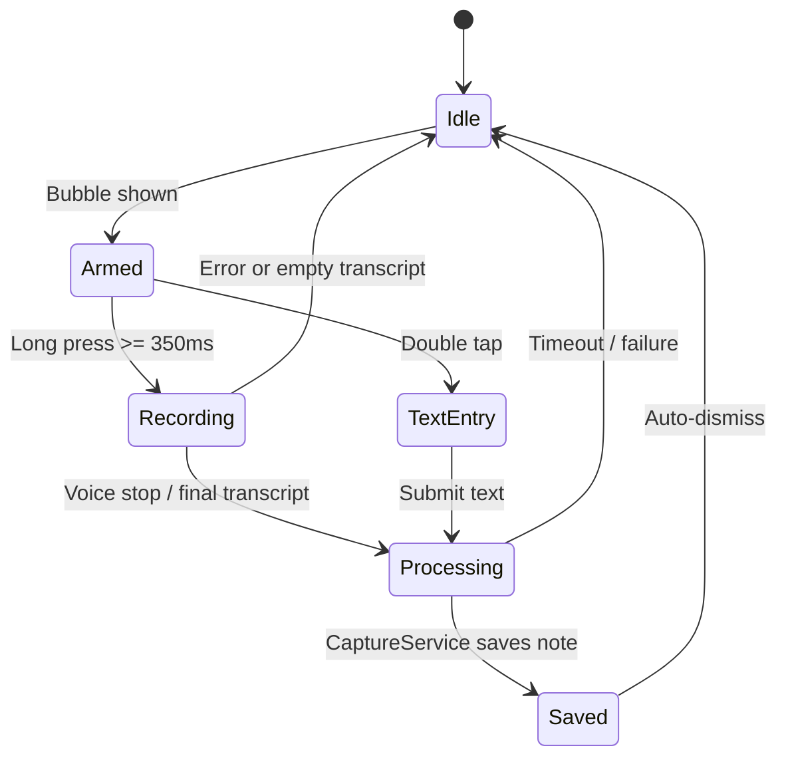
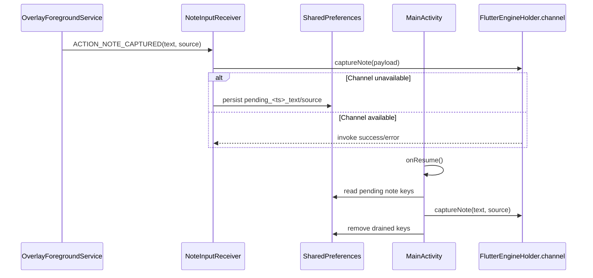
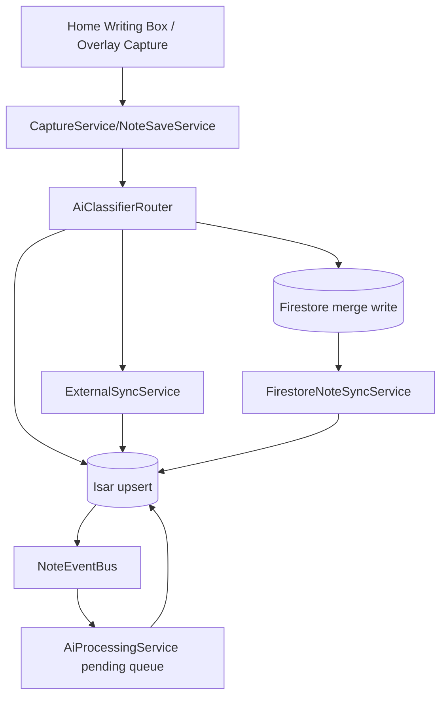

# WhisperLog Architecture (As-Built Audit)

Version: 3.2 (implementation-audited)
Date: 2026-04-05
Status: Current-state architecture from repository audit

## 1. Scope

This document describes the architecture currently implemented in the codebase.
It replaces blueprint-only assumptions with audited runtime behavior, concrete wiring, and operational constraints.

## 2. System Goals

WhisperLog is an AI-first capture and organization app with:
- raw transcript capture from overlay, editor, or dictation
- AI classification before persistence when possible
- Isar as the local source of truth for app reads and writes
- Firestore as a background cloud mirror and cross-device event source
- optional Google/Telegram integrations
- Android-first floating overlay capture

## 3. Runtime Topology

## 3.1 App Entrypoints

- Primary app entrypoint: lib/main.dart
- Native Overlay service entrypoint: android/../OverlayForegroundService.kt
- Native Intent router: android/../MainActivity.kt
- Background worker entrypoint: callbackDispatcher in lib/core/background/work_manager_service.dart
- FCM background entrypoint: firebaseMessagingBackgroundHandler in lib/features/sync/data/fcm_sync_service.dart
- Server-side complement (optional): functions/index.js

## 3.2 Startup Sequence (Main Process)

Implemented in lib/main.dart:
1. Register FCM background handler.
2. Load .env via AppEnv.load().
3. Initialize Firebase.
4. Initialize DI container via init().
5. Hydrate OverlayNotifier state (fetches preferences).
6. Request overlay permission via MethodChannel if needed.
7. Hydrate ThemeCubit.
8. Start WorkManager services asynchronously.
9. Start AiProcessingService event listeners asynchronously for fallback/pending notes.
10. Start ConnectivitySyncCoordinator asynchronously.
11. Initialize FcmSyncService asynchronously.
12. Run MaterialApp.router.

Failure handling is defensive: many startup steps are wrapped in try/catch and logged without crashing (except critical Firebase/DI failures).

## 4. Dependency Injection and Service Graph

Registered in lib/core/di/injection_container.dart.

Repositories/services:
- AppPreferencesRepository
- UserRepository
- NoteRepository
- SpeechToText
- ExternalSyncService
- NoteEventBus (singleton event stream)
- CaptureService
- NoteSaveService
- OverlayNotifier
- SystemBannerOverlay (Route)
- FirestoreNoteSyncService
- AiProcessingService
- FcmSyncService
- ConnectivitySyncCoordinator
- ThemeCubit

Notes:
- DI uses GetIt lazy singletons.
- DI uses GetIt lazy singletons.
- Overlay state is communicated via `MethodChannel("wishperlog/overlay")` and managed by `OverlayNotifier`.

## 5. Navigation Architecture

Router is defined in lib/app/router.dart using go_router.

Declared routes:
- / -> SignInScreen
- /signin -> SignInScreen
- /permissions -> PermissionsScreen
- /telegram -> TelegramScreen
- /home -> HomeScreenLayout
- /folder -> FolderScreen (category from extra or query/path fallback)
- /settings -> SettingsScreen

Redirect policy:
- If unauthenticated and route is not onboarding route, redirect to /.
- If authenticated and route is onboarding route, redirect to /home.
- Auth check failures are logged and router stays on current route.

## 6. Data Architecture

## 6.0 Data Layer (Current Migration State)

The app has transitioned to Isar-first for local reads and writes.

- `IsarNoteStore` is the active local source for app reads and writes.
- Firestore sync runs as a background listener and upserts remote changes into Isar.
- SQLite remains in the codebase only for staged cleanup and startup migration compatibility.

### Migration Plan

1. Completed: one-time startup backfill copied historical SQLite notes to Isar.
2. Completed: UI reads switched to Isar reactive streams.
3. Completed: core write paths switched to Isar.
4. Next: remove SQLite package and remaining legacy bootstrap code once rollout confidence is complete.

## 6.1 Canonical Domain Model

Note model in lib/shared/models/note.dart.

Key fields:
- noteId, uid
- rawTranscript, title, cleanBody
- category, priority, extractedDate
- createdAt, updatedAt
- status (active, archived, pendingAi)
- aiModel
- gcalEventId, gtaskId
- source (voiceOverlay, textOverlay, homeWritingBox)
- syncedAt

Serialization:
- toSqliteMap()/fromSqliteMap()
- toFirestoreJson()/fromFirestoreJson()

## 6.2 Local Persistence (System of Record)

Store: lib/core/storage/isar_note_store.dart
DB: Isar local store in app documents directory

Traits:
- Isar collection-backed note store with unique index on `noteId`
- index-based upserts (`putByNoteId`, `putAllByNoteId`) for idempotent writes
- reactive query streams (`watchActive`, `watchAll`) feeding UI directly
- helper queries for pending AI queue and digest/background tasks

## 6.3 Cloud Mirror (Best Effort)

Firestore path:
users/{uid}/notes/{noteId}

Cloud writes are merge-based and intentionally non-blocking for local UX.
Firestore is no longer the UI read source; remote changes are mirrored into Isar by `FirestoreNoteSyncService`.
Local save success is never rolled back by cloud failure.

## 7. Capture and Processing Flows

## 7.1 Home Capture Flow

Home UI is implemented in lib/features/home/presentation/screens/home_screen.dart.

- User types in Thought Canvas or long-presses mic for dictation.
- Save action uses NoteSaveService.saveNote(..., source: homeWritingBox).
- Transcript is classified first by AiClassifierRouter.
- Enriched note is written to Isar and mirrored to Firestore.
- If AI falls back, the note stays pendingAi and the fallback enrichment pipeline can retry it.
- Top notch success UI shown immediately via showTopNotchSavedMessage.

## 7.2 Overlay Capture Flow

Overlay orchestration is handled by Native Android:
- Native Service: `OverlayForegroundService.kt` (renders the Floating UI view via WindowManager).
- Intent Gateway: `MainActivity.kt` bridges Android Intents to Flutter MethodChannels.
- State Manager: `OverlayNotifier` (Dart) syncs toggles via SharedPreferences and controls native service visibility.

Flow:
- Native Background Recording (Hold): Triggers `ACTION_RECORD`/`ACTION_STOP_RECORD` via intents to start Flutter `CaptureUiController`.
- Quick Text Input (Double Tap): Triggers `ACTION_QUICK_NOTE`, opens `SystemBannerOverlay` / `QuickNoteEditor` bottom sheet over a transparent `MainActivity`.

### 7.2.1 Native Overlay Runtime State

### 7.2.2 Pending Note Recovery (Engine Unavailable)

## 7.3 Event-Driven AI Enrichment

Service: lib/features/ai/data/ai_processing_service.dart

Mechanics:
- On start(): sweeps pending notes once and subscribes to NoteEventBus.onNoteSaved.
- For each pending note:
  1. classify with GeminiNoteClassifier
  2. update note fields (title/category/priority/body/date/model/status)
  3. run ExternalSyncService for calendar/task linkage
  4. persist back to Isar
  5. mirror to Firestore

Resilience:
- in-flight note guard prevents duplicate concurrent processing per note.
- failures keep note as pendingAi for future retry sweeps/events.

## 8. Sync and Background Jobs

## 8.1 External Integration Sync

Service: lib/features/sync/data/external_sync_service.dart

- Uses GoogleSignIn silently when possible.
- For reminders with extractedDate and no gcalEventId: creates Calendar event (fuzzy duplicate guard).
- For tasks with no gtaskId: creates Google Task.
- Writes resulting IDs to note and mirrors to Firestore.

Also includes syncGoogleTaskCompletions() to archive local notes whose linked Google tasks are completed.

## 8.2 Connectivity-Based Retry Trigger

Service: lib/core/background/connectivity_sync_coordinator.dart

- Watches connectivity_plus stream.
- On offline -> online transition, schedules WorkManager flush task for pending AI queue.

## 8.3 WorkManager Jobs

Defined in lib/core/background/work_manager_service.dart.

Registered tasks:
- periodic_google_tasks_sync (every 4h)
- flush_pending_ai (one-off, scheduled on reconnect)
- telegram_daily_digest (periodic; daily window logic enforced in task code)

Worker callbacks:
- initialize Firebase and Isar
- execute per-task workflow

## 8.4 FCM Sync Path

Service: lib/features/sync/data/fcm_sync_service.dart

- initializes token + uploads to user document
- listens foreground/opened messages
- background handler processes note events

Supported message types:
- note_status_changed -> applyStatusFromPush
- note_updated -> syncNoteById

## 9. Settings and Preferences

- Theme mode persisted via AppPreferencesRepository.
- Digest time persisted via AppPreferencesRepository and mirrored to user doc.
- Overlay visibility/position/opacity/size/snap persisted in OverlayV1Preferences.
- Notification permission and token management handled from SettingsScreen.

## 10. UI Architecture

## 10.1 Current UI Composition

- Home screen is currently monolithic (single screen file) with embedded Thought Canvas + folder grid + search launcher.
- Folder screen supports archive/priority swipe actions and editing modal.
- Shared visual primitives: GlassContainer, GlassPageBackground, top notch confirmation.
- Theme toggling via ThemeCubit and AppTheme.

## 10.2 Overlay UI Components

- `MainActivity` uses `FlutterActivityLaunchConfigs.BackgroundMode.transparent` to allow Flutter modal routes to appear naturally over other apps.
- Native bubble coordinates inputs via `WindowManager`.
- `SystemBannerOverlay` displays a Truecaller-style drop-down banner for keyboard text capture or background recording progress.
- `QuickNoteEditor` provides a bottom sheet layout.

## 11. Security and Reliability Notes

- Local save path is robust with retries for SQLite writes in save services.
- Firestore writes are guarded for null auth and failures are logged (best effort).
- Startup intentionally tolerates non-critical dependency failures to keep app responsive.
- Overlay permissions include plugin request and permission_handler fallback.

## 12. Audit Findings (As-Built)

1. Overlay logic has been unified into a Native WindowManager Service communicating with Flutter via Intents and MethodChannels, rendering `FlutterOverlayService` obsolete.
2. Flutter background mode is configured as `transparent` to support overlaid app UI on double-tap or events.
3. Both client-side AI enrichment and server-side Cloud Function enrichment exist; carefully gated.
4. Firebase and SQLite integrations have been stabilized to retry aggressively and await auth hydrate (preventing ghosting).

## 13. Data Persistence Flow

## 13. Recommended Next Hardening Steps

1. Add Firestore query indexes for status/category combinations if the console prompts for them.
2. Add integration tests for Firebase-backed folder/search reads against the repository stream.
3. Split HomeScreen into tested presentation components to reduce regression risk.
4. Add architecture drift checks in CI (route table + DI registration + service contracts).

## 14. Delivery Plan

- See OVERLAY_INTEGRATION_PLAN.md for phase-by-phase implementation and verification status.

