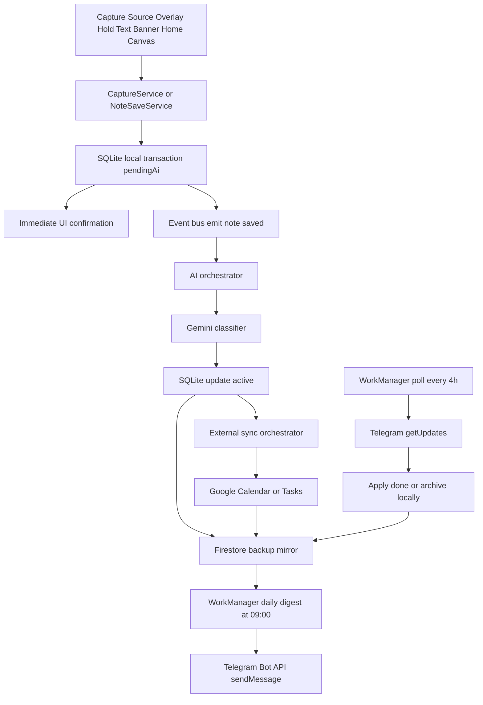
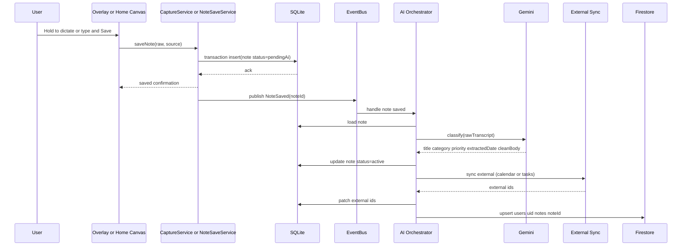
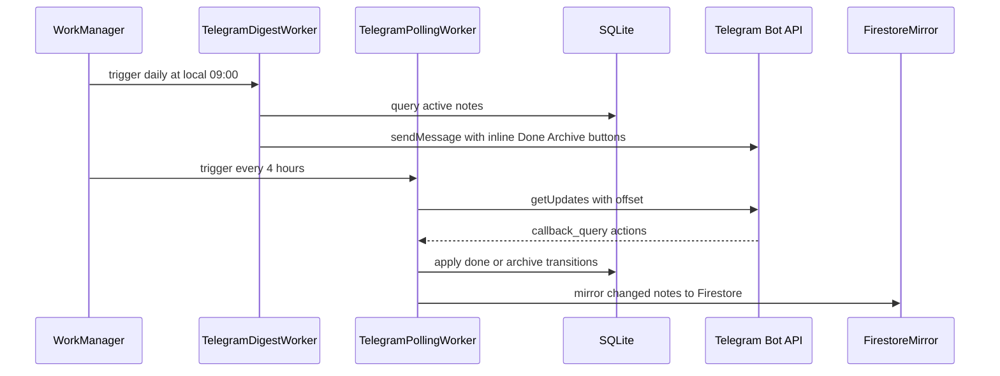
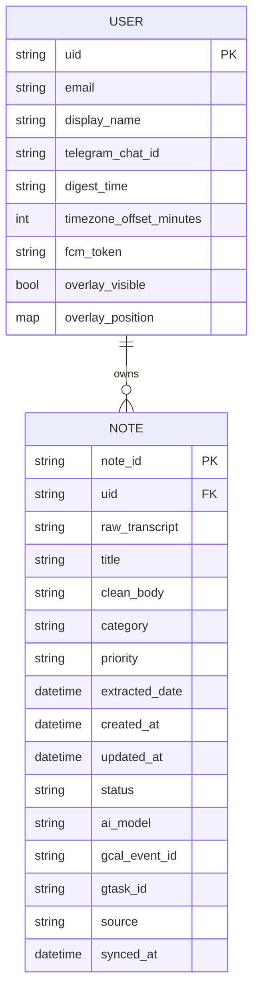

# WhisperLog Architecture

Version: 2.1 Blueprint-Conformant Target Architecture  
Date: 2026-04-04  
Status: Authoritative intended architecture for hardening and implementation alignment

## 1. Purpose

This document is the source-of-truth architecture specification for WhisperLog.
It defines the intended system shape, behavior, constraints, and acceptance criteria.

This architecture is explicitly based on the Original Master Blueprint and therefore enforces:
- local-first data handling
- zero-friction capture UX
- event-driven AI processing
- 100% free/client-side strategy for Telegram automation
- Android-first execution model

## 2. Product Intent

WhisperLog is a local-first, system-level capture product for fast thought externalization.
The user should be able to capture voice or text in under one interaction cycle, with immediate local confirmation.
Everything else is asynchronous enrichment.

### 2.1 Key Product Principles

1. Capture must be faster than cognition drift.
2. Save confirmation must not depend on network, AI, or cloud infrastructure.
3. Overlay and home canvas must share the same capture semantics.
4. AI is additive, not blocking.
5. Sync is best-effort and recoverable.
6. The default experience must function offline.

## 3. Non-Negotiable Constraints

1. No paid backend architecture requirement.
2. No Cloud Functions dependency for core Telegram digest flow.
3. No AI polling timers draining battery.
4. No bottom navigation bar in primary UX layout.
5. No blocking network call before local note save confirmation.

## 4. System Context

WhisperLog runs primarily on-device and treats cloud services as optional durability and integration layers.

### 4.1 External Dependencies

- Firebase Auth for user identity.
- Firestore for cloud backup mirror and cross-device sync.
- Gemini API for note classification/enrichment.
- Google Calendar API for reminder event materialization.
- Google Tasks API for task materialization.
- Telegram Bot API for daily digest send and callback update polling.

### 4.2 Runtime Platforms

- Android is mandatory target.
- iOS/web/desktop are non-primary and may remain partial.

### 4.3 Chronological System Story

WhisperLog should be understood as a time-ordered journey, not just a set of modules.

1. A user captures a thought from overlay or home canvas.
2. The app writes the note locally to SQLite with status pendingAi.
3. The user gets immediate save confirmation.
4. An event is emitted for AI enrichment.
5. Gemini classifies and beautifies the note asynchronously.
6. The note is upgraded to active.
7. External sync attempts calendar/task materialization where applicable.
8. Firestore mirrors the latest note snapshot for online durability and sync.
9. Daily Telegram digest is sent by client-side scheduler.
10. Telegram callbacks are polled and reflected back into local/cloud state.

## 5. Storage Model

### 5.1 Why the app uses two stores

WhisperLog separates responsibilities:

- SQLite is the on-device system of record.
- Firestore is the online NoSQL mirror and sync surface.

This is intentional. The app must confirm saves immediately, even when offline, while still retaining a cloud-backed copy for account recovery and multi-device continuity.

### 5.2 Storage Roles

- SQLite owns fast local reads, writes, counts, and stream-like UI refresh triggers.
- Firestore owns remote replication, account-scoped backup, and eventual convergence.
- AI and external sync read from and write to the local SQLite store first.
- Cloud writes happen after the local transaction succeeds.

### 5.3 Local-first Data Contract

1. Validate input.
2. Build a Note entity.
3. Persist to SQLite in a transaction.
4. Emit note-saved event.
5. Return success to the UI.
6. Continue with async sync and AI work.

### 5.4 Firebase Data Contract

Firestore is intentionally not the primary store.

- Path: `users/{uid}/notes/{noteId}`
- Writes are merge-based and idempotent.
- Firestore may lag the local store.
- Firestore failure must never roll back the local save.

## 6. High-Level Component Graph

## 7. End-to-End Data Pipeline

### 7.1 Capture-to-Active Lifecycle

### 7.2 Telegram Daily Digest and Action Feedback Loop

## 8. Core UX Architecture

### 8.1 Overlay States

Overlay must support three deterministic states:
1. Idle Bubble state
2. Listening state while hold gesture active
3. Processing-to-save then return to Idle

Double-tap opens text banner state.
Banner has exactly two closure paths:
- X closes without save
- Save persists immediately to SQLite

### 8.2 Home Thought Canvas

Top section must be a large multiline glassmorphic input region between 30vh and 40vh.

Canvas gesture parity with overlay:
- Hold mic starts on-device speech capture.
- Release mic stops and saves instantly.

Save feedback contract:
- On successful save, show a gentle top-center notch confirmation.
- Notch width: 60vw.
- Notch height bounds: 5vh to 20vh.
- Display duration: 2 to 3 seconds.
- Message includes: note title + "Saved as {Category}" + one contextual line.

### 8.3 Folder Grid

Bottom half shows exactly six folders:
- Tasks
- Reminders
- Ideas
- Follow-up
- Journal
- General

### 8.4 Design Language Contract

1. Mesh gradient atmospheric background.
2. Deep glassmorphism with blur and translucent borders.
3. No bottom navigation bars in core surface.
4. Motion should be subtle and state-meaningful.
5. Search surface must follow the same glassmorphic/translucent visual language.

### 8.5 Search Experience Contract

1. Search must rank by pragmatic relevance first (exact phrase, token overlap, starts-with).
2. Search must include semantic token expansion for common intent words (for example: task/todo, reminder/remind).
3. Search scope includes title, clean body, raw transcript, and category label.
4. Search UI is full-screen, glassmorphic, and consistent with Home/Folder surfaces.
5. Search result taps navigate to the relevant folder context without blocking UI.

### 8.6 UX Audit to UI Architecture Mapping

The dual-mode UX audit in `whisperlog_ux_audit_dual_mode.html` is now represented as production Flutter composition primitives with strict token semantics.

#### 8.6.1 Token System (Phase A)

Token extraction is centralized under `lib/core/theme/`.

1. `app_colors.dart`
- Encodes mode-specific raw color palettes as private constants.
- Exposes semantic runtime tokens via `AppColorTokens extends ThemeExtension`.
- Includes category chromatics (Tasks, Reminders, Ideas, Follow-up, Journal, General).

2. `app_typography.dart`
- Maps audit typography roles (`.sh`, `.ss`, `.eyebrow`, `.n-txt`) to reusable `TextStyle` contracts.
- Includes responsive scaling behavior for tablet/desktop widths.

3. `app_theme.dart`
- Maps semantic palette roles onto Material `ColorScheme`.
- Registers `AppColorTokens` extension in both `lightTheme` and `darkTheme`.
- Guarantees no widget-level hardcoded color dependency for audit-derived components.

#### 8.6.2 Layout Utility Translation (Phase B)

Audit utility classes are converted into reusable widget primitives:

1. `.card` -> `GlassCard`
- Uses `ClipRRect + BackdropFilter + translucent border/background`.
- Supports Layer-1/Layer-2 visual variants and optional tap handling.

2. `.g2/.g3/.g6` -> `ResponsiveGrid`
- Provides fixed semantic grid families while adapting columns by viewport width.
- Maintains mobile and tablet behavior without duplicating layout logic.

#### 8.6.3 Atomic and Molecule Layer (Phase B/C)

The audit's state atoms are composed as Flutter widgets:

1. `StatusDot`
- State-colored indicator (`idle`, `recording`, `processing`, `saved`).

2. `WaveformBars`
- Recording visualization translated from `.wb` stagger animation.

3. `ShimmerLayer`
- Processing shimmer translated from `.pshimmer`.

4. `CategoryBadge`
- Pill badge keyed by category enum + themed chromatics.

5. `DynamicNotchPill`
- Stateful molecule that morphs dimensions and content by capture state.
- Uses `AnimatedContainer`, `AnimatedSize`, and `AnimatedSwitcher` to avoid abrupt text swaps.

#### 8.6.4 Screen-Level Composition (Phase C)

Home screen composition is now modularized:

1. `ThoughtCanvas`
- Large glass writing surface (approx 35vh) with multiline draft input.
- Pins `DynamicNotchPill` bottom-left as the primary capture interaction affordance.
- Gesture contract: hold starts recording, release transitions to processing.

2. `FolderGridView`
- Renders six category cards using `ResponsiveGrid + GlassCard`.
- Preserves category identity via iconography and chromatic accents.

3. `HomeScreenLayout`
- Organism-level composition that stacks thought canvas and folder grid over a mesh-like gradient atmosphere.

#### 8.6.5 Capture State Machine (Phase D)

Capture UX is represented by deterministic UI state contracts:

1. `CaptureState` enum
- `idle`
- `recording`
- `processing`
- `saved`

2. `CaptureUiController`
- Holds current state + parsed text + optional saved category.
- Provides mocked flow simulation for UI-only visualization:
  - `idle -> recording` (manual stop gate)
  - `recording -> processing` (2s)
  - `processing -> saved` (1.5s visible confirmation)
  - `saved -> idle`

This controller is intentionally UI-scoped and detached from persistence, AI service calls, and sync pipelines.

## 9. Event-Driven AI Architecture

### 9.1 Triggering Model

Mandatory trigger: NoteSaved domain event.

Not allowed:
- perpetual Timer.periodic AI polling
- periodic full-database scans for pendingAi

### 9.2 AI Output Contract

Gemini returns strict JSON keys:
- title
- category
- priority
- extracted_date
- clean_body

Category allowed values:
- Tasks
- Reminders
- Ideas
- Follow-up
- Journal
- General

Priority allowed values:
- high
- medium
- low

### 9.3 AI Error Handling

1. If classification fails, keep note status as pendingAi.
2. Queue targeted retry for that specific note.
3. Never block UI.
4. Never delete user raw transcript.

## 10. External Sync Architecture

### 10.1 Eligibility Rules

Google Calendar sync eligibility:
- category == Reminders
- extracted_date != null
- gcal_event_id == null

Google Tasks sync eligibility:
- category == Tasks
- gtask_id == null

### 10.2 Idempotency

Do not duplicate external entities.
Use stored external ids and duplicate checks before create.

### 10.3 Failure Semantics

- local SQLite save is never rolled back because Google sync failed
- Firestore failure does not block the local note lifecycle
- sync retries are best-effort and bounded

## 11. Telegram Client-Side Strategy

### 11.1 Why Client-Side

Blueprint requires zero paid backend dependency for digest/action flow.
Therefore, Telegram operations execute from app via WorkManager.

### 11.2 Daily Digest Worker

- Trigger: local 09:00 every day
- Input: active notes from SQLite
- Output: formatted digest sent through sendMessage
- Buttons: Done and Archive inline callbacks

### 11.3 Polling Worker

- Trigger: every 4 hours
- Call: getUpdates with persisted offset
- Parse callback_query payload
- Apply note mutation locally in SQLite
- Mirror mutation to Firestore

### 11.4 Callback Payload Format

`<action>|<uid>|<note_id>`

Allowed actions:
- done
- archive

### 11.5 Security Considerations

- Bot token should not be hardcoded.
- Store token in env/config with hardening strategy.
- Avoid exposing sensitive logs.

## 12. Local Schema

### 12.1 SQLite Note Table

### 12.2 Field Definitions

1. note_id: globally unique immutable id
2. uid: owner user id
3. raw_transcript: raw captured text from voice or typing
4. title: short headline generated by AI or fallback
5. clean_body: beautified user-friendly body
6. category: one of six folder categories
7. priority: high medium low
8. extracted_date: parsed reminder/task datetime
9. created_at: creation timestamp
10. updated_at: mutation timestamp
11. status: pendingAi active archived done
12. ai_model: model name used
13. gcal_event_id: optional Calendar event id
14. gtask_id: optional Task id
15. source: capture origin enum
16. synced_at: last cloud sync timestamp

## 13. Why SQLite + Firebase Is Better Than Isar Here

WhisperLog originally explored Isar, but SQLite is the better fit for the current product shape.

### 13.1 Operational reasons

1. SQLite is the most widely battle-tested embedded store on mobile.
2. The app already depends on Firestore for online sync, so the local store should be simple and predictable.
3. SQLite reduces startup risk because it does not require Isar collection-generation and readiness barriers.
4. SQLite is easier to inspect, back up, and reason about when diagnosing save-path failures.
5. The app’s data model is mostly relational-by-behavior: notes, counts, statuses, external ids, and sync flags.

### 13.2 Reliability reasons

1. The app needs immediate save confirmation, even while offline.
2. SQLite provides direct transactional writes without the Isar `_collections` class of failures we hit in practice.
3. Firestore remains the online NoSQL mirror, so sync failure does not affect local capture.
4. SQLite keeps the local and cloud responsibilities cleanly separated.

### 13.3 Architectural reasons

1. The local store is not the product’s primary differentiator.
2. The product differentiator is capture UX, event-driven AI, and Telegram automation.
3. Using a simpler local store reduces maintenance overhead and startup complexity.
4. The app can still preserve a NoSQL online model where it matters: Firebase.

### 13.4 Tradeoff summary

- SQLite gives stable local transactions and straightforward schema evolution.
- Firestore gives flexible online documents, auth-scoped backup, and merge semantics.
- Together they produce a safer split than using Isar for local storage in this codebase.

## 14. Background Scheduling Architecture

### 14.1 WorkManager Jobs

Mandatory jobs:
1. telegram_daily_digest_0900_local
2. telegram_poll_updates_every_4h

Optional jobs:
1. connectivity_recovered_flush_pending
2. external_sync_maintenance

### 14.2 Job Constraints

- network required for Telegram and cloud sync tasks
- exponential backoff for API failures
- unique work names for idempotency

## 15. Reliability Patterns

1. Bounded retries with jitter for remote APIs.
2. Idempotent write operations.
3. Crash-safe checkpoints for long jobs.
4. Single-flight initialization for the SQLite store.
5. Defensive stream error containment.

## 16. Observability

### 16.1 Required Logs

- capture_save_started
- capture_save_local_success
- capture_save_local_failure
- note_saved_event_emitted
- ai_job_started
- ai_job_success
- ai_job_failure
- firestore_backup_success
- firestore_backup_failure
- telegram_digest_sent
- telegram_digest_failed
- telegram_poll_success
- telegram_poll_failed

### 16.2 Metrics

- local_save_latency_ms
- ai_processing_latency_ms
- ai_retry_count
- cloud_sync_latency_ms
- telegram_digest_send_count
- telegram_poll_action_count

## 17. Security and Privacy

1. Principle of least data transfer.
2. Raw transcript remains local-first.
3. Tokens managed through environment and secure storage strategy.
4. PII logging prohibited.
5. User-initiated data deletion path required.

## 18. Dependency Boundaries

Core app must not depend on paid server compute for critical flows.
Any optional backend integration must remain non-blocking and replaceable.

## 19. Anti-Patterns (Explicitly Forbidden)

1. AI Timer.periodic polling loops.
2. Blocking network call before local save confirmation.
3. Cloud-only digest orchestration.
4. Hidden status transitions without audit fields.
5. Global mutable singleton state without readiness barriers.

## 20. Migration Strategy to Blueprint Compliance

### Phase A: Runtime Hardening

- keep the SQLite local store as the single source of truth on device
- implement event bus and note-specific queues
- unify capture pipelines around the same local save contract

### Phase B: Telegram Clientization

- migrate digest send from cloud function to app worker
- migrate callback handling from webhook to getUpdates polling worker
- preserve Firestore mirror writes

### Phase C: Observability and QA

- implement instrumentation contract
- build deterministic integration test harness

## 21. Testing Architecture

### 21.1 Unit Tests

- note entity serialization
- category/priority parsing
- AI payload parsing
- Telegram payload parsing

### 21.2 Integration Tests

- capture -> SQLite pendingAi
- event emission -> AI update
- AI update -> Firestore merge
- daily digest worker send
- polling worker action apply

### 21.3 End-to-End Tests

- overlay hold-release capture
- overlay text banner save
- home canvas hold-release capture
- folder count updates

## 22. Requirement Traceability Matrix

| Control ID | Blueprint Clause | Enforced Rule | Validation Method |
|---|---|---|---|
| AC-001 | Local-first strict rule | SQLite write before async work | integration test |
| AC-002 | Event-driven AI | No timer polling | static code audit |
| AC-003 | Telegram client-side | No cloud function dependency | runtime dependency audit |
| AC-004 | Digest schedule | Daily local 09:00 | scheduler test |
| AC-005 | Poll schedule | 4-hour getUpdates worker | scheduler test |
| AC-006 | UX parity | Overlay and home gesture equivalence | UI integration test |
| AC-007 | Folder contract | Exactly six smart folders | widget test |
| AC-008 | Design language | Glassmorphism + mesh gradient + no bottom nav | visual review |
| AC-009 | Save latency | <= 200ms local confirmation target | performance test |
| AC-010 | Idempotency | no duplicate calendar/task entities | sync integration test |

## 23. Implementation Priorities and Exit Criteria

This section replaces the oversized checklist with practical execution guidance for engineering and QA.

### 23.1 Priority Backlog (Now -> Next)

1. AI Trigger Refactor (Critical)
- Remove timer-based scanning and keep the NoteSaved event stream as the only AI trigger.
- Ensure one event maps to one targeted note processing job.
- Add bounded retry policy per note with telemetry.

2. Telegram Client-Side Automation (High)
- Implement daily 09:00 local WorkManager digest job.
- Implement 4-hour Telegram getUpdates polling job.
- Persist polling offset safely across restarts.

3. Local Store Reliability (High)
- Keep SQLite as the only on-device note store.
- Ensure every repository shares the same store contract and single-flight init.
- Prevent stream crashes on startup race conditions.

4. Save Path Consistency (High)
- Guarantee every capture path confirms success immediately after local SQLite commit.
- Move all network sync operations to asynchronous post-commit jobs.

5. UX Parity Lock (Medium)
- Keep overlay and home canvas behavior equivalent for hold/release voice capture.
- Enforce double-tap expansion semantics for overlay text panel.

### 23.2 Release Gates

A release candidate cannot pass architecture review unless all gates below are green:

Gate A: Local-First Gate
- Evidence: tests proving note availability immediately after local commit with network disabled.

Gate B: Event-Driven AI Gate
- Evidence: no Timer.periodic AI loops in runtime path; event stream instrumentation present.

Gate C: Telegram Client-Side Gate
- Evidence: daily digest and 4-hour polling executed from app-side WorkManager.

Gate D: Stability Gate
- Evidence: no unhandled local-store initialization exceptions during cold start stress tests.

Gate E: UX Contract Gate
- Evidence: overlay + canvas interaction parity verified by integration tests.

### 23.3 Validation Matrix

| Area | Validation Method | Pass Threshold |
|---|---|---|
| Local save latency | Instrumented benchmark | P95 <= 200ms |
| AI trigger path | Static/runtime audit | Event-driven only |
| Telegram digest | WorkManager integration test | Sends once/day at local window |
| Telegram action polling | Integration test with mocked updates | Done/Archive applied idempotently |
| Local store safety | Cold-start stress tests | Zero unhandled init exceptions |
| Cloud backup durability | Offline/online recovery test | Eventual Firestore convergence |

### 23.4 Ownership Model

- Architecture owner: enforces non-negotiable constraints.
- Mobile lead: owns runtime implementation and migration sequencing.
- QA lead: owns gate evidence and regression matrix.
- Release manager: blocks shipment when any gate is red.

### 23.5 Short-Term Milestones

Milestone M1
- Keep event-driven AI and the local note store stable.
- Remove any residual storage assumptions in docs and tests.

Milestone M2
- Ship Telegram digest and polling workers in Flutter runtime.
- Remove Cloud Functions dependency from critical Telegram flow.

Milestone M3
- Finalize architecture conformance report and integration test coverage.

## 24. Operational Runbooks

### 24.1 Startup Runbook

1. Initialize Flutter binding.
2. Load environment variables.
3. Initialize Firebase.
4. Initialize DI container.
5. Initialize the local SQLite store on demand.
6. Start overlay coordinator.
7. Register WorkManager jobs.
8. Start app shell.

### 24.2 Capture Failure Runbook

1. Confirm input validity.
2. Confirm local SQLite store is reachable.
3. Retry transaction with bounded attempts.
4. Surface user-safe error if local write fails.
5. Record structured crash breadcrumb.

### 24.3 AI Failure Runbook

1. Keep note status pendingAi.
2. Enqueue targeted retry.
3. Increment retry metadata.
4. Backoff and stop after threshold.
5. Expose pending count to UI for transparency.

### 24.4 Telegram Failure Runbook

1. Validate bot token and chat id.
2. Retry send with exponential backoff.
3. Persist unsent digest marker.
4. Retry in next worker window.

## 25. Performance Budget

- Startup to interactive: <= 3.5s on target baseline device.
- Capture save local commit: <= 200ms p95.
- Overlay interaction feedback: <= 50ms visual response.
- Folder refresh after save: <= 300ms.

## 26. Data Retention and Cleanup

- Archived notes remain queryable for history views.
- Pending retry metadata older than retention window may be compacted.
- Telegram polling offsets must persist across process restarts.

## 27. Governance

Any architecture change to these sections requires:
1. architecture review
2. QA signoff
3. updated traceability matrix entries
4. updated test mapping

## 28. Definition of Done for Blueprint Compliance

A release is blueprint-compliant only when all are true:
1. No AI polling loop exists.
2. Capture local save is consistently non-blocking for network.
3. Telegram daily digest is app-side WorkManager at local 09:00.
4. Telegram action polling runs every 4 hours via getUpdates.
5. Overlay and home capture semantics are parity-complete.
6. Documentation, runtime, and tests align.

## 29. Appendix: Canonical Status Values

- pendingAi
- active
- archived
- done

## 30. Appendix: Canonical Category Values

- tasks
- reminders
- ideas
- followUp
- journal
- general

## 31. Appendix: Canonical Source Values

- voiceOverlay
- textOverlay
- homeWritingBox

## 32. Closing Statement

This ARCHITECTURE.md defines the intended target architecture and compliance contract.
Implementation, QA, and release decisions must be measured against this document.
