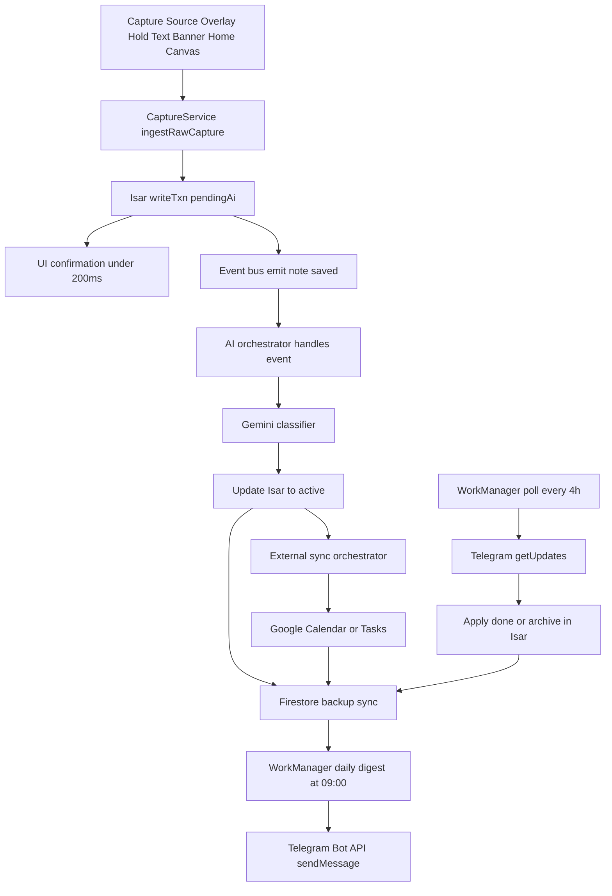
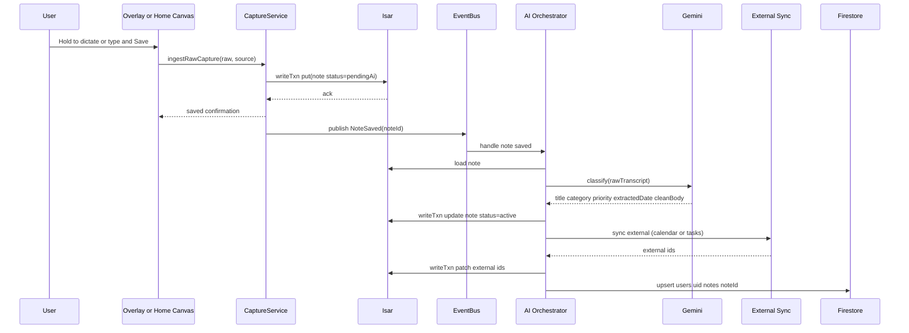
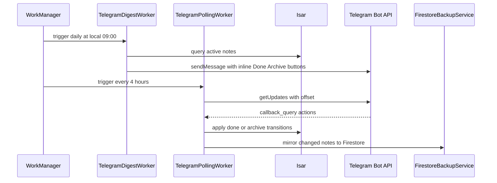
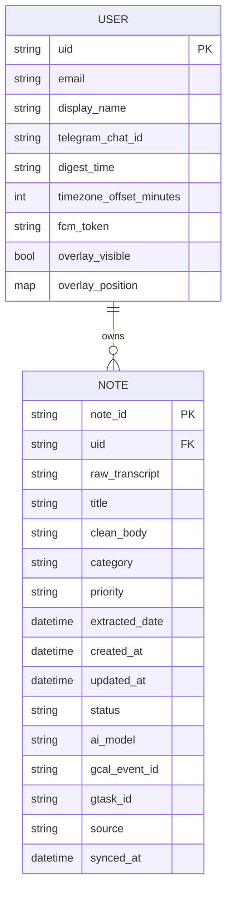

# WhisperLog Architecture

Version: 2.0 Blueprint-Conformant Target Architecture  
Date: 2026-04-04  
Status: Authoritative intended architecture for hardening and implementation alignment

## 1. Purpose

This document is the source-of-truth architecture specification for WhisperLog.
It defines the intended system shape, behavior, constraints, and acceptance criteria.

This architecture is explicitly based on the Original Master Blueprint and therefore enforces:
- local-first data handling
- zero-friction capture UX
- event-driven AI processing (no periodic polling loop for AI)
- 100% free/client-side strategy for Telegram automation
- Android-first execution model

## 2. Product Intent

WhisperLog is a local-first, system-level capture product for fast thought externalization.
The user should be able to capture voice or text in under one interaction cycle, with immediate local confirmation.
Everything else is asynchronous enrichment.

### 2.1 Key Product Principles

1. Capture must be faster than cognition drift.
2. Save confirmation must not depend on network, AI, or cloud infrastructure.
3. Overlay and home canvas must share the same capture semantics.
4. AI is additive, not blocking.
5. Sync is best-effort and recoverable.
6. The default experience must function offline.

## 3. Non-Negotiable Constraints

1. No paid backend architecture requirement.
2. No Cloud Functions dependency for core Telegram digest flow.
3. No AI polling timers draining battery.
4. No bottom navigation bar in primary UX layout.
5. No blocking network call before local note save confirmation.

## 4. System Context

WhisperLog runs primarily on-device and treats cloud services as optional durability and integration layers.

### 4.1 External Dependencies

- Firebase Auth for user identity.
- Firestore for cloud backup mirror.
- Gemini API for note classification/enrichment.
- Google Calendar API for reminder event materialization.
- Google Tasks API for task materialization.
- Telegram Bot API for daily digest send and callback update polling.

### 4.2 Runtime Platforms

- Android is mandatory target.
- iOS/web/desktop are non-primary and may remain partial.

### 4.3 Chronological System Story

WhisperLog should be understood as a time-ordered journey, not just a set of modules.

1. A user captures a thought from overlay or home canvas.
2. The app writes the note locally to Isar with status pendingAi.
3. The user gets immediate save confirmation.
4. An event is emitted for AI enrichment.
5. Gemini classifies and beautifies the note asynchronously.
6. The note is upgraded to active.
7. External sync attempts calendar/task materialization where applicable.
8. Firestore backup mirrors the latest note snapshot.
9. Daily Telegram digest is sent by client-side scheduler.
10. Telegram callbacks are polled and reflected back into local/cloud state.

## 5. High-Level Component Graph

## 6. End-to-End Data Pipeline

### 6.1 Capture-to-Active Lifecycle

### 6.2 Telegram Daily Digest and Action Feedback Loop

## 7. Core UX Architecture

### 7.1 Overlay States

Overlay must support three deterministic states:
1. Idle Bubble state
2. Listening state while hold gesture active
3. Processing-to-save then return to Idle

Double-tap opens text banner state.
Banner has exactly two closure paths:
- X closes without save
- Save persists immediately to Isar

### 7.2 Home Thought Canvas

Top section must be a large multiline glassmorphic input region between 30vh and 40vh.

Canvas gesture parity with overlay:
- Hold mic starts on-device speech capture.
- Release mic stops and saves instantly.

### 7.3 Folder Grid

Bottom half shows exactly six folders:
- Tasks
- Reminders
- Ideas
- Follow-up
- Journal
- General

### 7.4 Design Language Contract

1. Mesh gradient atmospheric background.
2. Deep glassmorphism with blur and translucent borders.
3. No bottom navigation bars in core surface.
4. Motion should be subtle and state-meaningful.

## 8. Local-First Storage Contract

### 8.1 Latency Objective

- P50 local save: <= 80ms
- P95 local save: <= 200ms
- User confirmation should occur immediately after local transaction success.

### 8.2 Save Ordering Rule

1. Validate input.
2. Construct note entity.
3. Write to Isar in transaction.
4. Return success to caller.
5. Fire async events for AI and cloud sync.

### 8.3 Forbidden Ordering

These are architecture violations:
- waiting for Gemini before save confirmation
- waiting for Firestore before save confirmation
- waiting for Google API sync before save confirmation

## 9. Event-Driven AI Architecture

### 9.1 Triggering Model

Mandatory trigger: NoteSaved domain event.

Not allowed:
- perpetual Timer.periodic AI polling
- periodic full-database scans for pendingAi

### 9.2 Event Payload

- eventType: NoteSaved
- noteId: string
- source: enum
- createdAt: timestamp
- retryCount: int default 0

### 9.3 AI Output Contract

Gemini returns strict JSON keys:
- title
- category
- priority
- extracted_date
- clean_body

Category allowed values:
- Tasks
- Reminders
- Ideas
- Follow-up
- Journal
- General

Priority allowed values:
- high
- medium
- low

### 9.4 AI Error Handling

1. If classification fails, keep note status as pendingAi.
2. Queue targeted retry for that specific note.
3. Never block UI.
4. Never delete user raw transcript.

## 10. Cloud Backup Architecture

### 10.1 Firestore Path

users/{uid}/notes/{noteId}

### 10.2 Write Semantics

- merge writes
- idempotent updates
- last-write-wins by updated_at
- offline-first with retries

### 10.3 Failure Semantics

- cloud failure does not rollback local save
- retry metadata retained locally

## 11. External Sync Architecture

### 11.1 Eligibility Rules

Google Calendar sync eligibility:
- category == Reminders
- extracted_date != null
- gcal_event_id == null

Google Tasks sync eligibility:
- category == Tasks
- gtask_id == null

### 11.2 Idempotency

Do not duplicate external entities.
Use stored external ids and duplicate checks before create.

## 12. Telegram Client-Side Strategy

### 12.1 Why Client-Side

Blueprint requires zero paid backend dependency for digest/action flow.
Therefore, Telegram operations execute from app via WorkManager.

### 12.2 Daily Digest Worker

- Trigger: local 09:00 every day
- Input: active notes from Isar
- Output: formatted digest sent through sendMessage
- Buttons: Done and Archive inline callbacks

### 12.3 Polling Worker

- Trigger: every 4 hours
- Call: getUpdates with persisted offset
- Parse callback_query payload
- Apply note mutation locally in Isar
- Mirror mutation to Firestore

### 12.4 Callback Payload Format

`<action>|<uid>|<note_id>`

Allowed actions:
- done
- archive

### 12.5 Security Considerations

- Bot token should not be hardcoded.
- Store token in env/config with hardening strategy.
- Avoid exposing sensitive logs.

## 13. Isar Data Schema (Strict)

### 13.1 Isar Note Entity

### 13.2 Field Definitions

1. note_id: globally unique immutable id
2. uid: owner user id
3. raw_transcript: raw captured text from voice or typing
4. title: short headline generated by AI or fallback
5. clean_body: beautified user-friendly body
6. category: one of six folder categories
7. priority: high medium low
8. extracted_date: parsed reminder/task datetime
9. created_at: creation timestamp
10. updated_at: mutation timestamp
11. status: pendingAi active archived done
12. ai_model: model name used
13. gcal_event_id: optional Calendar event id
14. gtask_id: optional Task id
15. source: capture origin enum
16. synced_at: last cloud sync timestamp

## 14. Firestore User Schema (Strict)

## 15. Background Scheduling Architecture

### 15.1 WorkManager Jobs

Mandatory jobs:
1. telegram_daily_digest_0900_local
2. telegram_poll_updates_every_4h

Optional jobs:
1. connectivity_recovered_flush_pending
2. external_sync_maintenance

### 15.2 Job Constraints

- network required for Telegram and cloud sync tasks
- exponential backoff for API failures
- unique work names for idempotency

## 16. Reliability Patterns

1. Bounded retries with jitter for remote APIs.
2. Idempotent write operations.
3. Crash-safe checkpoints for long jobs.
4. Readiness gates for Isar initialization.
5. Defensive stream error containment.

## 17. Observability

### 17.1 Required Logs

- capture_save_started
- capture_save_local_success
- capture_save_local_failure
- note_saved_event_emitted
- ai_job_started
- ai_job_success
- ai_job_failure
- firestore_backup_success
- firestore_backup_failure
- telegram_digest_sent
- telegram_digest_failed
- telegram_poll_success
- telegram_poll_failed

### 17.2 Metrics

- local_save_latency_ms
- ai_processing_latency_ms
- ai_retry_count
- cloud_sync_latency_ms
- telegram_digest_send_count
- telegram_poll_action_count

## 18. Security and Privacy

1. Principle of least data transfer.
2. Raw transcript remains local-first.
3. Tokens managed through environment and secure storage strategy.
4. PII logging prohibited.
5. User-initiated data deletion path required.

## 19. Dependency Boundaries

Core app must not depend on paid server compute for critical flows.
Any optional backend integration must remain non-blocking and replaceable.

## 20. Anti-Patterns (Explicitly Forbidden)

1. AI Timer.periodic polling loops.
2. Blocking network call before local save confirmation.
3. Cloud-only digest orchestration.
4. Hidden status transitions without audit fields.
5. Global mutable singleton state without readiness barriers.

## 21. Migration Strategy to Blueprint Compliance

### Phase A: Runtime Hardening

- remove AI polling service
- implement event bus and note-specific queues
- unify capture pipelines

### Phase B: Telegram Clientization

- migrate digest send from cloud function to app worker
- migrate callback handling from webhook to getUpdates polling worker
- preserve Firestore mirror writes

### Phase C: Observability and QA

- implement instrumentation contract
- build deterministic integration test harness

## 22. Testing Architecture

### 22.1 Unit Tests

- note entity serialization
- category/priority parsing
- AI payload parsing
- Telegram payload parsing

### 22.2 Integration Tests

- capture -> Isar pendingAi
- event emission -> AI update
- AI update -> Firestore merge
- daily digest worker send
- polling worker action apply

### 22.3 End-to-End Tests

- overlay hold-release capture
- overlay text banner save
- home canvas hold-release capture
- folder count updates

## 23. Requirement Traceability Matrix

The matrix below maps architecture controls to blueprint constraints.

| Control ID | Blueprint Clause | Enforced Rule | Validation Method |
|---|---|---|---|
| AC-001 | Local-first strict rule | Isar write before async work | integration test |
| AC-002 | Event-driven AI | No timer polling | static code audit |
| AC-003 | Telegram client-side | No cloud function dependency | runtime dependency audit |
| AC-004 | Digest schedule | Daily local 09:00 | scheduler test |
| AC-005 | Poll schedule | 4-hour getUpdates worker | scheduler test |
| AC-006 | UX parity | Overlay and home gesture equivalence | UI integration test |
| AC-007 | Folder contract | Exactly six smart folders | widget test |
| AC-008 | Design language | Glassmorphism + mesh gradient + no bottom nav | visual review |
| AC-009 | Save latency | <= 200ms local confirmation target | performance test |
| AC-010 | Idempotency | no duplicate calendar/task entities | sync integration test |

## 24. Implementation Priorities and Exit Criteria

This section replaces the oversized checklist with practical execution guidance for engineering and QA.

### 24.1 Priority Backlog (Now -> Next)

1. AI Trigger Refactor (Critical)
- Remove timer-based scanning and switch to NoteSaved event stream subscription.
- Ensure one event maps to one targeted note processing job.
- Add bounded retry policy per note with telemetry.

2. Telegram Client-Side Automation (High)
- Implement daily 09:00 local WorkManager digest job.
- Implement 4-hour Telegram getUpdates polling job.
- Persist polling offset safely across restarts.

3. Isar Startup Reliability (High)
- Harden Isar readiness barrier to avoid half-initialized handles.
- Ensure all repositories await a single in-flight init promise.
- Prevent stream crashes on startup race conditions.

4. Save Path Consistency (High)
- Guarantee every capture path confirms success immediately after local Isar commit.
- Move all network sync operations to asynchronous post-commit jobs.

5. UX Parity Lock (Medium)
- Keep overlay and home canvas behavior equivalent for hold/release voice capture.
- Enforce double-tap expansion semantics for overlay text panel.

### 24.2 Release Gates

A release candidate cannot pass architecture review unless all gates below are green:

Gate A: Local-First Gate
- Evidence: tests proving note availability immediately after local commit with network disabled.

Gate B: Event-Driven AI Gate
- Evidence: no Timer.periodic AI loops in runtime path; event stream instrumentation present.

Gate C: Telegram Client-Side Gate
- Evidence: daily digest and 4-hour polling executed from app-side WorkManager.

Gate D: Stability Gate
- Evidence: no unhandled Isar initialization exceptions during cold start stress tests.

Gate E: UX Contract Gate
- Evidence: overlay + canvas interaction parity verified by integration tests.

### 24.3 Validation Matrix

| Area | Validation Method | Pass Threshold |
|---|---|---|
| Local save latency | Instrumented benchmark | P95 <= 200ms |
| AI trigger path | Static/runtime audit | Event-driven only |
| Telegram digest | WorkManager integration test | Sends once/day at local window |
| Telegram action polling | Integration test with mocked updates | Done/Archive applied idempotently |
| Isar startup safety | Cold-start stress tests | Zero unhandled init exceptions |
| Cloud backup durability | Offline/online recovery test | Eventual Firestore convergence |

### 24.4 Ownership Model

- Architecture owner: enforces non-negotiable constraints.
- Mobile lead: owns runtime implementation and migration sequencing.
- QA lead: owns gate evidence and regression matrix.
- Release manager: blocks shipment when any gate is red.

### 24.5 Short-Term Milestones

Milestone M1
- Remove AI polling timer.
- Introduce event bus and targeted AI jobs.

Milestone M2
- Ship Telegram digest and polling workers in Flutter runtime.
- Remove Cloud Functions dependency from critical Telegram flow.

Milestone M3
- Complete Isar startup hardening and stream resilience.
- Finalize architecture conformance report.
## 25. Operational Runbooks

### 25.1 Startup Runbook

1. Initialize Flutter binding.
2. Load environment variables.
3. Initialize Firebase.
4. Initialize Isar with readiness barrier.
5. Initialize DI container.
6. Start overlay coordinator.
7. Register WorkManager jobs.
8. Start app shell.

### 25.2 Capture Failure Runbook

1. Confirm input validity.
2. Confirm Isar open and ready.
3. Retry transaction with bounded attempts.
4. Surface user-safe error if local write fails.
5. Record structured crash breadcrumb.

### 25.3 AI Failure Runbook

1. Keep note status pendingAi.
2. Enqueue targeted retry.
3. Increment retry metadata.
4. Backoff and stop after threshold.
5. Expose pending count to UI for transparency.

### 25.4 Telegram Failure Runbook

1. Validate bot token and chat id.
2. Retry send with exponential backoff.
3. Persist unsent digest marker.
4. Retry in next worker window.

## 26. Performance Budget

- Startup to interactive: <= 3.5s on target baseline device.
- Capture save local commit: <= 200ms p95.
- Overlay interaction feedback: <= 50ms visual response.
- Folder refresh after save: <= 300ms.

## 27. Data Retention and Cleanup

- Archived notes remain queryable for history views.
- Pending retry metadata older than retention window may be compacted.
- Telegram polling offsets must persist across process restarts.

## 28. Governance

Any architecture change to these sections requires:
1. architecture review
2. QA signoff
3. updated traceability matrix entries
4. updated test mapping

## 29. Definition of Done for Blueprint Compliance

A release is blueprint-compliant only when all are true:
1. No AI polling loop exists.
2. Capture local save is consistently non-blocking for network.
3. Telegram daily digest is app-side WorkManager at local 09:00.
4. Telegram action polling runs every 4 hours via getUpdates.
5. Overlay and home capture semantics are parity-complete.
6. Documentation, runtime, and tests align.

## 30. Appendix: Canonical Status Values

- pendingAi
- active
- archived
- done

## 31. Appendix: Canonical Category Values

- tasks
- reminders
- ideas
- followUp
- journal
- general

## 32. Appendix: Canonical Source Values

- voiceOverlay
- textOverlay
- homeWritingBox

## 33. Appendix: Architecture Decision Record Seeds

- ADR-001: local-first save ordering
- ADR-002: event-driven ai orchestration
- ADR-003: client-only telegram automation
- ADR-004: external sync idempotency
- ADR-005: isar readiness barrier strategy

## 34. Closing Statement

This ARCHITECTURE.md defines the intended target architecture and compliance contract.
Implementation, QA, and release decisions must be measured against this document.
