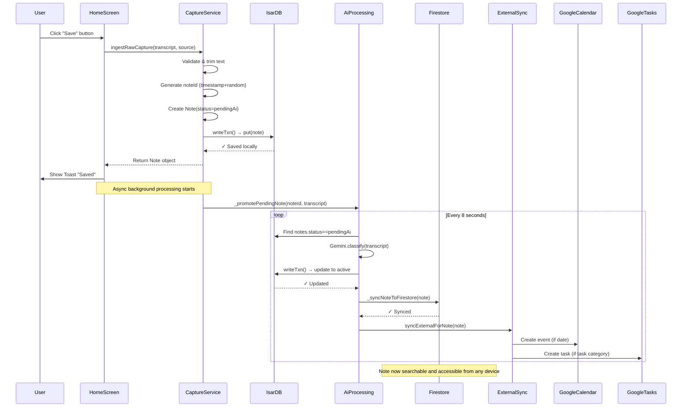
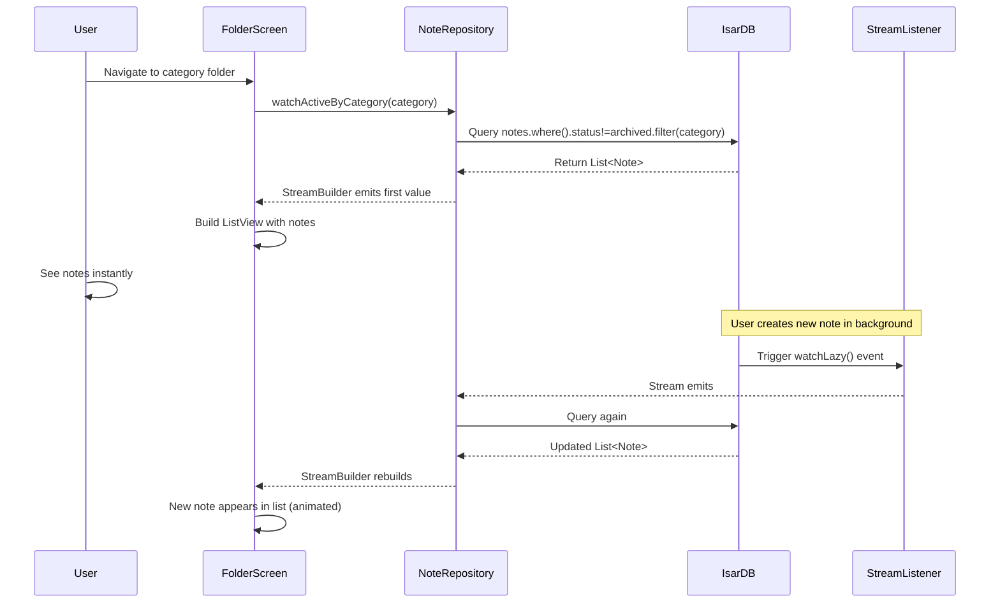
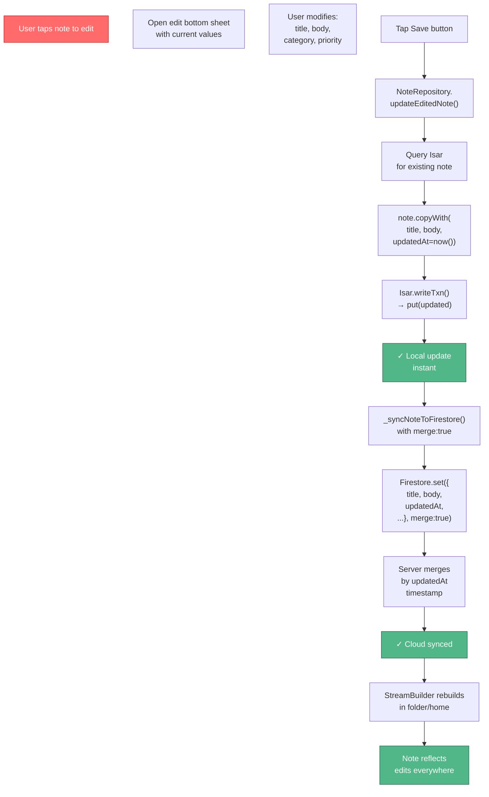
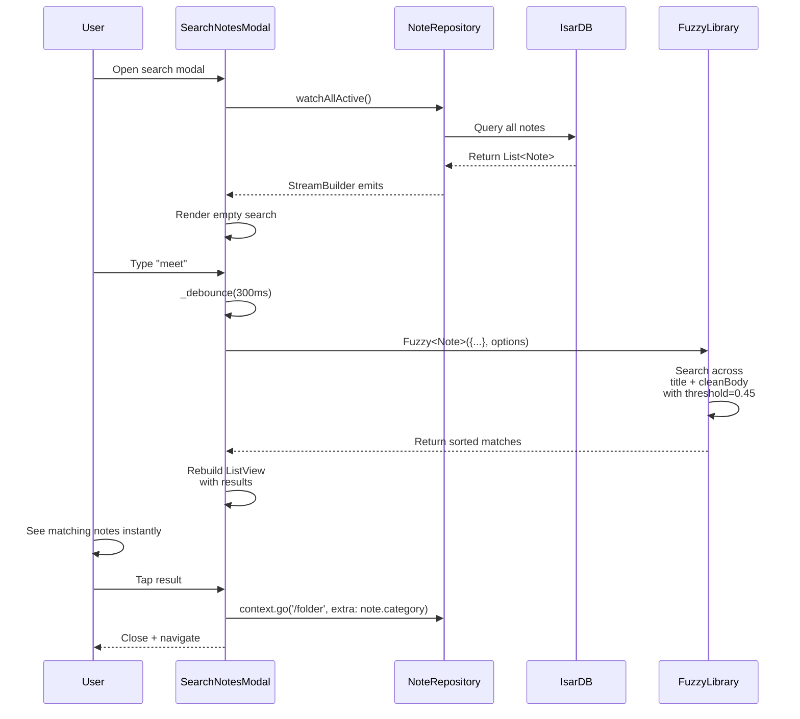

# WhisperLog Architecture

**Complete system design, data flows, database schemas, and component interactions.**

---

## Table of Contents
1. [System Architecture Diagram](#system-architecture)
2. [Data Flow & Pipelines](#data-flows)
3. [Database Schemas](#database-schemas)
4. [Services & Components](#services--components)
5. [Initialization Sequence](#initialization-sequence)
6. [Tech Stack (30 Technologies)](#tech-stack)
7. [Patterns & Best Practices](#patterns--best-practices)

---

## System Architecture

### Complete Component Graph

This diagram shows all layers, services, and integrations in WhisperLog:

```mermaid
graph TB
    subgraph "Presentation Layer"
        SignInScreen["SignIn Screen<br/>Google OAuth"]
        HomeScreen["Home Screen<br/>Thought Canvas"]
        FolderScreen["Folder Screen<br/>Category View"]
        SettingsScreen["Settings Screen<br/>Overlay Toggle"]
        OverlayBubble["Overlay Bubble<br/>Voice Capture"]
    end

    subgraph "State Management"
        ThemeCubit["Theme Cubit<br/>Light/Dark/System"]
        GoRouter["GoRouter<br/>Navigation"]
        OverlayCoord["OverlayCoordinator<br/>State+Config"]
    end

    subgraph "Feature Layer"
        CaptureService["CaptureService<br/>Note Ingestion"]
        NoteRepo["NoteRepository<br/>CRUD + Streams"]
        UserRepo["UserRepository<br/>Auth + User"]
        AiService["AiProcessingService<br/>Background AI"]
        ExternalSync["ExternalSyncService<br/>Google Services"]
        FirestoreSync["FirestoreNoteSyncService<br/>Cloud Sync"]
        FcmService["FcmSyncService<br/>Push Notifications"]
    end

    subgraph "Domain Models"
        NoteModel["Note Model<br/>Isar Collection"]
        Enums["Enums<br/>Category/Priority/Status"]
        UserModel["User Model"]
    end

    subgraph "Data Persistence"
        IsarDB["Isar Database<br/>Local NoSQL<br/>Thread-Safe"]
        SharedPrefs["SharedPreferences<br/>Settings + Overlay"]
    end

    subgraph "External Services"
        Firebase["Firebase<br/>Auth + Firestore"]
        Gemini["Google Gemini<br/>AI Classification"]
        GoogleCalendar["Google Calendar<br/>Event Sync"]
        GoogleTasks["Google Tasks<br/>Task Sync"]
        FCM["Firebase Cloud<br/>Messaging"]
    end

    subgraph "Platform Layer"
        OverlayWindow["flutter_overlay_window<br/>Android Overlay"]
        SpeechToText["speech_to_text<br/>Voice Recognition"]
        PermHandler["permission_handler<br/>Runtime Perms"]
        Connectivity["connectivity_plus<br/>Network State"]
        WorkManager["workmanager<br/>Background Jobs"]
    end

    subgraph "Core Infrastructure"
        DIContainer["GetIt<br/>Dependency Injection"]
        AppEnv["AppEnv<br/>Config + Env Vars"]
        WorkService["WorkManagerService<br/>Task Scheduling"]
        ConnectivityCoord["ConnectivitySyncCoordinator<br/>Network Triggers"]
    end

    SignInScreen --> UserRepo
    HomeScreen --> CaptureService
    HomeScreen --> NoteRepo
    FolderScreen --> NoteRepo
    SettingsScreen --> OverlayCoord
    OverlayBubble --> CaptureService
    OverlayBubble --> SpeechToText
    
    CaptureService --> IsarDB
    NoteRepo --> IsarDB
    AiService --> IsarDB
    FirestoreSync --> IsarDB
    
    CaptureService --> NoteModel
    NoteRepo --> NoteModel
    
    AiService --> Gemini
    ExternalSync --> GoogleCalendar
    ExternalSync --> GoogleTasks
    FirestoreSync --> Firebase
    FcmService --> FCM
    UserRepo --> Firebase
    
    DIContainer --> CaptureService
    DIContainer --> NoteRepo
    DIContainer --> AiService
    DIContainer --> FirestoreSync
    DIContainer --> FcmService
    
    Connectivity --> ConnectivityCoord
    WorkManager --> WorkService
    
    classDef presentation fill:#FF6B6B,stroke:#C92A2A,color:#fff
    classDef state fill:#4ECDC4,stroke:#1B998B,color:#fff
    classDef feature fill:#45B7D1,stroke:#0984E3,color:#fff
    classDef domain fill:#96CEB4,stroke:#52B788,color:#fff
    classDef persistence fill:#FFE66D,stroke:#FFA502,color:#000
    classDef external fill:#DDA15E,stroke:#BC6C25,color:#fff
    classDef platform fill:#D4A5A5,stroke:#9A6C6C,color:#fff
    classDef core fill:#C1A3E8,stroke:#8B5CF6,color:#fff
    
    class SignInScreen,HomeScreen,FolderScreen,SettingsScreen,OverlayBubble presentation
    class ThemeCubit,GoRouter,OverlayCoord state
    class CaptureService,NoteRepo,UserRepo,AiService,ExternalSync,FirestoreSync,FcmService feature
    class NoteModel,Enums,UserModel domain
    class IsarDB,SharedPrefs persistence
    class Firebase,Gemini,GoogleCalendar,GoogleTasks,FCM external
    class OverlayWindow,SpeechToText,PermHandler,Connectivity,WorkManager platform
    class DIContainer,AppEnv,WorkService,ConnectivityCoord core
```



---

## Data Flows

### 1. Save Flow: Capture → Isar → Firestore



### 2. View Flow: Stream-Based Rendering



### 3. Edit Flow: Local Update + Cloud Merge



### 4. Search Flow: Fuzzy Matching



---

## Database Schemas

### Isar Local Database: Note Collection

```dart
@collection
class Note {
  /// Hash of noteId (unique primary key)
  Id get isarId => fastHash(noteId);

  /// Unique identifier (timestamp_microseconds + random)
  final String noteId;

  /// Firebase user UID
  final String uid;

  /// Original raw input (voice transcript or pasted text)
  final String rawTranscript;

  /// AI-extracted or user-provided title (max 60 chars, truncated)
  final String title;

  /// AI-enhanced clean body text (for display and search)
  final String cleanBody;

  /// Note category (tasks, reminders, ideas, followUp, journal, general)
  @enumerated
  final NoteCategory category;

  /// Priority level (high, medium, low)
  @enumerated
  final NotePriority priority;

  /// Extracted date/time if calendar-relevant
  final DateTime? extractedDate;

  /// UTC timestamp when note was created
  final DateTime createdAt;

  /// UTC timestamp of last modification
  final DateTime updatedAt;

  /// Current status (active, pendingAi, archived)
  @enumerated
  final NoteStatus status;

  /// AI model name used (e.g., "gemini-2.0-flash")
  final String aiModel;

  /// Link to Google Calendar event (if synced)
  final String? gcalEventId;

  /// Link to Google Tasks item (if synced)
  final String? gtaskId;

  /// Source of capture (homeWritingBox, voiceOverlay, textOverlay)
  @enumerated
  final CaptureSource source;

  /// Last successful Firestore sync timestamp
  final DateTime? syncedAt;
}
```

### Firestore Cloud Database Structure

```
firestore/
├── users/{uid}
│   ├── email: string
│   ├── displayName: string
│   ├── photoUrl: string
│   ├── fcmToken: string                    # For push notifications
│   ├── createdAt: timestamp
│   └── notes/{noteId}                      # Subcollection
│       ├── note_id: string
│       ├── uid: string
│       ├── raw_transcript: string
│       ├── title: string
│       ├── clean_body: string
│       ├── category: string               # tasks, reminders, ideas, etc.
│       ├── priority: string               # high, medium, low
│       ├── extracted_date: timestamp
│       ├── created_at: timestamp
│       ├── updated_at: timestamp
│       ├── status: string                 # active, pendingAi, archived
│       ├── ai_model: string
│       ├── gcal_event_id: string
│       ├── gtask_id: string
│       ├── source: string
│       └── synced_at: timestamp
```

### Security Rules (Firestore)

```javascript
rules_version = '2';
service cloud.firestore {
  match /databases/{database}/documents {
    
    // User documents (read only for self, write restricted)
    match /users/{uid} {
      allow read, write: if request.auth.uid == uid;
      
      // Notes subcollection (full CRUD for user's notes)
      match /notes/{noteId} {
        allow read, write: if request.auth.uid == uid;
      }
    }
  }
}
```

---

## Services & Components

### CaptureService
**File**: `lib/features/capture/data/capture_service.dart`

Ingests raw transcripts and creates Note objects. Handles:
- Text validation and trimming
- Note ID generation (timestamp + random)
- Isar transaction wrapper
- Background AI promotion
- Firestore async sync

```dart
Future<Note?> ingestRawCapture({
  required String rawTranscript,
  required CaptureSource source,
  bool syncToCloud = true,
})
```

**Key Property**: Local save always succeeds, even if Firebase is offline.

### NoteRepository
**File**: `lib/features/notes/data/note_repository.dart`

Central CRUD interface with streams for reactive updates:
```dart
Future<void> savePendingFromHome(String rawText)
Stream<Map<NoteCategory, int>> watchActiveCounts()
Stream<List<Note>> watchActiveByCategory(NoteCategory category)
Stream<List<Note>> watchAllActive()
Future<void> updateEditedNote({...})
Future<void> archive(String noteId)
Future<void> cyclePriority(String noteId)
```

All operations are local-first with async Firestore sync.

### AiProcessingService
**File**: `lib/features/ai/data/ai_processing_service.dart`

Runs background polling every 8 seconds:
1. Query Isar for notes with `status == pendingAi`
2. Call GeminiNoteClassifier for each note
3. Extract title, category, priority, date
4. Update note to `status: active`
5. Trigger Firestore sync

**Non-blocking**: If Gemini API fails, note stays `pendingAi` for retry.

### FirestoreNoteSyncService
**File**: `lib/features/sync/data/firestore_note_sync_service.dart`

Bi-directional cloud sync:
- Push updated notes to Firestore with `merge: true`
- Pull changes via FCM push notifications
- Merge strategy: Server-side timestamp wins
- Error handling: Log + retry on next opportunity

### OverlayCoordinator
**File**: `lib/features/overlay_v1/overlay_coordinator.dart`

Manages Android floating bubble state:
- Permission request flow (flutter_overlay_window →  fallback to permission_handler)
- Isolate lifecycle management
- State persistence (SharedPreferences)
- Bubble config (opacity, size, snap position)

### FcmSyncService
**File**: `lib/features/sync/data/fcm_sync_service.dart`

Firebase Cloud Messaging integration:
- FCM token registration in user document
- Foreground message handling
- Background message processing via `ensureFcmBackgroundHandlerRegistered`
- Triggers cloud-to-local sync when remote note changes detected

### ExternalSyncService
**File**: `lib/features/sync/data/external_sync_service.dart`

Google Calendar & Tasks sync:
- Extract calendar dates → create Google Calendar events
- Detect task category → create Google Tasks items
- Fuzzy match existing events to prevent duplicates
- OAuth flow for Google API access

---

## Initialization Sequence

App startup follows a strict 13-step initialization sequence in `main.dart`:

```
1. WidgetsFlutterBinding.ensureInitialized()
   └─ Initialize Flutter engine binding
   
2. Register FCM background handler
   └─ Enable background message processing
   
3. Load .env file (AppEnv.load())
   └─ Set GOOGLE_GEMINI_API_KEY, TELEGRAM_BOT_USERNAME, etc.
   
4. Firebase.initializeApp(DefaultFirebaseOptions.currentPlatform)
   └─ Initialize Firebase SDK with platform-specific config
   
5. IsarService.instance.init()
   └─ Open local database with schema recovery
   
6. WorkManager.initialize()
   └─ Setup background task scheduler
   
7. RegisterPeriodicGoogleTasksSync()
   └─ Register Google Tasks sync task (4-hour interval)
   
8. init() from injection_container
   └─ Register 12+ services in GetIt
   
9. sl<ThemeCubit>().hydrate()
   └─ Load saved theme preference from SharedPreferences
   
10. sl<OverlayCoordinator>().hydrateAndRestore()
    └─ Restore overlay state if user had it visible before app closed
    
11. sl<AiProcessingService>().start()
    └─ Start 8-second polling loop for pendingAi notes
    
12. sl<ConnectivitySyncCoordinator>().start()
    └─ Monitor network state, trigger sync when online
    
13. sl<FcmSyncService>().initialize()
    └─ Setup FCM listeners and fetch initial token
    
14. runApp(MyApp())
    └─ Launch Flutter app with GoRouter-based navigation
```

---

## Tech Stack (30 Technologies)

### Frontend & UI (4)
| # | Technology | Version | Purpose |
|---|------------|---------|---------|
| 1 | Flutter | 3.11.4+ | Cross-platform mobile framework |
| 2 | Material Design 3 | native | Modern UI system with themes |
| 3 | GoRouter | 17.2.0 | Type-safe navigation |
| 4 | Flutter BLoC | 9.1.1 | State management pattern |

### State & DI (3)
| # | Technology | Version | Purpose |
|---|------------|---------|---------|
| 5 | GetIt | 9.2.1 | Service locator for DI |
| 6 | ValueNotifier | native | Reactive state (overlay) |
| 7 | Streams | native | Async data flows |

### Storage (2)
| # | Technology | Version | Purpose |
|---|------------|---------|---------|
| 8 | Isar | 3.1.0+1 | Local NoSQL database |
| 9 | SharedPreferences | 2.5.3 | Key-value store for prefs |

### Firebase (4)
| # | Technology | Version | Purpose |
|---|------------|---------|---------|
| 10 | Firebase Core | 4.6.0 | SDK initialization |
| 11 | Firebase Auth | 6.3.0 | Google OAuth sign-in |
| 12 | Cloud Firestore | 6.2.0 | Cloud database + sync |
| 13 | Firebase Cloud Messaging | 16.0.2 | Push notifications |

### AI & APIs (3)
| # | Technology | Version | Purpose |
|---|------------|---------|---------|
| 14 | Google Generative AI | 0.4.7 | Gemini classification |
| 15 | Google APIs for Dart | 14.0.0 | Calendar + Tasks APIs |
| 16 | Fuzzy | 0.5.1 | Fuzzy string matching |

### Platform Integrations (5)
| # | Technology | Version | Purpose |
|---|------------|---------|---------|
| 17 | flutter_overlay_window | 0.5.0 | Android floating bubble |
| 18 | speech_to_text | 7.0.0 | Voice-to-text |
| 19 | permission_handler | 11.3.1+ | Runtime permissions |
| 20 | connectivity_plus | 6.1.5 | Network monitoring |
| 21 | workmanager | 0.6.0 | Background task scheduling |

### Utilities & Helpers (5)
| # | Technology | Version | Purpose |
|---|------------|---------|---------|
| 22 | url_launcher | 6.3.2 | Open URLs/apps |
| 23 | http | 1.5.0 | HTTP client |
| 24 | flutter_dotenv | 5.2.1 | Environment variables |
| 25 | flutter_svg | 2.2.0 | SVG rendering |
| 26 | path_provider | 2.1.5 | Platform directories |

### Development & Build (3)
| # | Technology | Version | Purpose |
|---|------------|---------|---------|
| 27 | flutter_lints | 6.0.0 | Dart linting |
| 28 | build_runner | 2.4.6 | Code generation |
| 29 | isar_generator | 3.0.5 | Isar schema generation |
| 30 | Google Sign-In | 6.1.5 | OAuth provider |

---

## Patterns & Best Practices

### 1. Clean Architecture
```
Presentation ← Feature ← Data ← External Services
```
Each layer has clear responsibilities and dependencies flow downward only.

### 2. Repository Pattern
- `NoteRepository`: Abstracts local Isar + cloud Firestore
- `UserRepository`: Abstracts Firebase auth
- Single point of truth for data access

### 3. Service Locator Pattern
GetIt manages all singletons centrally—no manual dependency passing required.

### 4. Local-First with Async Cloud Sync
- Save always succeeds locally (< 50ms)
- Cloud sync happens asynchronously in background
- No blocked UI on network latency

### 5. Stream-Based Reactivity
```dart
StreamBuilder(
  stream: noteRepository.watchActiveByCategory(category),
  builder: (context, snapshot) {
    final notes = snapshot.data ?? [];
    return ListView(...);
  }
)
```
Automatic rebuilds when Isar database changes.

### 6. Error Handling & Recovery
- Try-catch wrappers on all async operations
- Detailed debug logging with context prefixes (`[Main]`, `[CaptureService]`, etc.)
- Graceful fallbacks (Isar schema recovery, Firebase init timeout, etc.)

### 7. Background Processing
- 8-second polling loop for AI (non-blocking)
- 4-hour WorkManager task for Google Tasks sync
- Network-aware sync via ConnectivitySyncCoordinator

---

## Conclusion

WhisperLog combines **local-first architecture** with **cloud-first convenience**, ensuring notes are instantly saved and accessible offline while syncing seamlessly to the cloud when available. The modular service-oriented design makes the system maintainable, testable, and extensible for future features.

---

## Layered Architecture

### 1. Core Layer (`lib/core/`)

#### Configuration (`core/config/`)
- **AppEnv**: Environment variable loader
  - `.env` file parser
  - Firebase configuration

#### Dependency Injection (`core/di/`)
- **injection_container.dart**: GetIt setup
- **Registered Singletons**:
  - `AppPreferencesRepository` - User preferences
  - `UserRepository` - Firebase auth & Firestore user management
  - `NoteRepository` - Note CRUD operations
  - `ExternalSyncService` - Google Calendar/Tasks sync
  - `CaptureService` - Note ingestion pipeline
  - `OverlayV1Preferences` - Overlay state persistence
  - `OverlayCoordinator` - Overlay lifecycle management
  - `FirestoreNoteSyncService` - Cloud sync service
  - `AiProcessingService` - Background AI processing
  - `FcmSyncService` - Firebase messaging
  - `ConnectivitySyncCoordinator` - Network-based sync triggers
  - `ThemeCubit` - Theme state management

#### Storage (`core/storage/`)
- **IsarService**: Isar database singleton
  - Thread-safe initialization with retry logic (20 attempts)
  - Automatic recovery from corrupted files
  - Schema version management
  - Supported collections: `Note`

#### Settings (`core/settings/`)
- **AppPreferencesRepository**: SharedPreferences wrapper
  - Theme mode (light|dark|system, default: system)
  - Digest time (hour/minute, default: 09:00)

#### Theme (`core/theme/`)
- **app_theme.dart**: Material Design 3 themes (light/dark)
- **theme_cubit.dart**: BLoC for theme state with persistence

#### Background Tasks (`core/background/`)
- **WorkManagerService**: Background task orchestration
  - Periodic Google Tasks sync: every 4 hours
  - Constraints: network connected, battery not low
  - Retry: exponential backoff (30-minute intervals)
- **ConnectivitySyncCoordinator**: Network change monitoring
  - Triggers flush of pending AI processing when online
  - Retries with exponential backoff (15-minute intervals)

---

### 2. Shared Layer (`lib/shared/`)

#### Data Models
- **Note** (`shared/models/note.dart`):
  - Isar collection with custom ID hashing
  - Fields:
    ```
    noteId (string, primary key via fastHash)
    uid (Firebase user ID or 'local_anonymous')
    rawTranscript (original voice-to-text)
    title (AI-derived or user-provided)
    cleanBody (AI-processed content)
    category (NoteCategory: tasks|reminders|ideas|followUp|journal|general)
    priority (NotePriority: high|medium|low)
    extractedDate (DateTime, optional)
    createdAt (DateTime)
    updatedAt (DateTime)
    status (NoteStatus: active|archived|pendingAi)
    aiModel (model name used for processing)
    gcalEventId (Google Calendar event link)
    gtaskId (Google Tasks list link)
    source (CaptureSource: voiceOverlay|textOverlay|homeWritingBox)
    syncedAt (last cloud sync timestamp)
    ```
  - **Custom ID Logic**: `fastHash()` - XOR-based hashing for Isar compatibility

- **Enums** (`shared/models/enums.dart`):
  - `NoteCategory`: 6 categories for note classification
  - `NotePriority`: 3 priority levels
  - `NoteStatus`: 3 states (active, archived, pendingAi)
  - `CaptureSource`: 3 capture origins

- **User** (`shared/models/user.dart`):
  - Firebase user data wrapper

#### Widgets & Utilities
- **shared/widgets/**: Reusable UI components
  - `GlassContainer`: Glassmorphic design component
  - `GlassPageBackground`: Page background with glass effect
  - `GlassNoteCard`: Reusable note card widget
- **shared/models/note_helpers.dart**: Utility functions for note operations

---

### 3. Features Layer (`lib/features/`)

#### Authentication Feature (`features/auth/`)
- **UserRepository**:
  - Google Sign-In integration
  - Firebase Auth state stream
  - Firestore user document management
  - FCM token registration and updates
  - Exception handling with developer-friendly errors (SHA-1 mismatch)
- **Onboarding Screens**:
  - SignInScreen: Google OAuth entry point
  - PermissionsScreen: Runtime permission requests
  - TelegramScreen: Telegram bot connection flow

#### Note Capture Feature (`features/capture/`)

**Data Layer**:
- **CaptureService**:
  - Main ingestion pipeline for voice/text
  - Operations:
    1. Validate and trim input text
    2. Generate unique noteId (timestamp + 20-bit random)
    3. Create Note with `status: pendingAi`
    4. Store in Isar with transaction
    5. Optional Firestore sync (controlled by `syncToCloud` parameter)
    6. Queue for AI processing via `_promotePendingNote()`
  - Dependencies: GeminiNoteClassifier, Firebase, IsarService
  - Error handling: Try-catch with detailed logging

- **CaptureNoteRepository**: Alternative capture path (legacy)

#### Notes Management Feature (`features/notes/`)

**Data Layer**:
- **NoteRepository**:
  - CRUD operations on Note collection
  - Key methods:
    - `savePendingFromHome(text)`: User-typed notes
    - `archive(noteId)`: Mark as archived
    - `unarchive(noteId)`: Restore archived notes
    - `watchActiveCounts()`: Stream of per-category counts
    - `watchActiveByCategory(category)`: Stream of category notes
    - `watchAllActive()`: Stream of all active notes
    - `watchPendingAiCount()`: Stream of pending count
  - Uses Isar transactions for atomicity
  - Firestore sync for cloud backup

**Presentation Layer**:
- **FolderScreen**: Category-based note list with:
  - Live note count updates
  - AI processing status banner
  - Note editing bottom sheet
  - Archive/unarchive actions

#### AI Processing Feature (`features/ai/`)

**Data Layer**:
- **AiProcessingService**:
  - Autonomous background processor
  - Periodic checking every 8 seconds
  - Operations per note:
    1. Find notes with `status: pendingAi`
    2. Call `GeminiNoteClassifier.classify()`
    3. Update note with AI results
    4. Sync to Firestore
  - Single instance prevents concurrent processing
  - Methods: `start()`, `flushPendingQueue()`, `dispose()`

- **GeminiNoteClassifier**:
  - Google Generative AI (Gemini) integration
  - Extracts:
    - Enhanced title from transcript
    - Category classification
    - Priority inference
    - Action items
    - Relevant dates for calendar/task sync

#### Synchronization Feature (`features/sync/`)

**Data Layer**:

1. **FirestoreNoteSyncService**:
   - Bi-directional cloud sync
   - Cloud path: `users/{uid}/notes/{noteId}`
   - Methods:
     - `syncNoteById()`: Fetch from cloud, update local
     - `applyStatusFromPush()`: Handle FCM status changes
     - `watchAndSyncArchive()`: Keep archive status in sync

2. **ExternalSyncService**:
   - Google Calendar & Google Tasks integration
   - Ensures OAuth sign-in is connected
   - Syncs active notes to Google services
   - Bidirectional sync for updates
   - Uses fuzzy matching for reconciliation
   - APIs: CalendarApi (v3), TasksApi (v1)

3. **FcmSyncService**:
   - Firebase Cloud Messaging integration
   - Lifecycle:
     - `initialize()`: Register FCM token to Firestore
     - `onMessage`: Handle foreground messages
     - `onMessageOpenedApp`: Handle notification taps
     - Background handler: Process messages while app closed
   - FCM token persisted in Firestore user document

4. **GoogleApiClient**:
   - Authenticated HTTP client for Google APIs
   - Uses GoogleSignIn for OAuth token management

#### Overlay Feature (`features/overlay_v1/`)

**Domain Layer** (`overlay_v1/domain/`):
- **OverlayV1State**:
  - `mode`: OverlayV1Mode (hidden|idle)
  - `position`: Offset (x, y coordinates)
  - `isVisible`: Computed property

- **OverlayBubbleConfig**:
  - `opacity`: 0.1-1.0 (default: 0.4)
  - `size`: 40-80 dp (default: 56)
  - `snapEnabled`: bool (default: true)

**Data Layer** (`overlay_v1/data/`):
- **OverlayV1Preferences**:
  - SharedPreferences persistence
  - Persisted state: visibility, position, opacity, size, snap settings

- **OverlayV1Logger**: Debug logging

**Presentation Layer** (`overlay_v1/presentation/`):

1. **OverlayCoordinator**:
   - Core orchestrator for overlay lifecycle
   - Methods:
     - `requestPermission()`: Two-stage fallback (FlutterOverlayWindow → Permission.systemAlertWindow)
     - `showIdleBubble()`: Boot overlay with current config
     - `hideOverlay()`: Close overlay and persist state
     - `updateBubbleConfig()`: Live config broadcast to isolate
     - `hydrate()`: Load state from SharedPreferences
     - `hydrateAndRestore()`: Load and show if enabled
   - Polling mechanism: 15 attempts × 300ms for permission checks
   - Detailed boot diagnostics and error logging

2. **OverlayBubbleWidget**:
   - State machine for bubble ↔ text panel transitions
   - Visual states:
     - **Idle**: White transparent circle, 56dp, icon: mic_none
     - **Listening**: Blue pulse, 1.1× scale, border prominence, icon: mic, haptic feedback
     - **Processing**: Orange indicator, 1.04× scale, icon: hourglass_bottom
   - Gestures:
     - **Drag**: Pan position with edge snapping (if snapEnabled)
     - **Long press**: Start voice capture (press) → finish (release)
     - **Tap/Double-tap**: Toggle text panel
   - Voice capture lifecycle:
     1. Check microphone permission
     2. Initialize speech_to_text with onDevice: true
     3. Listen and accumulate transcript with partialResults
     4. On release: stop listening, process, save to Isar
     5. Empty transcript filtering
   - Text panel lifecycle:
     1. Resize window from bubble to 240dp height
     2. Auto-focus text field
     3. Save → Isar ingestion with syncToCloud: false
   - Toast system: Auto-dismiss after 900ms
   - Dependencies: SpeechToText, CaptureService, FlutterOverlayWindow

3. **OverlayPermissionExplainerDialog**:
   - Glassmorphic dialog explaining SYSTEM_ALERT_WINDOW requirement
   - Shown before permission request

4. **OverlayCustomizationScreen**:
   - Settings screen for opacity/size/snap tuning
   - Real-time slider updates broadcast to active overlay

#### Home Screen Feature (`features/home/`)
- **HomeScreen**:
  - Large multiline "Thought Canvas" for quick text capture
  - Inline dictation controls with mic glow animation
  - Category grid with live note counts
  - Search integration
  - Voice support with animated listening state

#### Settings Feature (`features/settings/`)
- **SettingsScreen**:
  - Theme mode selection
  - Digest time configuration
  - Floating Capture toggle with permission auto-check
  - Telegram bot connection
  - Sync now trigger
  - Notification settings

---

## Data Flow Architecture

### 1. Voice Capture Lifecycle (Overlay)
```
User Long-Press Bubble
    ↓
_onLongPressStart()
    ↓
Mic permission check
    ↓
Initialize SpeechToText (onDevice: true)
    ↓
Visual: Listening state (blue pulse)
    ↓
Accumulate transcript via partialResults
    ↓
User Releases
    ↓
_onLongPressEnd()
    ↓
Stop listening
    ↓
[Empty filter] → discard if blank
    ↓
CaptureService.ingestRawCapture(syncToCloud: false)
    ↓
Isar.writeTxn() → save locally
    ↓
Show toast "Saved"
    ↓
Return to Idle state
```

### 2. Home Screen Text Capture Lifecycle
```
User types in Thought Canvas
    ↓
Hits "Save" button
    ↓
_saveWritingBox()
    ↓
CaptureService.ingestRawCapture(syncToCloud: true)
    ↓
Isar.writeTxn() → save locally
    ↓
_promotePendingNote() → queue for AI (async)
    ↓
Firestore.set() → sync to cloud (async, unwaited)
    ↓
Show snackbar "Note saved"
    ↓
Clear text field
```

### 3. AI Processing Lifecycle
```
AiProcessingService.start() → 8-second polling loop
    ↓
Query Isar: notes.filter().statusEqualTo(pendingAi).findAll()
    ↓
For each pending note:
  ├─ GeminiNoteClassifier.classify()
  ├─ Extract: title, category, priority, date, content
  └─ Update note fields
    ↓
Isar.writeTxn() → save updated note with status: active
    ↓
_syncNoteToFirestore() → cloud sync (async)
    ↓
Note now visible in Folder screens
```

### 4. Cloud Synchronization Lifecycle
```
Network State Change (Online)
    ↓
ConnectivitySyncCoordinator detects change
    ↓
Trigger: AiProcessingService.flushPendingQueue()
    ↓
ExternalSync.syncExternalForNote() for active notes
    ↓
FirestoreNoteSyncService.syncNoteById() for pending sync
    ↓
FCM registration and sync status updates
    ↓
All notes synced to cloud
```

---

## State Management Strategy

### BLoC Pattern
- **ThemeCubit**: Theme mode (light|dark|system)
  - Persists via SharedPreferences
  - Watches system theme if mode = system

### Reactive Streams
- **NoteRepository**: Isar lazy watch streams
  - `watchActiveCounts()`: Per-category sync with Firestore
  - `watchActiveByCategory()`: Real-time note list updates
  - `watchPendingAiCount()`: AI processing progress indicator
  - `watchAllActive()`: App-wide note stream

### ValueNotifier Pattern
- **OverlayCoordinator**:
  - `state`: OverlayV1State (mode, position)
  - `bubbleConfig`: OverlayBubbleConfig (opacity, size, snap)
  - Listeners broadcast changes to overlay isolate via `shareData()`

---

## Error Handling & Recovery

### Database Layer
- **Isar Corruption Recovery**:
  - Automatic purge and reinitialize on schema mismatch
  - 20-attempt retry with 50ms delays on lock conflicts
  - Graceful degradation if init fails temporarily

### Network Layer
- **Firestore Sync**:
  - Silent failures with exponential backoff retry
  - Connection monitoring via ConnectivityPlus
  - Manual "Sync Now" trigger in Settings

### Overlay Layer
- **Permission Fallback**:
  - Primary: `FlutterOverlayWindow.requestPermission()`
  - Fallback: `Permission.systemAlertWindow.request()`
  - Polling: 15 attempts × 300ms after request returns
- **Boot Diagnostics**:
  - Detailed `debugPrint()` logging of every step
  - Stack traces on exceptions
  - NavigatorObserver to catch unexpected routing

### Capture Layer
- **Input Validation**:
  - Trim whitespace
  - Filter empty strings
  - Unique noteId generation (timestamp + random)
- **Error Logging**:
  - Try-catch with stack trace capture
  - Context-aware debug messages

---

## Routing Architecture

### GoRouter Configuration (`lib/app/router.dart`)

| Route | Screen | Purpose |
|-------|--------|---------|
| `/` | SignInScreen | Default redirect |
| `/signin` | SignInScreen | Google OAuth entry |
| `/permissions` | PermissionsScreen | Runtime permission flow |
| `/telegram` | TelegramScreen | Telegram bot connection |
| `/home` | HomeScreen | Main app after auth |
| `/folder` | FolderScreen | Category-based note list |
| `/settings` | SettingsScreen | App settings & overlay toggle |
| `/settings/overlay-customization` | OverlayCustomizationScreen | Bubble appearance tuning |

### Auth Redirect Logic
```
FirebaseAuth.instance.currentUser != null?
  ├─ Yes → Navigate to /home
  └─ No  → Navigate to /signin
```

---

## Platform-Specific Considerations

### Android
- **Overlay**: flutter_overlay_window (v0.5.0)
  - Requires SYSTEM_ALERT_WINDOW permission
  - Separate isolate for window management
  - ForegroundServiceType: specialUse
- **Speech Recognition**: On-device via speech_to_text
- **Permissions**: Runtime via permission_handler

### iOS/Web/Desktop
- **Overlay**: Not available (graceful fallback)
- **Speech Recognition**: Supported via speech_to_text
- **Cloud Sync**: Full support via Firebase

---

## Security & Privacy

### Authentication
- **Firebase Auth**: Google Sign-In with SHA-1 verification
- **OAuth Scope**: Email and profile information
- **Token Management**: Automatic refresh via Firebase

### Data Storage
- **Local**: Isar with no built-in encryption
- **Cloud**: Firestore with user-scoped security rules
  - Rule: `request.auth.uid == userId` for user/{userId} access

### External APIs
- **Google APIs**: OAuth-authenticated HTTP client (google_sign_in)
- **FCM**: Server-to-client authentication via FCM token

---

## Performance Optimization

### Database
- **Lazy Initialization**: IsarService uses `Future<Isar>?` to avoid blocking
- **Transactions**: Batch operations with writeTxn()
- **Indexing**: Primary key on noteId via custom fastHash()

### Background Processing
- **AI Processing**: 8-second periodic polling (not real-time)
- **Sync Debouncing**: Exponential backoff (15-30 min intervals)
- **Network Monitoring**: Connectivity-based sync triggers

### UI
- **AnimatedSwitcher**: Efficient state transitions in overlay
- **Lazy Loading**: Stream builders for list rendering
- **SingleTickerProviderStateMixin**: Minimal animation controllers

---

## Testing Strategy

### Unit Tests
- Note model validation
- Capture service ingestion logic
- AI classification results
- Utility functions (category parsing, date extraction)

### Integration Tests
- Overlay lifecycle (permission → show → hide)
- Capture → AI processing → sync pipeline
- Cloud sync with offline handling
- External service integration

### Manual Testing Checklist
- [ ] Google Sign-In works without ApiException 10
- [ ] Overlay bubble appears as 56dp transparent circle
- [ ] Voice capture saves notes to local database
- [ ] Home canvas save writes to Firestore
- [ ] AI processing categorizes notes
- [ ] Floating capture toggle reads OS permission state
- [ ] Settings save/restore persist across restarts
- [ ] Offline mode captures locally, syncs when online
- [ ] Google Calendar/Tasks sync works bidirectionally

---

## Deployment & Versioning

### Current Version
- **App Version**: 1.0.0+1
- **Build Target**: Android SDK 35, iOS 12.0+

### Dependencies Updates
- **Outdated Packages**: 25 packages have newer versions
- **Constraint Flexibility**: Consider gradual upgrades per platform

---

## Future Enhancements

1. **Encryption**: End-to-end encryption for local and cloud storage
2. **Biometric Auth**: Fingerprint/face unlock for sensitive notes
3. **Batch Sync**: Optimize cloud sync with batching and compression
4. **Custom AI Models**: On-device Gemini Nano for privacy
5. **Voice Commands**: Gesture-based overlay interactions
6. **Multi-device Sync**: Real-time sync across multiple devices
7. **Note Sharing**: Collaborative note-taking features
8. **Widgets**: Home screen widgets for quick access
9. **Accessibility**: Screen reader and high-contrast support
10. **Analytics**: User behavior insights with privacy compliance

---

## Documentation References

- [Flutter Documentation](https://flutter.dev/docs)
- [Firebase Documentation](https://firebase.google.com/docs)
- [Firestore Security Rules](https://firebase.google.com/docs/firestore/security/start)
- [Google APIs for Dart](https://pub.dev/packages/googleapis)
- [Isar Documentation](https://isar.dev/)
- [BLoC Pattern](https://bloclibrary.dev/)
- [GoRouter Documentation](https://pub.dev/packages/go_router)
