# WhisperLog Architecture

Version: current implementation audit
Date: 2026-04-08
Status: Current runtime wiring

## 1. Scope

This is the consolidated architecture audit for WhisperLog.
It replaces the older split docs and collects the current implementation across startup, routing, capture, overlay, AI enrichment, sync, background jobs, settings, and Telegram flows.

Important normalization note: the current app uses Isar as the local source of truth for reads and writes. Older SQLite wording in prior docs is stale and should be ignored.

## 2. System Goals

WhisperLog is an AI-first capture and organization app with:
- raw transcript capture from overlay, editor, or dictation
- local-first persistence so the UI updates immediately
- AI classification before cloud mirroring when possible
- Firestore as a background cloud mirror and cross-device event source
- Google Calendar and Google Tasks integration for dated or task notes
- Telegram digest and bot command support
- Android-first floating overlay capture

## 3. Visual Index

This document includes 11 high-information visuals covering:
1. runtime topology
2. startup sequence
3. dependency graph
4. navigation and guards
5. capture lifecycle
6. overlay fallback chain
7. AI enrichment pipeline
8. sync push/pull flow
9. background jobs
10. Telegram linking
11. settings and persistence

## 4. Runtime Topology

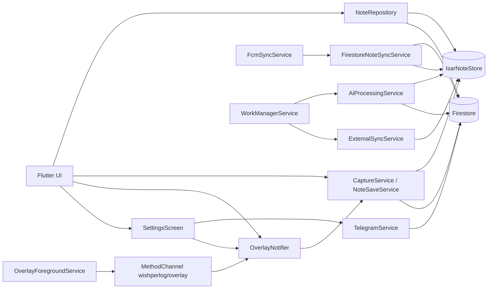

## 5. App Entrypoints

- Primary app entrypoint: [lib/main.dart](lib/main.dart)
- Native overlay service entrypoint: Android `OverlayForegroundService`
- Native intent router: Android `MainActivity`
- Background worker entrypoint: `callbackDispatcher` in [lib/core/background/work_manager_service.dart](lib/core/background/work_manager_service.dart)
- FCM background entrypoint: `firebaseMessagingBackgroundHandler` in [lib/features/sync/data/fcm_sync_service.dart](lib/features/sync/data/fcm_sync_service.dart)
- Server-side complement: [functions/index.js](functions/index.js)

## 6. Startup Sequence

The current startup sequence in [lib/main.dart](lib/main.dart) is:
1. register the FCM background handler
2. load environment values with `AppEnv.load()`
3. initialize Firebase
4. initialize dependency injection
5. hydrate `OverlayNotifier`
6. initialize Isar
7. hydrate `ThemeCubit`
8. initialize WorkManager
9. initialize local notifications and request permission when supported
10. run the app
11. drain pending native overlay notes
12. register periodic WorkManager syncs
13. start `AiProcessingService`
14. start `ConnectivitySyncCoordinator`
15. start `FirestoreNoteSyncService`
16. initialize `FcmSyncService`

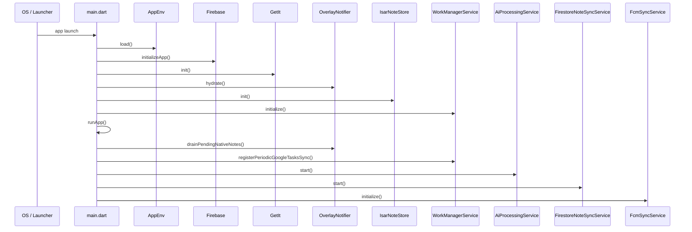

Failure handling is defensive. Most startup steps are wrapped in `try/catch` and logged without crashing, except the critical Firebase and dependency injection bootstrap.

## 7. Dependency Injection and Service Graph

Registered in [lib/core/di/injection_container.dart](lib/core/di/injection_container.dart).

Core services and repositories:
- `AppPreferencesRepository`
- `UserRepository`
- `NoteRepository`
- `SpeechToText`
- `ExternalSyncService`
- `NoteEventBus`
- `CaptureService`
- `NoteSaveService`
- `OverlayNotifier`
- `FirestoreNoteSyncService`
- `AiProcessingService`
- `FcmSyncService`
- `ConnectivitySyncCoordinator`
- `ThemeCubit`
- `TelegramService`

```mermaid
flowchart TD
  DI[GetIt container] --> Prefs[AppPreferencesRepository]
  DI --> Users[UserRepository]
  DI --> Notes[NoteRepository]
  DI --> STT[SpeechToText]
  DI --> Ext[ExternalSyncService]
  DI --> Bus[NoteEventBus]
  DI --> Capture[CaptureService]
  DI --> Save[NoteSaveService]
  DI --> Overlay[OverlayNotifier]
  DI --> Sync[FirestoreNoteSyncService]
  DI --> AI[AiProcessingService]
  DI --> FCM[FcmSyncService]
  DI --> Conn[ConnectivitySyncCoordinator]
  DI --> Theme[ThemeCubit]
  DI --> Telegram[TelegramService]
```

Notes:
- DI uses GetIt lazy singletons.
- Overlay state is communicated through `MethodChannel("wishperlog/overlay")`.
- The overlay bridge is initialized in `OverlayNotifier.hydrate()`.

## 8. Navigation Architecture

Router is defined in [lib/app/router.dart](lib/app/router.dart) using go_router.

Routes:
- `/` -> SignInScreen
- `/signin` -> SignInScreen
- `/permissions` -> PermissionsScreen
- `/telegram` -> TelegramScreen
- `/home` -> HomeScreenLayout
- `/search` -> SearchScreen
- `/notes/:noteId` -> NoteDetailScreen
- `/folder` -> FolderScreen
- `/settings` -> SettingsScreen
- `/system_banner` -> SystemBannerOverlay

Redirect policy:
- If unauthenticated and the route is not onboarding, redirect to `/`.
- If authenticated and the route is onboarding, redirect to `/home`.
- Auth check failures are logged and the router stays on the current route.

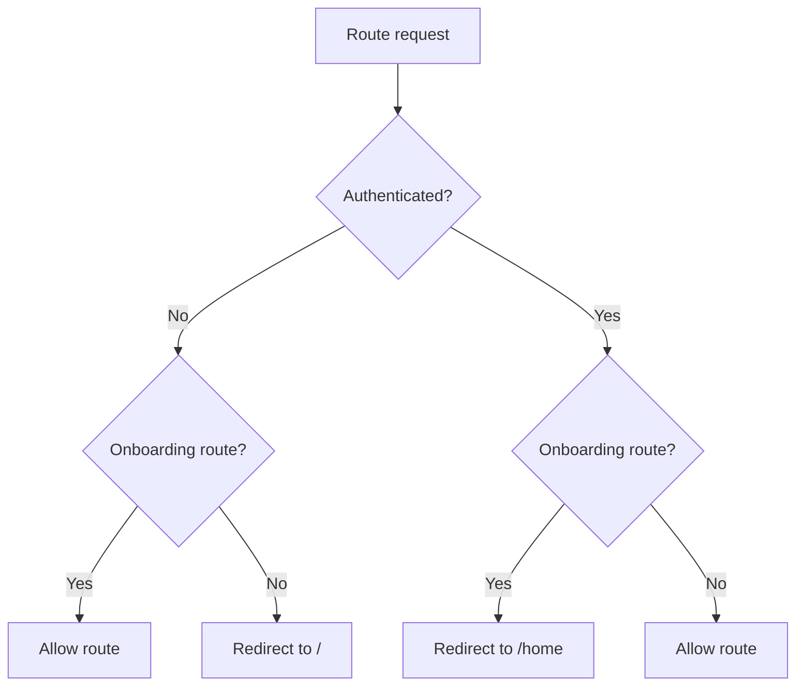

## 9. Data Architecture

### 9.1 Canonical Domain Model

Source: [lib/shared/models/note.dart](lib/shared/models/note.dart)

Key fields:
- noteId, uid
- rawTranscript, title, cleanBody
- category, priority, extractedDate
- createdAt, updatedAt
- status
- aiModel
- gcalEventId, gtaskId
- source
- syncedAt

### 9.2 Enums and Shared Values

Source: [lib/shared/models/enums.dart](lib/shared/models/enums.dart)

Current enums:
- `NoteCategory`: tasks, reminders, ideas, followUp, journal, general
- `NotePriority`: high, medium, low
- `NoteStatus`: active, archived, pendingAi, deleted
- `CaptureSource`: voiceOverlay, textOverlay, homeWritingBox, shortcutTile, notification, googleTasks, googleCalendar
- `AiProvider`: auto, gemini, groq, huggingface

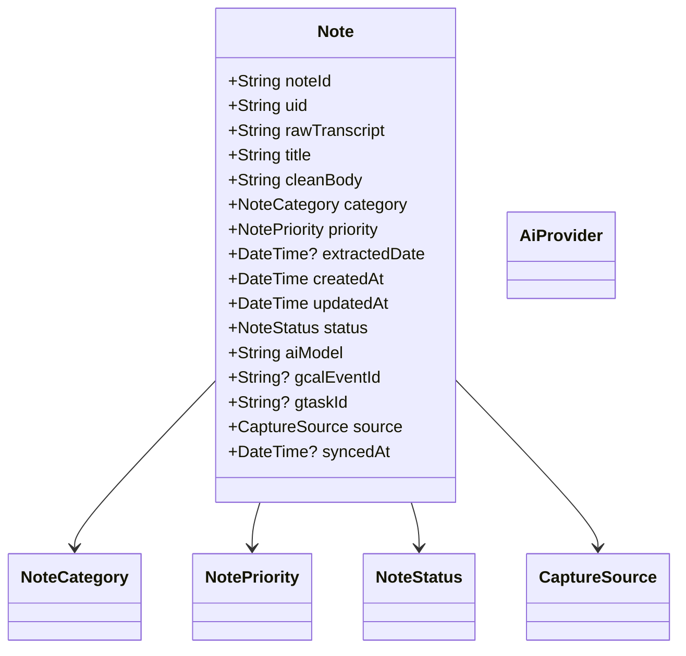

### 9.3 Local Persistence

Store: `IsarNoteStore`

Traits:
- collection-backed local note store
- unique index on `noteId`
- idempotent upserts by noteId
- reactive streams for active/all notes
- pending-AI queue queries for background work

### 9.4 Cloud Mirror

Firestore path:
`users/{uid}/notes/{noteId}`

Policy:
- local save first
- Firestore write is best-effort and merge-based
- cloud failure does not roll back local success
- remote changes are mirrored back into Isar by `FirestoreNoteSyncService`

## 10. Capture and Overlay Runtime

### 10.1 Native / Flutter Overlay Bridge

The current overlay path is centered on `OverlayNotifier` plus the native foreground service.

MethodChannel calls used by the bridge:
- Native -> Flutter: `notifyRecordingStarted`, `notifyRecordingTranscript`, `notifyRecordingStopped`, `notifyRecordingFailed`, `captureNote`, `promptMicrophonePermission`
- Flutter -> Native: `show`, `hide`, `checkPermission`, `requestPermission`, `updateIslandState`, `notifySaved`, `flushPendingNotes`

`OverlayNotifier` also routes the overlay editor action to `/system_banner`.

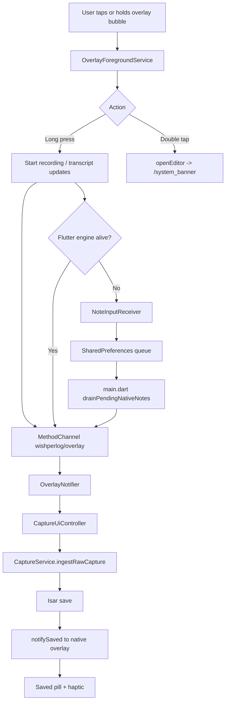

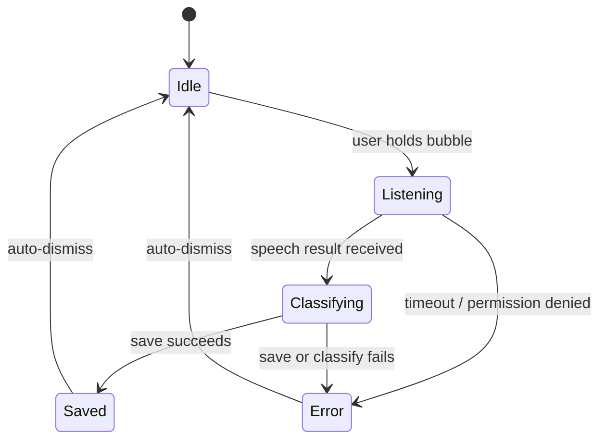

### 10.2 Capture Flow

Flow summary:
1. User enters text in the home canvas or starts dictation from the overlay bubble.
2. `CaptureService` validates the raw transcript and creates a `Note` with `status: pendingAi`.
3. The note is saved into Isar immediately.
4. `NoteEventBus` emits the save event.
5. `AiProcessingService` picks up the note asynchronously.
6. Firestore is updated as a mirror write.
7. UI feedback is shown through the top notch confirmation and overlay saved pill.

### 10.3 Fallback Chain

The native overlay is designed to survive engine death and app resume gaps.

1. Direct MethodChannel save when Flutter is alive.
2. LocalBroadcast fallback through `NoteInputReceiver`.
3. SharedPreferences queue for notes captured while the engine is dead.
4. `main.dart` drains pending native notes after launch.

This is the main reliability improvement over the older overlay docs.

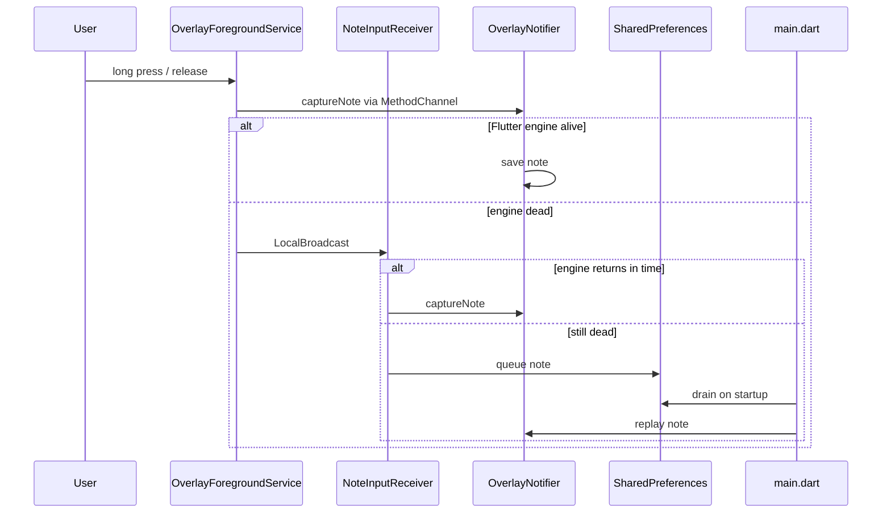

## 11. AI Enrichment and Sync

### 11.1 Event-Driven AI Enrichment

Service: [lib/features/ai/data/ai_processing_service.dart](lib/features/ai/data/ai_processing_service.dart)

Mechanics:
- On start, it sweeps pending notes once.
- It subscribes to `NoteEventBus.onNoteSaved`.
- Each note is classified by `AiClassifierRouter` / `GeminiNoteClassifier`.
- Enriched note fields are written back to Isar.
- `ExternalSyncService` runs for calendar/task linkage when appropriate.
- The enriched note is mirrored to Firestore.

Resilience:
- in-flight note guards prevent duplicate processing
- failures keep the note in `pendingAi` for retry
- connectivity restoration triggers retry work through WorkManager

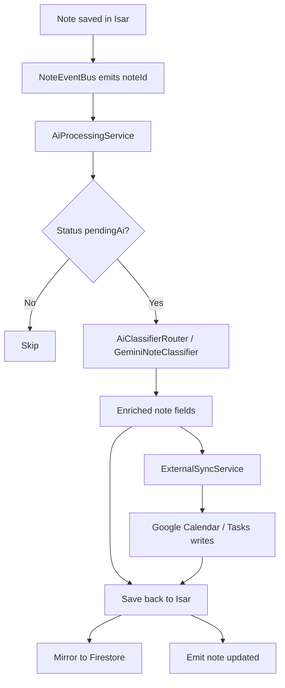

### 11.2 Cloud Mirror and Push/Pull Sync

Flow:
- Isar write happens first.
- `CaptureService` and `AiProcessingService` push merge writes to Firestore.
- `FirestoreNoteSyncService` listens for remote updates and upserts them into Isar.
- `FcmSyncService` receives push messages and triggers targeted refreshes.

Supported FCM message types:
- `note_status_changed` -> apply status from push
- `note_updated` -> sync note by id

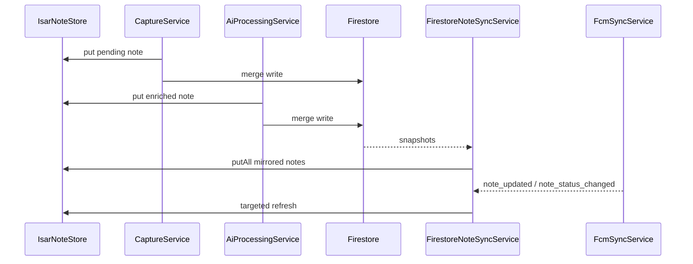

### 11.3 Background Jobs

WorkManager task names:
- `wishperlog.periodic_google_tasks_sync`
- `wishperlog.flush_pending_ai`
- `wishperlog.telegram_daily_digest`

Background jobs currently do the following:
- periodic Google Tasks sync checks for completed tasks and archives linked notes
- pending AI flush retries notes after reconnect
- Telegram digest sends a local daily summary without requiring a server bot runtime

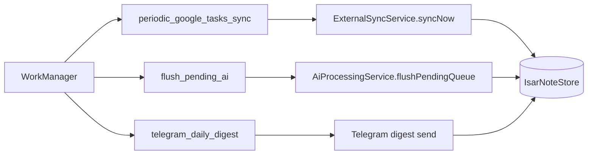

## 12. External Integrations

### 12.1 Google Calendar and Google Tasks

Service: [lib/features/sync/data/external_sync_service.dart](lib/features/sync/data/external_sync_service.dart)

Rules:
- reminder notes with an extracted date can create Calendar events
- task notes can create Google Tasks items
- resulting external IDs are written back to the note and mirrored to Firestore

### 12.2 Telegram

Service: [lib/features/sync/data/telegram_service.dart](lib/features/sync/data/telegram_service.dart)

Current behavior:
- `resolveBotUsername()` uses configured username first, then falls back to Telegram `getMe`.
- `resolveChatIdByStartToken()` polls `getUpdates` and matches exact `/start <token>` for no-backend setups.
- Bot commands are registered locally for help and digest interactions.
- The digest flow runs as a device-side WorkManager job.

Telegram command surface:
- start
- help
- status
- digest
- top
- today
- slots
- stats
- find
- agenda
- menu
- focus
- nudge
- ping

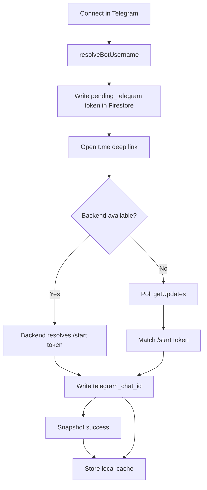

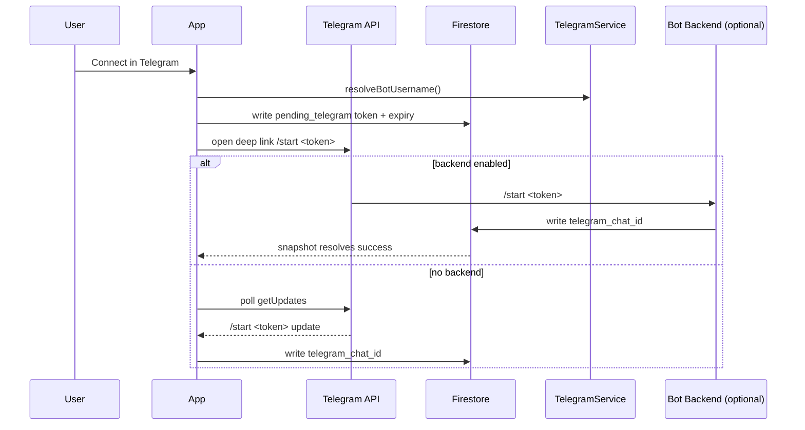

## 13. Settings and Preferences

- Theme mode is persisted through `ThemeCubit` and `AppPreferencesRepository`.
- Overlay enabled state and position are persisted by `OverlayNotifier` in SharedPreferences.
- Digest time and Telegram chat ID are tracked in Firestore through `UserRepository`.
- Notification permission and token handling are initialized during startup.

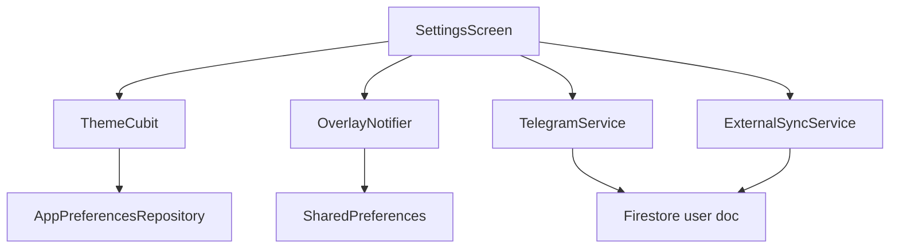

## 14. UI Architecture

### 14.1 Current UI Composition

- Home screen combines the thought canvas, folder grid, and overlay-style confirmation surfaces.
- Folder screen supports category browsing and edit actions.
- Search screen uses ranked semantic-pragmatic matching across title, body, transcript, and category.
- System banner overlay is used for quick note editing from the overlay bridge.

### 14.2 Visual Primitives

- Glass surfaces and mesh-gradient backgrounds are part of the current design system.
- The save notch is a top-center confirmation surface that stays visible for a short confirmation window.
- Overlay saved states are mirrored between Flutter UI and the native overlay pill.

## 15. Current Invariants

1. Local save must complete before any network-dependent operation.
2. `NoteEventBus` save events must fire only after local persistence succeeds.
3. Protected routes must remain inaccessible when unauthenticated.
4. Background handlers must initialize Firebase before any Firestore operation.
5. Overlay toggles should only report enabled when the native overlay is actually shown.

## 16. Operational Notes and Risks

1. Isar is the active local store; older SQLite documentation is stale.
2. The native overlay and Flutter overlay code paths are intentionally decoupled and bridged by MethodChannel.
3. Telegram no-backend fallback is effective, but a backend poller would compete for `getUpdates` if both are enabled at once.
4. The local app currently favors reliability over perfect immediate remote consistency.
5. Retry and error reporting are mostly log-based, so observability is still lightweight.

## 17. Implementation Drift That Has Been Normalized

- Overlay hydration now happens during app startup in `main.dart`.
- Pending native notes are drained after launch instead of being lost on app resume.
- Telegram linking no longer depends on a server-only flow.
- WorkManager covers Google Tasks, pending AI retries, and Telegram digest jobs.
- Firestore is treated as a mirror and sync source, not the primary local database.

## 18. Implementation Map

| Area | Primary Files | Responsibility |
|---|---|---|
| Startup | [lib/main.dart](lib/main.dart) | bootstrap, post-launch services, overlay drain |
| Routing | [lib/app/router.dart](lib/app/router.dart) | auth guards, routes, transitions |
| Capture | [lib/features/capture/data/capture_service.dart](lib/features/capture/data/capture_service.dart) | instant local save, Firestore mirror |
| AI | [lib/features/ai/data/ai_processing_service.dart](lib/features/ai/data/ai_processing_service.dart) | classification, enrichment, retries |
| Sync | [lib/features/sync/data/firestore_note_sync_service.dart](lib/features/sync/data/firestore_note_sync_service.dart) | Firestore snapshots to Isar |
| Push | [lib/features/sync/data/fcm_sync_service.dart](lib/features/sync/data/fcm_sync_service.dart) | push handling and targeted refresh |
| Background | [lib/core/background/work_manager_service.dart](lib/core/background/work_manager_service.dart) | periodic tasks, flush jobs |
| Overlay | [lib/features/overlay/overlay_notifier.dart](lib/features/overlay/overlay_notifier.dart) | bridge, state sync, native coordination |
| Telegram | [lib/features/sync/data/telegram_service.dart](lib/features/sync/data/telegram_service.dart) | bot commands, chat linking, digest |
| Preferences | [lib/features/auth/data/repositories/user_repository.dart](lib/features/auth/data/repositories/user_repository.dart) | user profile and chat ID persistence |
| Model | [lib/shared/models/note.dart](lib/shared/models/note.dart) | note schema |
| Enums | [lib/shared/models/enums.dart](lib/shared/models/enums.dart) | canonical values |

## 19. Tech Stack Reference

**Frontend**: Flutter, Material Design 3, GoRouter, BLoC
**State**: GetIt, Streams, ValueNotifier
**Storage**: Isar, Firestore
**AI**: Google Gemini, optional fallback providers
**Platform**: overlay window, speech-to-text, permission handling
**Background**: connectivity_plus, workmanager, notifications

## 20. Summary

WhisperLog now has a single runtime model:
- capture locally first
- enrich asynchronously
- mirror to Firestore
- sync back from cloud events when needed
- keep overlay, Telegram, and background jobs resilient across app lifecycle boundaries
