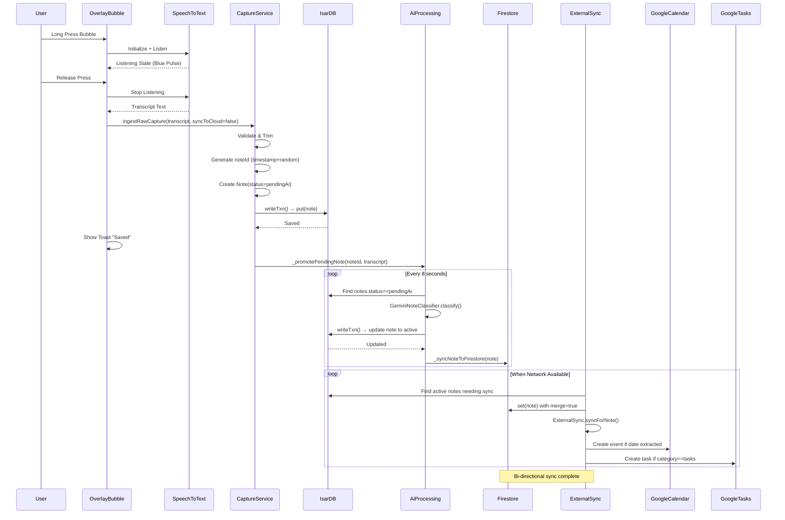
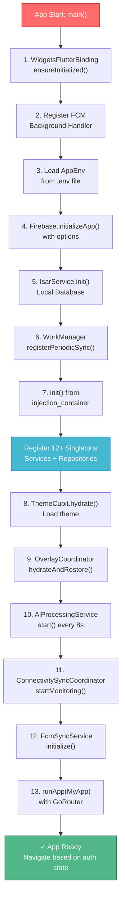
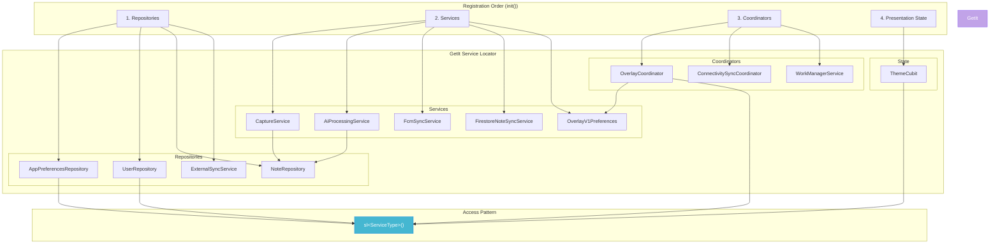
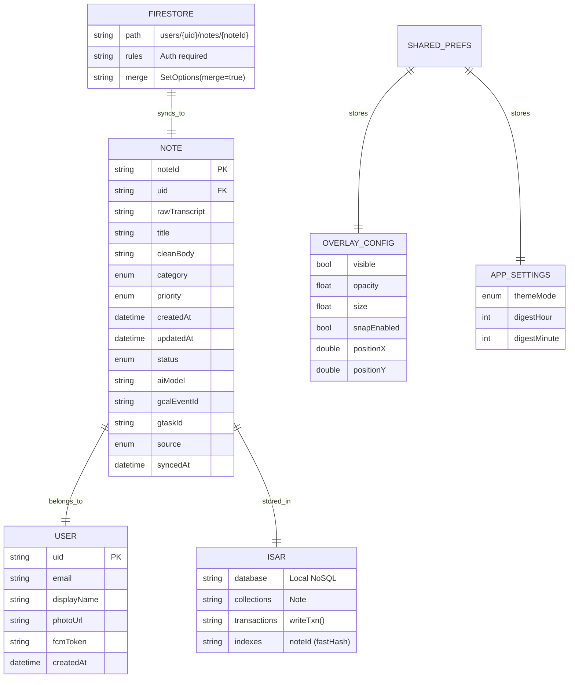
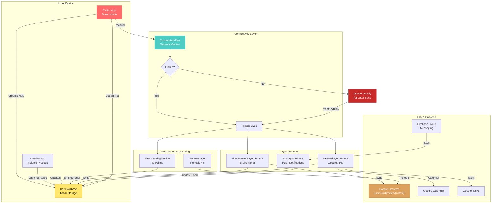
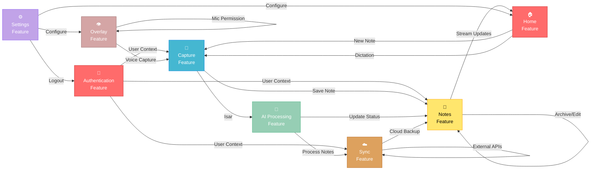
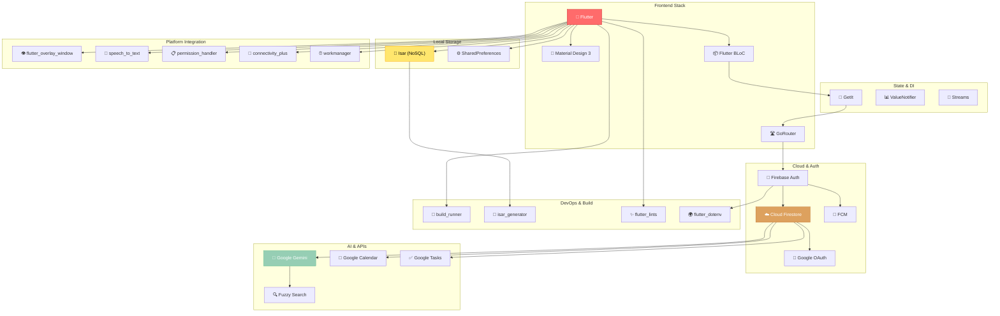

# WhisperLog System Architecture - Mermaid Diagrams

## 1. Complete System Architecture

```mermaid
graph TB
    subgraph "Presentation Layer"
        SignInScreen["SignIn Screen<br/>Google OAuth"]
        HomeScreen["Home Screen<br/>Thought Canvas"]
        FolderScreen["Folder Screen<br/>Category View"]
        SettingsScreen["Settings Screen<br/>Overlay Toggle"]
        OverlayBubble["Overlay Bubble<br/>Voice Capture"]
    end

    subgraph "State Management"
        ThemeCubit["Theme Cubit<br/>Light/Dark/System"]
        GoRouter["GoRouter<br/>Navigation"]
        OverlayCoord["OverlayCoordinator<br/>State+Config"]
    end

    subgraph "Feature Layer"
        CaptureService["CaptureService<br/>Note Ingestion"]
        NoteRepo["NoteRepository<br/>CRUD + Streams"]
        UserRepo["UserRepository<br/>Auth + User"]
        AiService["AiProcessingService<br/>Background AI"]
        ExternalSync["ExternalSyncService<br/>Google Services"]
        FirestoreSync["FirestoreNoteSyncService<br/>Cloud Sync"]
        FcmService["FcmSyncService<br/>Push Notifications"]
    end

    subgraph "Domain Models"
        NoteModel["Note Model<br/>Isar Collection"]
        Enums["Enums<br/>Category/Priority/Status"]
        UserModel["User Model"]
    end

    subgraph "Data Persistence"
        IsarDB["Isar Database<br/>Local NoSQL<br/>Thread-Safe"]
        SharedPrefs["SharedPreferences<br/>Settings + Overlay"]
    end

    subgraph "External Services"
        Firebase["Firebase<br/>Auth + Firestore"]
        Gemini["Google Gemini<br/>AI Classification"]
        GoogleCalendar["Google Calendar<br/>Event Sync"]
        GoogleTasks["Google Tasks<br/>Task Sync"]
        FCM["Firebase Cloud<br/>Messaging"]
    end

    subgraph "Platform Layer"
        OverlayWindow["flutter_overlay_window<br/>Android Overlay"]
        SpeechToText["speech_to_text<br/>Voice Recognition"]
        PermHandler["permission_handler<br/>Runtime Perms"]
        Connectivity["connectivity_plus<br/>Network State"]
        WorkManager["workmanager<br/>Background Jobs"]
    end

    subgraph "Core Infrastructure"
        DIContainer["GetIt<br/>Dependency Injection"]
        AppEnv["AppEnv<br/>Config + Env Vars"]
        WorkService["WorkManagerService<br/>Task Scheduling"]
        ConnectivityCoord["ConnectivitySyncCoordinator<br/>Network Triggers"]
    end

    %% Presentation to State
    SignInScreen --> GoRouter
    HomeScreen --> GoRouter
    FolderScreen --> GoRouter
    SettingsScreen --> GoRouter
    OverlayBubble --> GoRouter
    
    %% State to Features
    GoRouter --> ThemeCubit
    GoRouter --> OverlayCoord
    ThemeCubit --> SharedPrefs
    OverlayCoord --> OverlayCoord
    
    %% Screens to Features
    SignInScreen --> UserRepo
    HomeScreen --> CaptureService
    HomeScreen --> NoteRepo
    FolderScreen --> NoteRepo
    SettingsScreen --> OverlayCoord
    OverlayBubble --> CaptureService
    OverlayBubble --> SpeechToText
    
    %% Features to Models
    CaptureService --> NoteModel
    NoteRepo --> NoteModel
    UserRepo --> UserModel
    
    %% Features to Persistence
    CaptureService --> IsarDB
    NoteRepo --> IsarDB
    AiService --> IsarDB
    FirestoreSync --> IsarDB
    UserRepo --> Firebase
    
    %% Features to External
    AiService --> Gemini
    ExternalSync --> GoogleCalendar
    ExternalSync --> GoogleTasks
    FirestoreSync --> Firebase
    FcmService --> FCM
    UserRepo --> Firebase
    
    %% Platform Integration
    OverlayBubble --> OverlayWindow
    OverlayBubble --> SpeechToText
    OverlayBubble --> PermHandler
    CaptureService --> PermHandler
    Connectivity --> ConnectivityCoord
    WorkManager --> WorkService
    
    %% Core Infrastructure
    DIContainer --> CaptureService
    DIContainer --> NoteRepo
    DIContainer --> UserRepo
    DIContainer --> AiService
    DIContainer --> ExternalSync
    DIContainer --> FirestoreSync
    DIContainer --> FcmService
    AppEnv --> Firebase
    WorkService --> AiService
    ConnectivityCoord --> FirestoreSync
    
    %% Styling
    classDef presentation fill:#FF6B6B,stroke:#C92A2A,color:#fff
    classDef state fill:#4ECDC4,stroke:#1B998B,color:#fff
    classDef feature fill:#45B7D1,stroke:#0984E3,color:#fff
    classDef domain fill:#96CEB4,stroke:#52B788,color:#fff
    classDef persistence fill:#FFE66D,stroke:#FFA502,color:#000
    classDef external fill:#DDA15E,stroke:#BC6C25,color:#fff
    classDef platform fill:#D4A5A5,stroke:#9A6C6C,color:#fff
    classDef core fill:#C1A3E8,stroke:#8B5CF6,color:#fff
    
    class SignInScreen,HomeScreen,FolderScreen,SettingsScreen,OverlayBubble presentation
    class ThemeCubit,GoRouter,OverlayCoord state
    class CaptureService,NoteRepo,UserRepo,AiService,ExternalSync,FirestoreSync,FcmService feature
    class NoteModel,Enums,UserModel domain
    class IsarDB,SharedPrefs persistence
    class Firebase,Gemini,GoogleCalendar,GoogleTasks,FCM external
    class OverlayWindow,SpeechToText,PermHandler,Connectivity,WorkManager platform
    class DIContainer,AppEnv,WorkService,ConnectivityCoord core
```



---

## 2. Data Flow: Voice Capture to Cloud Sync



---

## 3. Application Initialization Flow



---

## 4. Overlay Window Lifecycle (Android)

```mermaid
stateDiagram-v2
    [*] --> Requesting: User toggles<br/>Floating Capture ON
    
    Requesting --> FlutterOverlayWin: Call requestPermission()
    FlutterOverlayWin --> Fallback: If fails after 300ms×15
    Fallback --> PermHandler: Permission.systemAlertWindow<br/>.request()
    
    PermHandler --> GrantedCheck: Poll isPermissionGranted()
    GrantedCheck --> System{OS says<br/>Granted?}
    System -->|No| Denied
    System -->|Yes| SettingPrefs: Save to SharedPrefs
    
    SettingPrefs --> ShowWindow: Call showOverlay()
    ShowWindow --> Bubble: Render OverlayBubbleWidget<br/>in isolate
    
    Bubble --> Idle: Idle state<br/>56dp circle
    
    Idle --> Dragging: Pan gesture
    Dragging --> EdgeSnap: Release on edge
    EdgeSnap --> Idle: Snap to edge<br/>if enabled
    
    Idle --> Listening: Long press start
    Listening --> Speaking: Recording voice
    Speaking --> Processing: Long press end
    Processing --> TextBack: Save to Isar
    TextBack --> Idle: Return to idle
    
    Idle --> TextPanel: Tap/Double-tap
    TextPanel --> TextInput: Show text field
    TextInput --> SaveText: Hit Save
    SaveText --> Idle
    
    Idle --> Disabled: User toggles OFF
    Disabled --> HideWindow: Call hideOverlay()
    HideWindow --> ClearPrefs: Clear visible=false
    ClearPrefs --> [*]
    
    Denied --> [*]
    
    style Bubble fill:#FF6B6B,stroke:#C92A2A,color:#fff
    style Idle fill:#4ECDC4,stroke:#1B998B,color:#fff
    style Listening fill:#45B7D1,stroke:#0984E3,color:#fff
    style TextPanel fill:#FFE66D,stroke:#FFA502,color:#000
```

---

## 5. Note Processing Pipeline

```mermaid
graph LR
    subgraph "Capture Phase"
        Voice["Voice/Text Input"]
        Validate["Validate & Trim"]
        Create["Create Note<br/>status=pendingAi"]
        SaveLocal["Save to Isar"]
    end
    
    subgraph "AI Phase"
        Queue["Queue for AI"]
        Poll["8s Polling Loop"]
        Classify["Gemini<br/>Classify"]
        Extract["Extract:<br/>Title, Category,<br/>Priority, Date"]
        UpdateNote["Update Note<br/>status=active"]
    end
    
    subgraph "Sync Phase"
        SaveCloud["Save to Firestore"]
        ExtSync["External Sync"]
        Calendar["→ Google Calendar"]
        Tasks["→ Google Tasks"]
    end
    
    subgraph "Display Phase"
        FindNote["Find in Isar"]
        WatchStream["Stream to Folder"]
        ShowUI["Display in<br/>Category List"]
    end
    
    Voice --> Validate
    Validate -->|Empty?| Discard["❌ Discard"]
    Validate -->|Valid| Create
    Create --> SaveLocal
    SaveLocal --> Queue
    
    Queue --> Poll
    Poll --> Classify
    Classify --> Extract
    Extract --> UpdateNote
    UpdateNote --> SaveCloud
    
    SaveCloud --> ExtSync
    ExtSync -->|has date| Calendar
    ExtSync -->|category=tasks| Tasks
    
    UpdateNote --> FindNote
    FindNote --> WatchStream
    WatchStream --> ShowUI
    
    style Voice fill:#FF6B6B,stroke:#C92A2A,color:#fff
    style SaveLocal fill:#FFE66D,stroke:#FFA502,color:#000
    style Classify fill:#45B7D1,stroke:#0984E3,color:#fff
    style ShowUI fill:#52B788,stroke:#2B6A4F,color:#fff
    style Discard fill:#999,stroke:#666,color:#fff
```



---

## 6. State & Dependency Injection



---

## 7. Database Schema & Relationships



---

## 8. Network & Sync Architecture



---

## 9. Feature Dependency Graph



---

## 10. Tools & Technologies Summary



---

## Diagram Notes

- **Color Legend**:
  - 🔴 Red: UI/Presentation
  - 🔵 Blue: Features/Services
  - 🟡 Yellow: Storage
  - 🌴 Green: External APIs
  - 🟣 Purple: Infrastructure

- **Architecture Pattern**: Clean Architecture + BLoC
- **Data Flow**: Local-first → Queue for AI → Cloud backup
- **Sync Strategy**: Network-triggered with exponential backoff
- **Error Handling**: Graceful degradation with detailed logging
