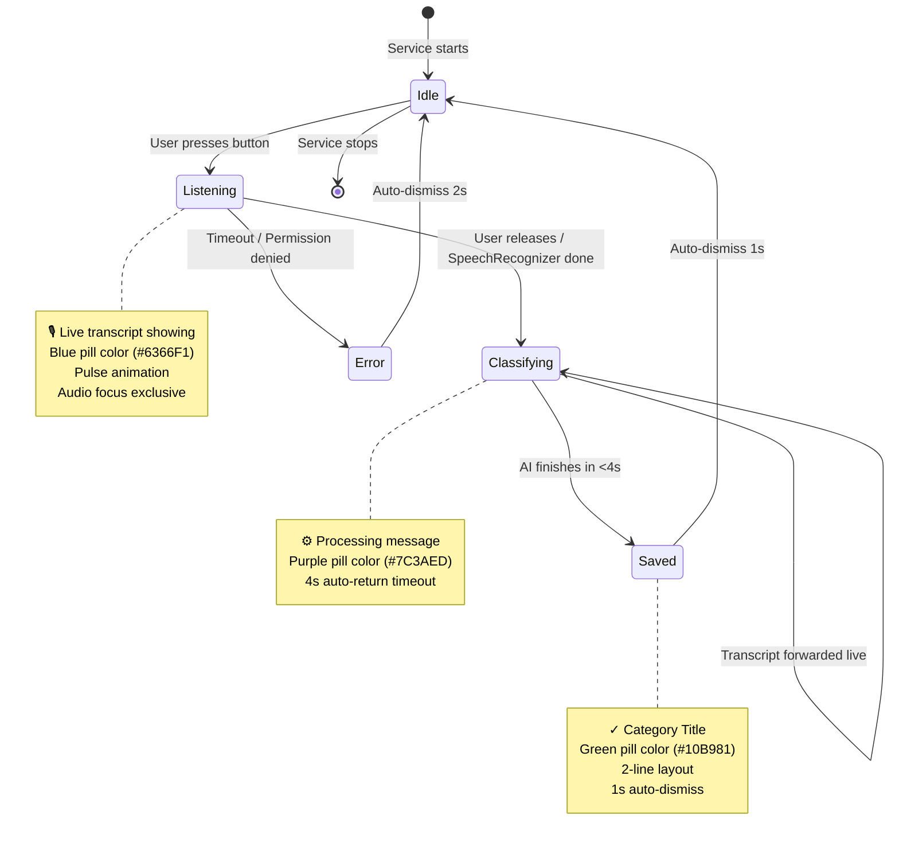
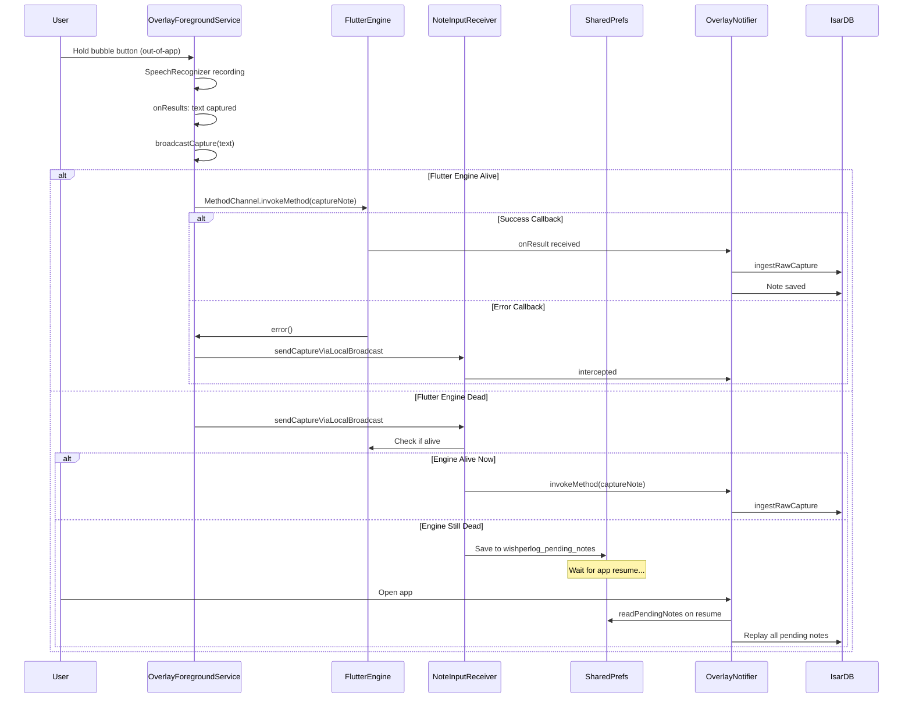
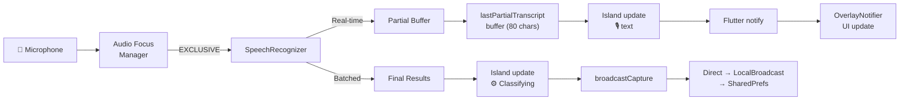
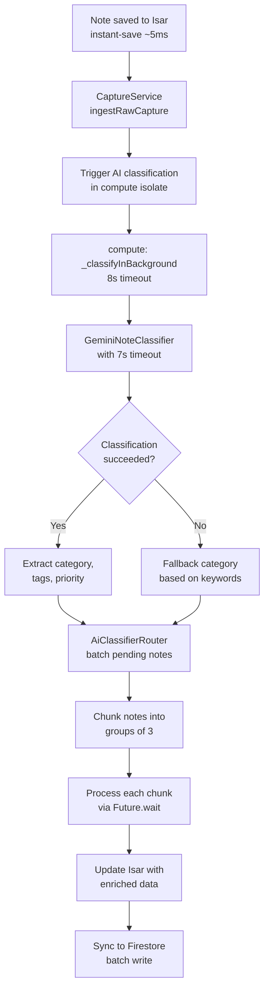

# WishperLog Overlay Architecture & Flow

## System Overview

The overlay system consists of three key layers working in concert:

1. **Native Android Overlay** - Floating UI, voice capture, dynamic island
2. **Flutter Bridge** - State management, note persistence, AI processing
3. **Cloud Sync** - Firestore sync, analytics, background processing

## Key Components

### Native Layer (Kotlin)
- `OverlayForegroundService` - Main overlay management service
- `NoteInputReceiver` - LocalBroadcast receiver for out-of-app fallback  
- `MainActivity` - MethodChannel bridge to Flutter
- Audio Focus Manager - Exclusive audio capture for voice recording

### Flutter Layer  (Dart)
- `OverlayNotifier` - State holder, MethodChannel listener, UI coordination
- `CaptureService` - Instant-save note ingestion (~5ms)
- `AiProcessingService` - Background AI enrichment (3 concurrent max)
- `IsarNoteStore` - Local persistence with Completer-based initialization
- `CaptureUiController` - State broadcasting for UI updates

### Dynamic Island States
- **Idle**: Hidden/gone
- **Listening**: Blue pill, animated waveform, showing transcript  
- **Classifying**: Purple pill, rotation spinner, processing message
- **Saved**: Green pill, category + title, auto-dismiss in 1s
- **Error**: Red pill, error message, auto-dismiss in 2s

---

## Voice Capture Flow (Out-of-App)

```mermaid
flowchart TD
    A["User holds floating button<br/>(out of app)"] --> B["OverlayForegroundService<br/>startVoiceCapture"]
    B --> C["Check RECORD_AUDIO<br/>permission"]
    C -->|Denied| C1["Show 🔒 Permission<br/>Dismiss in 2s"]
    C -->|Granted| D["Request Audio Focus<br/>AUDIOFOCUS_GAIN_EXCLUSIVE"]
    D --> E["Create SpeechRecognizer<br/>with RecognitionListener"]
    E --> F["startListening Intent<br/>PARTIAL_RESULTS=true"]
    F --> G["Show 🎙 Listening...<br/>blue pill animates"]
    
    G --> H{Audio input<br/>received?}
    H -->|No| I["10s timeout fires<br/>Force stopListeningCalled"]
    H -->|Yes| J["onPartialResults<br/>callback fires"]
    
    J --> K["Update island text<br/>showPersistentIsland<br/>🎙 transcript"]
    K --> L["Forward to Flutter<br/>notifyRecordingTranscript<br/>MethodChannel"]
    L --> M{User released<br/>button?}
    M -->|No| J
    M -->|Yes| N["stopVoiceCapture<br/>stopListeningCalled=true"]
    
    N --> O["Release Audio Focus"]
    O --> P["Wait for onResults<br/>or onError"]
    
    P --> Q{Did we get<br/>results?}
    Q -->|Yes| Q1["onResults callback<br/>extract text from bundle"]
    Q -->|Salvage| Q2["onError w ERROR_NO_MATCH<br/>Use lastPartialTranscript"]
    Q -->|No| Q3["onError w other code<br/>Dismiss island, fail"]
    
    Q1 --> R["Show ⚙ Classifying...<br/>purple pill"]
    Q2 --> R
    R --> S["broadcastCapture<br/>text, SOURCE_VOICE"]
    
    S --> T{Flutter engine<br/>alive?}
    T -->|Yes| T1["Direct MethodChannel call<br/>captureNote"]
    T -->|No| T2["sendCaptureViaLocalBroadcast<br/>LocalBroadcastManager"]
    
    T1 --> T1A{Call succeeded?}
    T1A -->|Yes| U["Note received &<br/>saved in Flutter"]
    T1A -->|No/Error| T2
    
    T2 --> T2A["NoteInputReceiver<br/>receives broadcast"]
    T2A --> T2B{Engine alive<br/>now?}
    T2B -->|Yes| T2B1["invokeMethod<br/>captureNote"]
    T2B -->|No| T2B2["Save to SharedPrefs<br/>wishperlog_pending_notes"]
    
    T2B1 --> U
    T2B2 --> T2B2A["MainActivity.onResume<br/>calls drainPendingNotes"]
    T2B2A --> T2B2B["Read SharedPrefs<br/>replay all pending"]
    T2B2B --> U
    
    U --> V["CaptureService.ingestRawCapture<br/>instant-save ~5ms"]
    V --> W["Show ✓ Category<br/>Title pill (2-line)"]
    W --> X["Start AI classification<br/>in compute isolate<br/>8s timeout"]
    X --> Y["AiProcessingService<br/>sweep pending notes<br/>3 concurrent chunks"]
    Y --> Z["Notes enriched &<br/>synced to Firestore"]
    Z --> Z1["scheduleIslandDismiss<br/>1000ms"]
    Z1 --> Z2["Smooth fade-out<br/>animation"]
    Z2 --> Z3["removeIslandNow<br/>Clear WindowManager"]
```

---

## Island State Machine

---

## Fallback Chain for Out-of-App Recording

The system implements a robust fallback chain to capture notes even when the app is backgrounded:

---

## Audio Capture Pipeline

---

## AI Processing Pipeline

---

## MethodChannel Contract

### bidirectional communication between Native and Flutter

#### Native → Flutter (from OverlayForegroundService)
- `notifyRecordingStarted` - Recording started, show recording UI
- `notifyRecordingTranscript(text)` - Live transcript update
- `notifyRecordingStopped` - Recording finished
- `notifyRecordingFailed` - Recording failed/error
- `captureNote(text, source)` - Captured note (from Receiver)
- `promptMicrophonePermission` - Request mic permission

#### Flutter → Native (from OverlayNotifier)
- `show` - Show overlay bubble
- `hide` - Hide overlay bubble  
- `checkPermission` - Check overlay permission
- `requestPermission` - Request overlay permission
- `updateIslandState(state, message)` - Update island display
- `notifySaved(title, category, collection)` - Show saved pill
- `drainPendingNotes` - Replay saved notes from SharedPrefs

---

## Responsiveness & Timeouts

| Component | Timeout | Purpose |
|-----------|---------|---------|
| SpeechRecognizer | 10s hard limit | Prevent infinite listening |
| AI Classification | 7s Gemini API | Prevent hanging classifiers |
| Processing Auto-Return | 4s | Show saved state if AI slow |
| Compute Isolate | 8s | Background task safety |
| Island Dismiss (Normal) | 1s | Quick auto-clear |
| Island Dismiss (Error) | 2s | Give user time to read |
| Audio Focus Request | Immediate | Critical for overlay |

---

## Key Optimizations

1. **Instant-Save** (~5ms): Note written to Isar immediately, AI runs async
2. **Audio Focus Exclusive**: Prevents system from playing other audio during recording
3. **Parallel AI Processing**: 3 concurrent notes max, chunked via Future.wait
4. **Fallback Chain**: Direct → LocalBroadcast → SharedPrefs → Drain on Resume
5. **Completer-Based Init**: IsarNoteStore init with proper cancellation
6. **Partial Transcript Salvage**: Recovers text even on ERROR_NO_MATCH
7. **Fixed Island Width**: 340dp consistent across devices
8. **Animation-Free Unsafe Changes**: Instant rendering for modal-class interactions

---

## Design Principles

### **Immersive Experience**
- Island feels part of the system, not stuck
- Smooth transitions (fade-in/out animations)
- Premium gradient backgrounds with accent glows  
- Responsive feedback to every action

### **Reliability**
- Multiple fallback paths for message delivery
- SharedPrefs backup when engine dead
- Error salvaging for partial transcripts
- No silent failures - always logged

### **Performance**
- <10ms overlay operations
- Async AI processing doesn't block UI
- Proper audio focus prevents system lag
- Fixed-size island for predictable layout

### **User Control**
- Quick 1s dismiss for clutter-free experience
- Always shows status (Listening → Classifying → Saved)
- Live transcript while recording
- Clear visual feedback on errors
