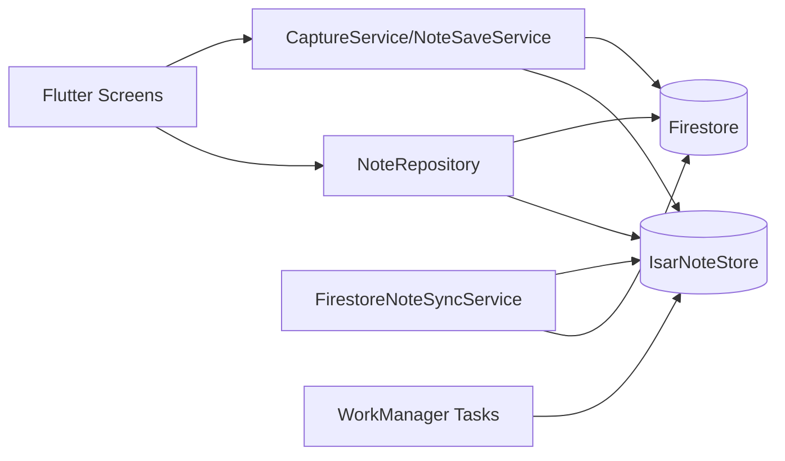
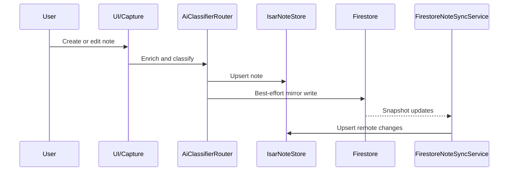

# WhisperLog

**Local-first voice and text capture app with AI-powered categorization, real-time cloud sync, and Android overlay window for seamless note-taking.**

[](https://flutter.dev)
[](#license)
[](https://dart.dev)

---

## Features

Note: local data now runs Isar-first for both reads and writes, while Firestore remains an asynchronous cloud mirror and cross-device sync source.

### 📝 Note Capture
- **Voice Capture**: Long-press Android floating bubble for instant voice-to-text capture
- **Text Input**: Write directly in the app's thought canvas or overlay text panel
- **Offline-First**: Save instantly to local Isar store—no internet required
- **Real-Time Sync**: Notes automatically sync to Firestore when network available

### 🤖 AI-Powered Classification
- **Gemini Integration**: Automatic title extraction and note categorization
- **6 Smart Categories**: Tasks, Reminders, Ideas, Follow-ups, Journal, General
- **Priority Inference**: High/Medium/Low priority auto-detected
- **Date Extraction**: Automatic calendar date/time parsing from note content
- **Event-Driven Architecture**: AI processing and cloud sync trigger instantly and asynchronously upon local save, preserving battery life and eliminating polling.

### 📂 Organization & Search
- **Smart Folders**: Browse notes by category with real-time count badges
- **Semantic + Pragmatic Search**: Ranked matching across title/body/raw text/category with token intent expansion
- **Edit & Update**: Modify notes inline with Firestore sync
- **Status Tracking**: Active, Pending AI, or Archived states

### ☁️ Cloud Synchronization
- **Firestore Integration**: Cloud backup and multi-device sync
- **FCM Push Notifications**: Real-time push triggers from other devices
- **Bi-directional Sync**: Changes on any device instantly reflect everywhere
- **Conflict Resolution**: Automatic merge with server-side timestamps

### 🔗 External Integrations
- **Google Calendar**: Auto-create calendar events from dated notes
- **Google Tasks**: Sync task-category notes to Google Tasks
- **Telegram Daily Digest**: Client-side scheduled WorkManager task delivers a 9 AM summary locally (No paid cloud functions required).

### 🎨 User Experience
- **Theme Support**: Light/Dark/System theme with persistent preference
- **Glass UI**: Modern glassmorphic design using Material Design 3
- **Gentle Save Notch**: Top-center confirmation notch (`60vw`, `5-20vh`) stays visible for ~2.6s
- **Android Overlay**: Floating bubble managed by native overlay service + `OverlayNotifier` state sync
- **Permission Handling**: Graceful flows for microphone and overlay permissions

---

## Quick Start

### Prerequisites
- Flutter SDK 3.11.4+
- Dart 3.11+
- Android SDK 31+ or Xcode 13+
- Firebase project with Firestore + Authentication enabled

### Setup Steps

1. **Clone & Install**
   ```bash
   git clone <repo>
   cd wishperlog
   flutter pub get
   ```

2. **Configure Environment**
   ```bash
   cp .env.example .env
   # Edit .env with your credentials:
   # - GOOGLE_GEMINI_API_KEY
   # - TELEGRAM_BOT_USERNAME (optional)
   ```

3. **Firebase Setup**
   - Create Firebase project at console.firebase.google.com
   - Enable Google authentication and Firestore
   - Download google-services.json → android/app/
   - Configure iOS via Firebase Console

4. **Code Generation**
   ```bash
   flutter pub run build_runner build
   ```

5. **Run**
   ```bash
   flutter run
   ```

---

## Architecture

WhisperLog follows **Clean Architecture** with layers for Presentation, Features, and Data. See [ARCHITECTURE.md](ARCHITECTURE.md) for:
- Complete system diagrams (Mermaid)
- Database schemas and storage topology (Isar + Firestore)
- Data pipeline flows
- Service descriptions
- 30-item tech stack reference

Overlay rollout details and current implementation status are tracked in [OVERLAY_INTEGRATION_PLAN.md](OVERLAY_INTEGRATION_PLAN.md).

## UX Audit Implementation

WhisperLog UI is now implemented from the dual-mode audit (`whisperlog_ux_audit_dual_mode.html`) as a production token-driven component architecture.

### Design System Layers

1. **Theme Tokens (`lib/core/theme/`)**
- `app_colors.dart`: dual-mode semantic color tokens via `ThemeExtension`.
- `app_typography.dart`: audit typography roles mapped to reusable Flutter `TextStyle` contracts.
- `app_theme.dart`: light/dark `ThemeData` with semantic `ColorScheme` mapping.

2. **Layout Primitives (`lib/shared/widgets/layout/`)**
- `glass_card.dart`: reusable translucent/blur surface.
- `responsive_grid.dart`: adaptive grid abstraction for `.g2/.g3/.g6` style layouts.

3. **Atomic Components (`lib/shared/widgets/atoms/`)**
- `status_dot.dart`: status indicator atom.
- `waveform_bars.dart`: recording waveform atom.
- `shimmer_layer.dart`: processing shimmer atom.
- `category_badge.dart`: category pill atom.

4. **Molecules + Organisms**
- `dynamic_notch_pill.dart`: state-driven notch molecule.
- `thought_canvas.dart`: top capture organism.
- `folder_grid_view.dart`: category-folder organism.
- `home_screen_layout.dart`: composed home surface.

### Capture UX State Machine (UI-Only Mock)

Under `lib/features/capture/presentation/state/`:

1. `capture_state.dart` defines `idle`, `recording`, `processing`, `saved`.
2. `capture_ui_controller.dart` manages deterministic transitions and mock timing.

Flow contract:

1. `idle -> recording` on hold gesture.
2. `recording -> processing` after release/manual stop.
3. `processing -> saved` after 2-second mock AI delay.
4. `saved -> idle` after 1.5-second confirmation window.

This keeps UI behavior deterministic while backend wiring (Isar/Firestore/AI orchestration) remains decoupled.

## UI Structure

Current high-level home composition:

1. Mesh-gradient atmospheric background.
2. Thought Canvas (35vh glass card) with borderless multiline input.
3. Dynamic Notch Pill pinned bottom-left in the canvas.
4. Folder Grid with six semantic categories and mock active-note counts.

### Notch State Rendering

1. **Idle**: compact pill, neutral status dot, helper text.
2. **Recording**: expanded pill, pulsing status dot + waveform bars.
3. **Processing**: medium pill with shimmer + Gemini sublabel.
4. **Saved**: confirmation pill with parsed title + category badge.

All transitions use implicit animations (`AnimatedContainer`, `AnimatedSize`, `AnimatedSwitcher`) for smooth state morphing and non-jarring content swaps.

---

## Data Pipeline

### Current Runtime Architecture





### Save Flow (Local-First, Async Cloud)
1. User enters text/voice in Home Canvas or overlay bubble
2. CaptureService validates and creates Note with `status: pendingAi`
3. Note saved to **Isar local store** instantly (< 50ms)
4. User sees a top-center glass notch confirmation for ~2.6s
5. Background: event-driven AI orchestration invokes Gemini classification per newly saved note and updates status to `active`
6. Background: FirestoreNoteSyncService → pushes to `users/{uid}/notes/{noteId}`

**Guarantee**: Notes save instantly locally even if Firebase is offline.

### View & Search
- **Home Screen**: StreamBuilder on category counts (real-time updates)
- **Folder Screen**: StreamBuilder on filtered notes by category
- **Search**: Glassmorphic full-screen search with ranked semantic-pragmatic matching across title + cleanBody + raw transcript + category

### Edit & Sync
- Modify note fields → NoteRepository.updateEditedNote()
- Isar transaction updates locally
- Firestore sync with `merge: true` (server timestamp conflict resolution)

---

## Project Structure

```
lib/
├── main.dart                    # App startup with 13-step init sequence
├── app/router.dart              # GoRouter with auth-based navigation
├── core/                        # DI, storage, config, themes
├── features/                    # Modular feature packages
│   ├── auth/                    # Google Sign-In & UserRepository
│   ├── capture/                 # CaptureService for ingestion
│   ├── notes/                   # NoteRepository & CRUD
│   ├── home/                    # HomeScreen with writing box
│   ├── folder/                  # FolderScreen (category view)
│   ├── overlay/                 # Overlay coordinator, communication service, preferences, floating UI
│   ├── ai/                      # AiProcessingService & Gemini
│   └── sync/                    # Firestore, FCM, ExternalSync services
└── shared/                      # Models, enums, reusable widgets
```

---

## Key Services

| Service | Purpose |
|---------|---------|
| **CaptureService** | Ingest raw transcripts → create Note objects |
| **NoteRepository** | Central CRUD interface for all note operations |
| **AiProcessingService** | Event-driven Gemini classify → set to active |
| **FirestoreNoteSyncService** | Bi-directional sync with conflict resolution |
| **OverlayNotifier** | Overlay toggle/position state management and native bridge orchestration |
| **OverlayForegroundService (Android)** | System-level floating capture bubble and quick-capture interactions |
| **ExternalSyncService** | Google Calendar/Tasks event creation |
| **FcmSyncService** | FCM token registration & message handling |

---

## Tech Stack

**Frontend**: Flutter 3.11.4 • Material Design 3 • GoRouter • BLoC  
**State**: GetIt • Streams • ValueNotifier  
**Storage**: Isar (local primary) • Firestore (cloud mirror)  
**AI**: Google Gemini • Google Calendar/Tasks APIs  
**Platform**: flutter_overlay_window • speech_to_text • permission_handler  
**Utilities**: connectivity_plus • workmanager • flutter_dotenv  

See [ARCHITECTURE.md](ARCHITECTURE.md#tech-stack) for 30-item detailed reference.

---

## Troubleshooting

**"Unable to save note" error**: Check logs for `[CaptureService]` errors. Restart app to reinitialize. See [issues.md](issues.md) for debugging.

**Overlay not showing**: Grant "Display over other apps" permission in Android Settings.

**FCM not working**: Verify google-services.json is in android/app/ and Firebase project is properly configured.

**Notes not syncing**: Check internet connection. Ensure Firebase auth is initialized (check logs).

---

## Contributing

PRs welcome! Before submitting:
1. `flutter analyze` (zero issues)
2. `dart format lib/`
3. Test on Android device + simulator
4. Describe changes in PR

---

## License

MIT License. See LICENSE file.

---

**Made with ❤️ for seamless note-taking.**
