# WishperLog — Complete Project Documentation
**Generated from source audit · 97 files · 23 078 lines · April 2026**

---

## Table of Contents
1. [Project Overview & Value Proposition](#1-project-overview--value-proposition)
2. [Audit Report — Bugs & Fixes](#2-audit-report--bugs--fixes)
3. [System Architecture](#3-system-architecture)
4. [Database Schema](#4-database-schema)
5. [Application Map](#5-application-map)
6. [Visual Architecture — Mermaid Diagrams](#6-visual-architecture--mermaid-diagrams)

---

## 1. Project Overview & Value Proposition

### What is WishperLog?

WishperLog is an **AI-powered ambient thought-capture system** for Android, built with Flutter. Its core promise is zero-friction capture: a persistent floating overlay bubble lives on top of every other app, letting users speak or type a raw thought in seconds without ever switching context. A background Dart isolate classifies, titles, and prioritizes the thought using Gemini (primary) or Groq (fallback) — entirely invisibly.

The user's mental output is always captured, always organized, and always available — both in the app and delivered to their Telegram chat on a user-configured schedule.

### Core Capabilities

| Capability | Mechanism |
|---|---|
| Always-on voice/text capture | Android foreground overlay service (`OverlayForegroundService.kt`) with draggable bubble |
| Zero-UI background processing | Headless Dart isolate (`BackgroundNoteService.kt` → `backgroundNoteCallback`) |
| AI classification | Dual-provider router: Google Gemini primary, Groq fallback |
| Offline-first storage | Isar embedded DB; transparent Firestore fallback and sync |
| Telegram digest delivery | Cloudflare Worker cron reads pre-built `message_state.telegram` from Firestore |
| Google ecosystem sync | Bidirectional Google Tasks + Google Calendar integration |
| Dynamic Island-style notifications | `TopNotchMessage` pill overlay, spring-animated |
| Glassmorphism design system | Tactile Soft-Glass v3.0 with rim light, compound shadows, mesh gradient |

### Workflow Improvement

Opening a notes app during a meeting, a commute, or a creative moment creates friction that causes ideas to be lost. WishperLog eliminates that friction: one tap on the always-present bubble → speak → done. The AI organises it. By morning, the user's Telegram delivers a prioritised digest — no app required.


---

## 3. System Architecture

### 3.1 Execution Environments

WishperLog runs across four distinct runtimes:

**Flutter UI Process** — Primary Flutter engine running the widget tree, BLoC/Cubit state, GoRouter navigation, and all business logic. `get_it` is the service locator. Communicates with Kotlin via named `MethodChannel` instances.

**Android Native (Kotlin)** — Three components extend lifecycle beyond Flutter:
- `OverlayForegroundService` — `SYSTEM_ALERT_WINDOW` foreground service; manages draggable bubble and voice recording
- `BackgroundNoteService` — spawns a headless Flutter engine (second Dart isolate) when the main UI is absent
- `BootReceiver` — restores the overlay service after device reboot when `persistOnReboot` is enabled in `OverlaySettings`

**Firebase** — Firebase Auth (Google OAuth only), Cloud Firestore (notes + user profiles + pre-computed digests), and FCM (cross-device sync triggers).

**Cloudflare Workers** — Single TypeScript Worker at `wishperlog-digest.veerbhadra0524.workers.dev`. Handles: per-minute cron for Telegram digest delivery, and a webhook endpoint for interactive Telegram bot commands.

### 3.2 Key Architectural Decisions

**Offline-first with Isar:** Every note write hits Isar first (sub-millisecond). Firestore sync is a secondary, non-blocking operation. `ConnectivitySyncCoordinator` queues a WorkManager flush when connectivity is restored.

**Pre-computed digests:** `MessageStateService.recompute()` rebuilds and caches `users/{uid}.message_state.telegram` in Firestore on every note mutation. The Worker cron does one Firestore field read per user — no computation at delivery time. This design is critical: the cron fires every minute for potentially hundreds of users.

**Headless Dart isolation:** `backgroundNoteCallback` boots its own Firebase + Isar instance. It receives notes from Kotlin via MethodChannel, processes them fully (AI classification + Firestore sync + digest rebuild), then signals Kotlin with the result. The main app UI is completely uninvolved.

### 3.3 Main App Startup Sequence

```
WidgetsFlutterBinding.ensureInitialized()
  → FCM background handler registered
  → AppEnv.load() — flutter_dotenv reads .env
  → Firebase.initializeApp(DefaultFirebaseOptions)
  → init() — get_it DI container wired
  → OverlayNotifier.hydrate() — MethodChannel established
  → IsarNoteStore.instance.init() — Isar or Firestore-only fallback
  → ThemeCubit.hydrate() — theme from SharedPreferences
  → WorkManagerService.initialize() — registers callbackDispatcher
  → LocalNotificationService.initialize()
  → runApp(...)
  [post-launch, non-blocking via unawaited]:
    → OverlayNotifier.drainPendingNativeNotes()
    → WorkManagerService.registerPeriodicGoogleTasksSync()
    → AiProcessingService.start()
    → ConnectivitySyncCoordinator.start()
    → FirestoreNoteSyncService.start()
    → LocalNotificationService.scheduleDigestReminder()
    → FcmSyncService.initialize()
```

### 3.4 Dependency Injection Map (`injection_container.dart`)

| Registration | Type | Notes |
|---|---|---|
| `AppPreferencesRepository` | LazySingleton | SharedPreferences wrapper |
| `NoteRepository` | LazySingleton | Isar + Firestore write orchestrator |
| `SpeechToText` | LazySingleton | STT engine |
| `TelegramService` | LazySingleton | `.instance` singleton |
| `NoteEventBus` | LazySingleton | `.instance` broadcast streams |
| `IsarNoteStore` | LazySingleton | `.instance` singleton |
| `CaptureService` | LazySingleton | No-arg constructor; creates own AI router |
| `CaptureUiController` | LazySingleton | Cubit; depends on `CaptureService` + `SpeechToText` |
| `OverlayNotifier` | LazySingleton | ChangeNotifier; MethodChannel bridge |
| `AiClassifierRouter` | LazySingleton | `.hydrate()` called immediately on register |
| `FirestoreNoteSyncService` | LazySingleton | Firestore stream listener |
| `AiProcessingService` | LazySingleton | Depends on `NoteEventBus` |
| `FcmSyncService` | LazySingleton | FCM token + message handler |
| `ConnectivitySyncCoordinator` | LazySingleton | Network state watcher |
| `ThemeCubit` | LazySingleton | Depends on `AppPreferencesRepository` |
| `GoogleSignIn` | LazySingleton | Scopes: email, calendar, tasks |
| `ExternalSyncService` | LazySingleton | Depends on `GoogleSignIn` |
| `UserRepository` | LazySingleton | Depends on `GoogleSignIn` |
| `MessageStateService` | LazySingleton | `.instance` singleton |

---

## 4. Database Schema

### 4.1 Isar On-Device Schema (`Note` collection)

| Field | Dart Type | Isar Type | Indexed | Notes |
|---|---|---|---|---|
| `isarId` | `Id` | auto-int | — | Isar internal |
| `noteId` | `String` | hash | unique | UUID; matches Firestore doc ID |
| `uid` | `String` | string | — | Firebase UID |
| `rawTranscript` | `String` | string | — | Verbatim voice/text input |
| `title` | `String` | string | — | AI-generated title |
| `cleanBody` | `String` | string | — | AI-cleaned body |
| `category` | `NoteCategory` | enum-name | — | `tasks`, `reminders`, `ideas`, `followUp`, `journal`, `general` |
| `priority` | `NotePriority` | enum-name | — | `high`, `medium`, `low` |
| `status` | `NoteStatus` | enum-name | hash | `active`, `archived`, `pendingAi`, `deleted` |
| `aiModel` | `String` | string | — | Model identifier |
| `source` | `CaptureSource` | enum-name | — | `voiceOverlay`, `textOverlay`, `homeWritingBox`, etc. |
| `extractedDate` | `DateTime?` | dateTime | — | NLP-parsed due date |
| `createdAt` | `DateTime` | dateTime | — | |
| `updatedAt` | `DateTime` | dateTime | — | |
| `syncedAt` | `DateTime?` | dateTime | — | Last external sync time |
| `gtaskId` | `String?` | string | — | Google Tasks task ID |
| `gcalEventId` | `String?` | string | — | Google Calendar event ID |

`NoteStatus` lifecycle:
```
pendingAi  →  active    (after AI classification succeeds)
active     →  archived  (user action or Google Tasks completion pull)
active     →  deleted   (user action)
```

### 4.2 Firestore Schema

```
users/                                     ← root collection
  {uid}/                                   ← user document
    │
    ├── display_name:   string
    ├── email:          string
    ├── photo_url:      string
    ├── created_at:     Timestamp
    │
    ├── telegram_chat_id:              string   ← set by Worker on /start
    ├── telegram_link_token:           string   ← one-time token (cleared after use)
    ├── telegram_link_token_created_at: Timestamp
    ├── digest_time:    string                  ← legacy single-slot "HH:MM"
    ├── digest_slots:   string[]               ← multi-slot ["09:00","21:00"]
    ├── tz_offset_minutes: number              ← UTC offset in minutes (e.g. 330=IST)
    │
    ├── message_state:  map
    │     telegram:    string   ← pre-built HTML, rebuilt on every note mutation
    │     updated_at:  Timestamp
    │
    ├── google_access_token:   string
    ├── google_refresh_token:  string
    │
    ├── notes/                           ← subcollection
    │     {noteId}/
    │       note_id:        string
    │       uid:            string
    │       raw_transcript: string
    │       title:          string
    │       clean_body:     string
    │       category:       string  (NoteCategory.name)
    │       priority:       string  (NotePriority.name)
    │       status:         string  (NoteStatus.name)
    │       ai_model:       string
    │       source:         string  (CaptureSource.name)
    │       extracted_date: Timestamp|null
    │       created_at:     Timestamp
    │       updated_at:     Timestamp
    │       synced_at:      Timestamp|null
    │       gtask_id:       string|null
    │       gcal_event_id:  string|null
    │       is_deleted:     boolean  (denormalized flag)
    │
    └── (future: digest/current → structured aggregate document)
```

### 4.3 Cloudflare KV (Dedup Store)

**Namespace:** `DIGEST_SENT`
**Key format:** `YYYY-MM-DD:HH:MM:{uid}` (local date + local slot + uid)
**TTL:** 93 600 seconds (26 hours)
**Purpose:** Prevents re-sending the same digest if the cron fires twice in the same minute (e.g., cold start latency).

### 4.4 Digest Rebuild Flow

```
Any note mutation
  (create / update / delete / archive)
          │
          ▼
NoteRepository._syncNoteToFirestore()
          │
          └── unawaited(MessageStateService.instance.recompute())
                            │
                            ├── _fetchActiveNotes(uid)
                            │      → Isar.getAllActive() first
                            │      → Firestore fallback if Isar empty
                            │
                            └── rebuildDigest(notes, uid)
                                    │
                                    ├── _buildTelegram()
                                    │     Sort by priority.name rank + updatedAt desc
                                    │     Format HTML: title, category, priority, body snippet
                                    │
                                    └── _persist(uid, telegram)
                                          users/{uid}.message_state.telegram = html
                                          users/{uid}.message_state.updated_at = now
```

The background isolate (`backgroundNoteCallback`) also calls `MessageStateService.instance.rebuildDigest()` directly after processing overlay notes, ensuring the digest is fresh even when the main app UI is not running.

---

## 5. Application Map

### 5.1 Routes

All routes use a custom `_buildPage()` transition: Fade + Slide (4–8% normalized offset) + Scale (0.985 → 1.0) over 260–420 ms depending on the route.

| Route | Screen | Auth Guard Behaviour |
|---|---|---|
| `/` | `SignInScreen` | Authed → redirect `/home` |
| `/signin` | `SignInScreen` | Same as `/` |
| `/permissions` | `PermissionsScreen` | Authed → redirect `/home` |
| `/telegram` | `TelegramScreen` | Unauthed → redirect `/` |
| `/home` | `HomeScreenLayout` | Unauthed → redirect `/` |
| `/search` | `SearchScreen` | Unauthed → redirect `/` |
| `/notes/:noteId` | `NoteDetailScreen` | Unauthed → redirect `/` |
| `/notes/:noteId/view` | `NoteViewScreen` | Unauthed → redirect `/`; requires `Note` extra |
| `/folder` | `FolderScreen` | Unauthed → redirect `/`; accepts `NoteCategory` extra or `?category=` query param |
| `/settings` | `SettingsScreen` | Unauthed → redirect `/` |
| `/system_banner` | `SystemBannerOverlay` | Unauthed → redirect `/` |

### 5.2 Screen Descriptions

**`SignInScreen`** — Branded entry with animated mesh-gradient. Single tactile "Continue with Google" button with rim-light glassmorphism. `_EnvironmentSetupOverlay` dialog runs a 4-step progress animation while AI router and Isar initialize. On success navigates to `/permissions` (first-time) or `/home` (returning).

**`PermissionsScreen`** — Sequential permission requests: `SYSTEM_ALERT_WINDOW`, `RECORD_AUDIO`, `POST_NOTIFICATIONS`. Plain-language explanations per permission. Disabled "Continue" until all are granted.

**`TelegramScreen`** — Telegram link status with live stream. "Connect in Telegram" generates a base64 link token, stores it in Firestore with a server timestamp, and opens the bot deep-link `https://t.me/{bot}?start={token}`. Listens to `TelegramService.watchLinkedChatId()` to update UI in real-time when the Worker processes the connection.

**`HomeScreenLayout`** — Main shell wrapping `HomeScreen` in `MeshGradientBackground` with `OverlayRootWrapper`. Hosts the `TopNotchMessage` Dynamic Island entry point.

**`HomeScreen`** — Split layout: top third = `ThoughtCanvas` (voice mic + text input → `NoteRepository.savePendingFromHome()`); middle = recent notes feed (`GlassNoteCard`); bottom = `FolderGrid` (2×N category cards with live counts from `NoteRepository.watchActiveCountsLocal()`).

**`FolderScreen`** — Category-filtered note list via `NoteRepository.watchActiveByCategoryLocal()`. Tap → `/notes/:id/view`, long-press → `/notes/:id`. Category color leaks into the mesh background.

**`NoteDetailScreen`** — Full form editor. Title (max 120 chars), body (required), category dropdown, priority dropdown. Save calls `NoteRepository.updateEditedNote()`. Archive/delete available. Uses `NoteRepository.watchNoteById()` stream to stay in sync with background AI updates.

**`NoteViewScreen`** — Read-only view. Requires `Note` passed as route `extra`. Displays category badge, priority badge, AI model chip, formatted body, collapsible raw transcript section. "Edit" button → `/notes/:id`.

**`SearchScreen`** — Full-screen search. `SmartNoteSearch.searchSync()` runs client-side fuzzy matching against all active notes from `NoteRepository.watchAllActive()`. Category filter chips. Shows `SearchHit.score` and `matchedField`. Result tap → `/notes/:id`.

**`SettingsScreen`** — Sections: Appearance (theme), Notifications (permission status), Speech (language, on-device STT toggle), AI Engine (Gemini/Groq status badges), Overlay (`OverlayCustomisationSheet`), Telegram (connect/disconnect, live chat ID), Digest Schedule (`DigestScheduleSection`), Google Sync (sync now, reconnect), Account (avatar, name, email), Sign Out.

### 5.3 Overlay System Components

| Component | Location | Role |
|---|---|---|
| `OverlayForegroundService.kt` | Android | `WindowManager` bubble, mic, MethodChannel bridge |
| `BackgroundNoteService.kt` | Android | Spawns headless Dart isolate via `FlutterEngineHolder` |
| `BootReceiver.kt` | Android | Restores overlay on reboot |
| `NoteInputReceiver.kt` | Android | Receives broadcast intents from bubble |
| `OverlayNotifier` | Flutter | ChangeNotifier; mirrors overlay state to main app |
| `OverlayBubble` | Flutter | Widget rendered in overlay window |
| `QuickNoteEditor` | Flutter | Expanded text input widget |
| `OverlayCustomisationSheet` | Flutter | Appearance settings bottom sheet |
| `OverlaySettings` | Flutter | Serializable model, persisted to SharedPreferences |
| `CaptureUiController` | Flutter | Cubit; drives Dynamic Island state |

---

## 6. Visual Architecture — Mermaid Diagrams

---

### Diagram 1 — Full System Architecture

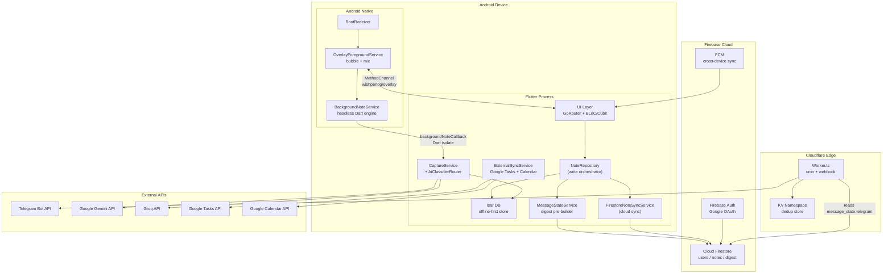

---

### Diagram 2 — Firestore Database ERD

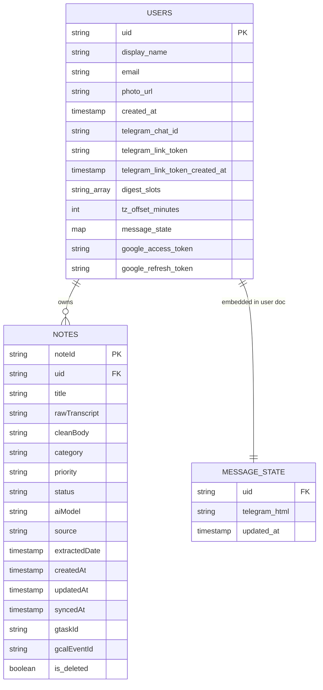

---

### Diagram 3 — User Authentication Flow

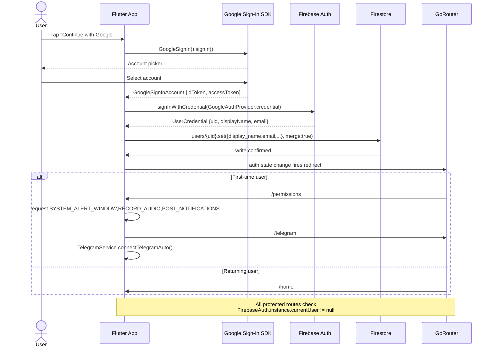

---

### Diagram 4 — Note Creation & Digest Update Sequence

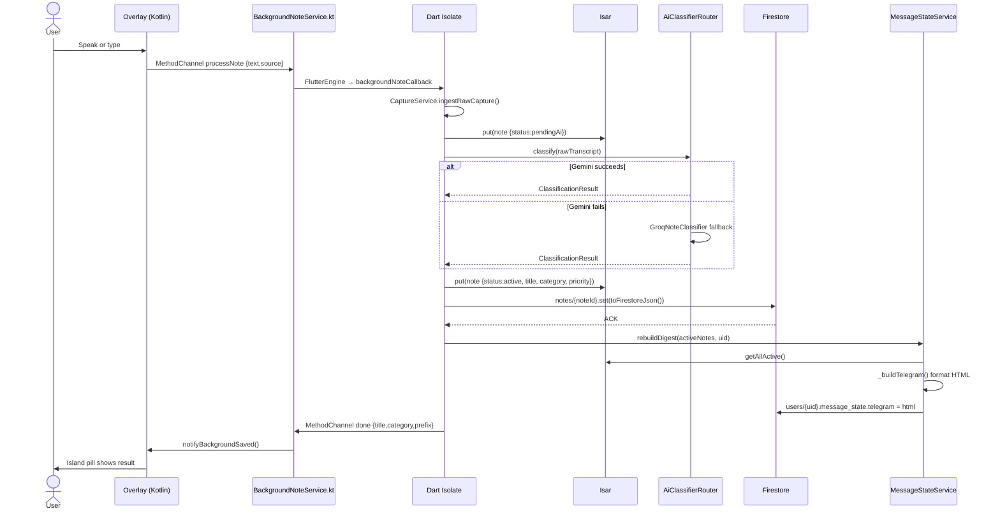

---

### Diagram 5 — Telegram Bot Webhook Request Flow

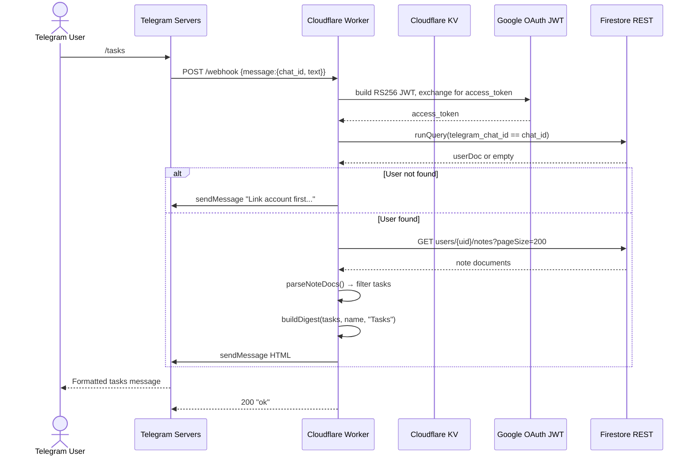

---

### Diagram 6 — App Navigation & Screen State Machine

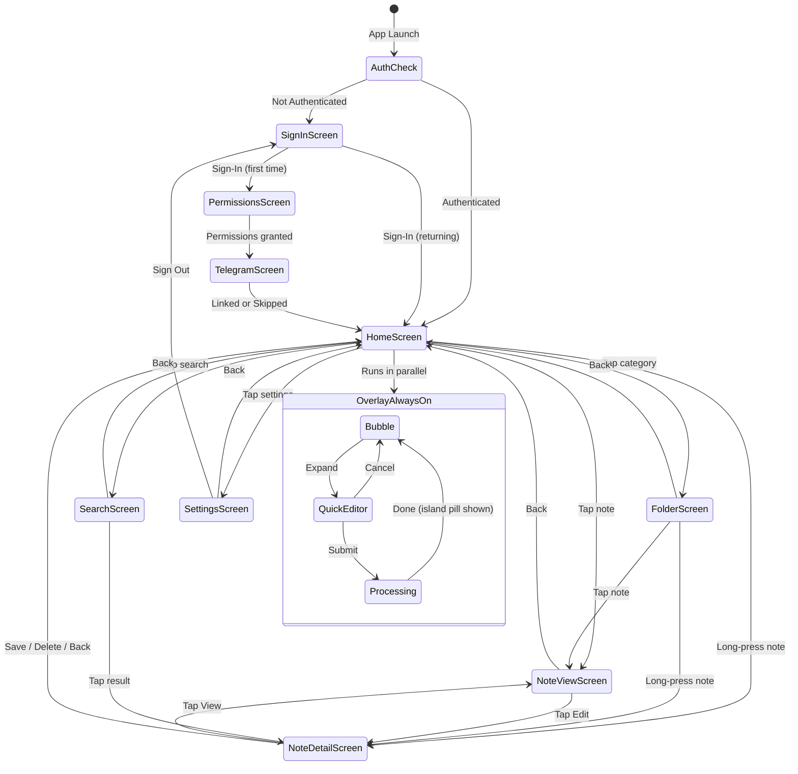

---

### Diagram 7 — Cron-Job Execution Flow

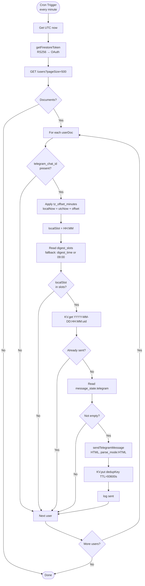

---

### Diagram 8 — AI Classification Pipeline

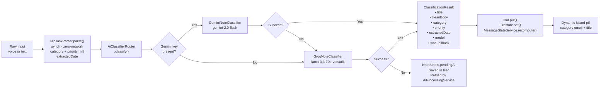

---

### Diagram 9 — Offline-First Sync Architecture

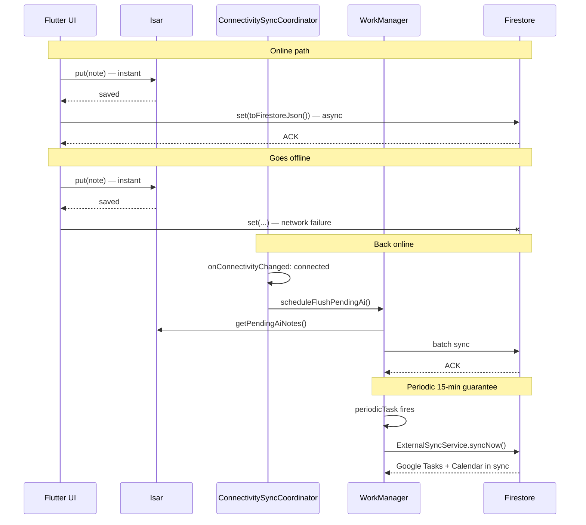

---

### Diagram 10 — Android/Dart MethodChannel Bridge

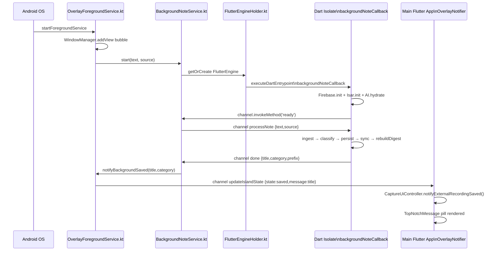

---

### Diagram 11 — Digest Pre-Build and Delivery End-to-End

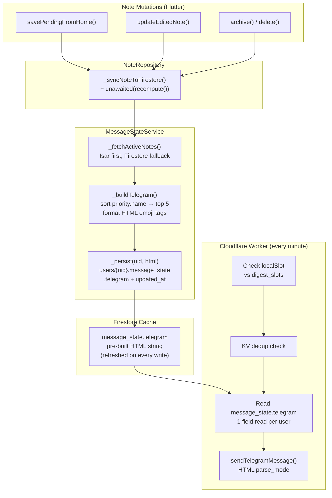

---

## Appendix A — Technology Stack

| Layer | Technology | Notes |
|---|---|---|
| UI Framework | Flutter 3.x / Dart 3 | |
| Local DB | Isar 3.x | Embedded NoSQL with code-gen |
| Cloud DB | Cloud Firestore | Firebase SDK |
| Auth | Firebase Auth + Google Sign-In | Google OAuth only |
| Push | Firebase Cloud Messaging | Cross-device sync |
| AI Primary | Google Gemini 2.0 Flash | `gemini-2.0-flash` |
| AI Fallback | Groq | `llama-3.3-70b-versatile` |
| Edge Compute | Cloudflare Workers (TypeScript) | Cron + webhook |
| KV Store | Cloudflare KV | Digest dedup |
| Messaging | Telegram Bot API v7.x | |
| Google Integration | googleapis Dart package | Tasks + Calendar |
| State Management | flutter_bloc / Cubit | |
| DI | get_it | Service locator pattern |
| Navigation | GoRouter | Declarative |
| Background Tasks | WorkManager | Periodic Google sync |
| Build | Gradle Kotlin DSL 8.x | |

## Appendix B — Critical Environment Variables

| Variable | Where | Purpose |
|---|---|---|
| `GEMINI_API_KEY` | Flutter `.env` | Primary AI classification |
| `GROQ_API_KEY` | Flutter `.env` | Fallback AI classification |
| `TELEGRAM_BOT_USERNAME` | Flutter `.env` | Deep-link generation in TelegramService |
| `GOOGLE_WEB_CLIENT_ID` | Compile-time define or `.env` | Google Sign-In web flow |
| `TELEGRAM_BOT_TOKEN` | Cloudflare Worker secret | Telegram Bot API auth |
| `FIREBASE_PROJECT_ID` | Cloudflare Worker secret | Firestore REST API project |
| `FIREBASE_CLIENT_EMAIL` | Cloudflare Worker secret | Service account identity |
| `FIREBASE_PRIVATE_KEY` | Cloudflare Worker secret | RS256 JWT signing (PEM, `\n` escaped) |

---

*End of documentation.md — WishperLog · Audit April 2026*
