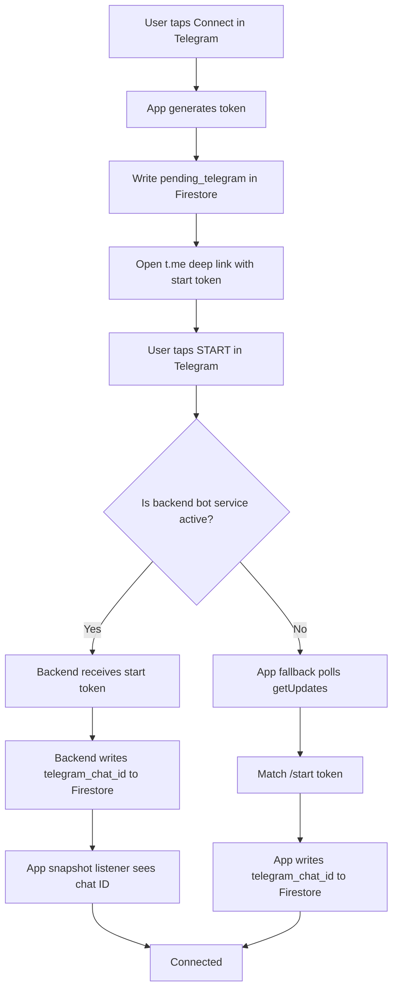
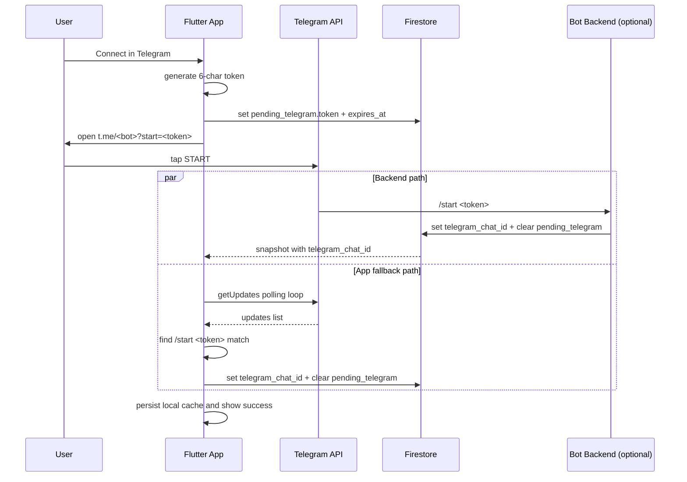
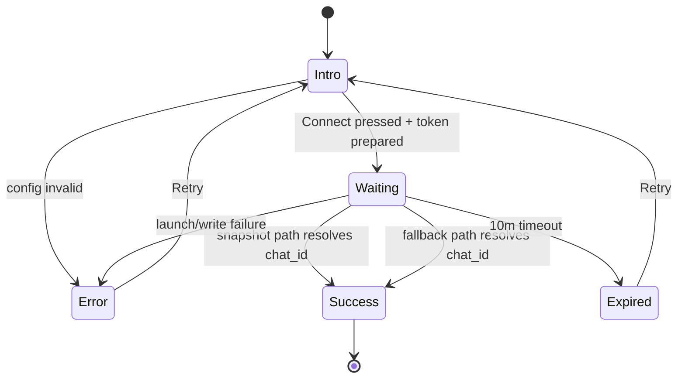
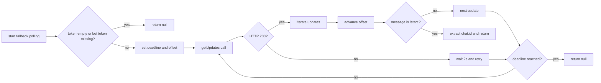
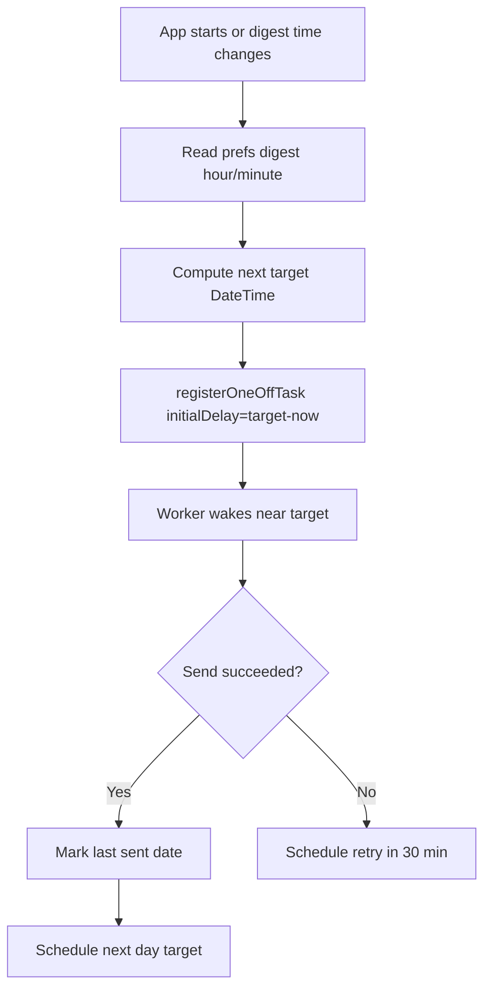
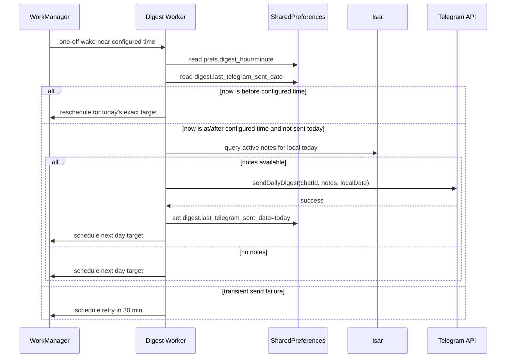
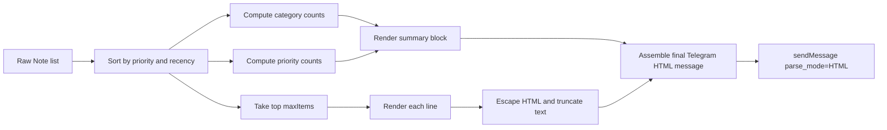
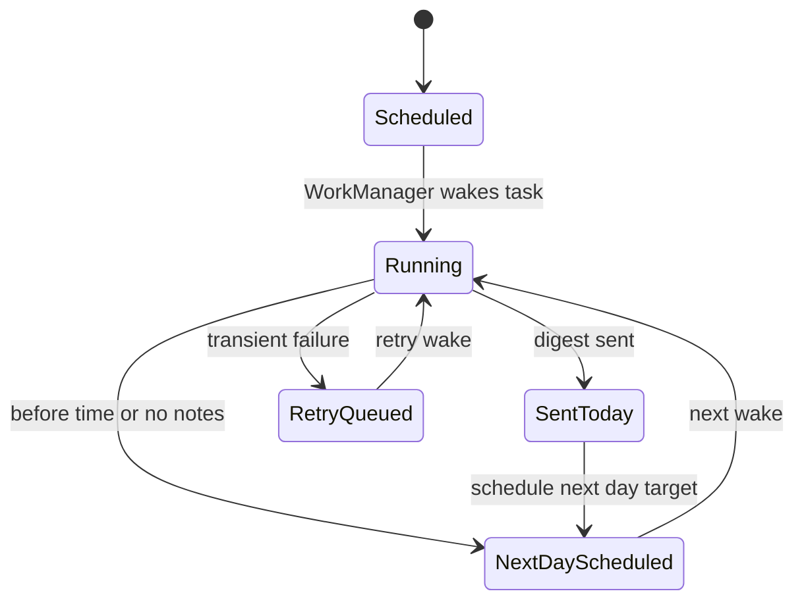

# Telegram Auto-Link Workaround (No Bot Backend)

## Why this document exists

This document explains, in detail, how Telegram auto-linking was made to work when the bot has no backend service (no webhook worker, no polling server, no cloud bot runtime).

Without this workaround, the app could open Telegram and ask the user to tap START, but linking never finished because no server was present to consume `/start <token>` and write `telegram_chat_id` to Firestore.

This guide covers:
- the original architecture and why it stalled
- the fallback design that works with a fresh bot only
- exact app-side flow and state transitions
- operational caveats and future migration advice
- troubleshooting and verification steps

---

## 1. Problem statement

### 1.1 Intended architecture (server-assisted)

The intended architecture was:
1. app writes `pending_telegram.token` to `users/{uid}`
2. app opens `https://t.me/<bot_username>?start=<token>`
3. user taps START in Telegram
4. bot backend receives `/start <token>`
5. backend resolves token -> user and writes `telegram_chat_id`
6. app listens to Firestore snapshot and marks connection success

### 1.2 Why it failed in your real setup

You had only the Telegram bot (created in BotFather), but no background service processing updates.

So step 4 never happened:
- no webhook endpoint
- no bot polling process
- no service updating Firestore

Result: the app waited for Firestore update that never arrived.

---

## 2. Final robust solution (hybrid)

The app now uses a hybrid strategy:
- primary path: Firestore snapshot-based auto-link (for backend-enabled environments)
- fallback path: app-side Telegram `getUpdates` polling, matching `/start <token>` directly

This means the same UI flow works in both setups:
- with backend: backend wins naturally
- without backend: fallback wins and writes chat ID from the app

### 2.1 High-level architecture

---

## 3. End-to-end sequence (both paths)

---

## 4. State machine used by onboarding

---

## 5. Exact implementation changes

## 5.1 Config loading made resilient

File: `lib/core/config/app_env.dart`

What changed:
- Telegram keys now load from `--dart-define` first
- if missing, fallback to `.env`

Why:
- avoids false "not configured" when values exist in `.env` but not in build defines

---

## 5.2 Telegram service now supports two new capabilities

File: `lib/features/sync/data/telegram_service.dart`

Added capability A: resolve bot username at runtime
- method: `resolveBotUsername()`
- behavior:
  - use configured username if available
  - otherwise call Telegram `getMe` using bot token
  - cache resolved username in memory

Added capability B: no-backend fallback auto-link
- method: `resolveChatIdByStartToken(token, timeout)`
- behavior:
  - poll `getUpdates`
  - track update `offset`
  - parse message text
  - match exact `/start <token>`
  - return matching `chat.id`

Important detail:
- token match is strict to avoid linking to unrelated `/start` events

---

## 5.3 Onboarding flow now runs dual resolution paths

File: `lib/features/onboarding/presentation/screens/telegram_screen.dart`

What it does now:
1. resolves bot username via `resolveBotUsername()`
2. writes `pending_telegram` token with 10-minute expiry
3. launches deep link to Telegram
4. starts Firestore snapshot listener (primary path)
5. starts fallback polling task (secondary path)
6. first successful resolver wins (guarded by `_completed` flag)
7. persists local cached chat ID and shows success
8. clears pending token on success/timeout

Why this design is robust:
- works with backend and without backend
- avoids duplicate completion via single-completion guard
- keeps future backend architecture intact

---

## 5.4 Settings screen can start auto-link directly

File: `lib/features/settings/presentation/screens/settings_screen.dart`

What changed:
- added "Connect in Telegram" action from Settings
- validates bot availability using runtime username resolution
- navigates to `/telegram` connect flow
- refreshes Telegram ID on return

Manual chat ID remains only as fallback override.

---

## 5.5 Router adjusted for authenticated access

File: `lib/app/router.dart`

What changed:
- `/telegram` is no longer treated as onboarding-only locked route
- authenticated users can open Telegram connect flow from Settings

---

## 6. Fallback resolver logic in detail

Practical behavior:
- if user taps START quickly, linkage usually completes in a few seconds
- if user waits too long, timeout state appears and retry is required

---

## 7. Security and correctness considerations

### 7.1 Token design
- current token length: 6 chars
- charset: lowercase letters + digits
- one-time intent with short expiry window (10 min)

### 7.2 Strict matching
- fallback only accepts exact `/start <token>`
- ignores plain `/start` with no token
- ignores unrelated messages and older updates by offset progression

### 7.3 Race handling
- two resolvers can run in parallel
- `_completed` flag ensures first winner finalizes once

### 7.4 Single-consumer Telegram warning

Telegram `getUpdates` is effectively single-consumer per bot token stream.
If a backend service also polls updates, it can consume updates before the app fallback sees them (or vice versa).

Recommendation:
- production with backend: disable app fallback polling
- no-backend mode: keep app fallback enabled

---

## 8. Firestore data contract

User doc fields used:
- `telegram_chat_id: string`
- `pending_telegram.token: string`
- `pending_telegram.expires_at: timestamp`

Write helpers in repository:
- `writePendingTelegramToken(token, expiresAt)`
- `clearPendingTelegramToken()`
- `updateTelegramChatId(chatId)`

---

## 9. Validation checklist (what to test)

1. Missing username + valid token
- expected: username resolves via `getMe`, linking still works

2. Missing token
- expected: connect shows not-configured style error

3. No backend service
- expected: fallback polling resolves `/start <token>` and links

4. Backend service present
- expected: snapshot path links quickly; fallback should not double-complete

5. Expired session
- expected: timeout message and retry path

6. Settings entrypoint
- expected: Connect in Telegram launches flow and updates status when returning

---

## 10. Troubleshooting quick guide

### Symptom: "Telegram bot not configured"
Check:
- `TELEGRAM_BOT_TOKEN` exists in `--dart-define` or `.env`
- app has internet access
- bot token is valid

### Symptom: START tapped but no link
Check:
- message contains token payload (`/start <token>`)
- no competing external poller draining updates
- retry and send START again from fresh generated link

### Symptom: Connected once, later mismatched behavior
Check:
- chat ID override not pointing to another chat
- clear override and reconnect via auto-link

---

## 11. Migration note for future backend rollout

When backend webhook/poller is deployed:
1. keep token deep-link protocol unchanged
2. let backend be the source that writes `telegram_chat_id`
3. optionally gate app fallback behind feature flag (off by default in prod)
4. keep Settings "Connect in Telegram" UX unchanged

This preserves user experience while improving reliability and observability in production.

---

## 12. Summary

Auto-link now works in both environments:
- backend-enabled architecture (original plan)
- bot-only setup with no backend service (new fallback)

The workaround is intentionally additive, not destructive: it keeps the long-term architecture while unblocking immediate real-world usage.

---

## 13. Daily Telegram digest at user-specified time

This section explains how digest scheduling was upgraded for near-exact-time delivery and how Telegram message rendering was upgraded to a production-grade template system.

### 13.1 What was fragile before

Earlier behavior depended on periodic work plus a timing window. Because WorkManager periodic execution is inexact, digest could be delayed or skipped in edge timings.

Example failure mode:
- digest configured for 09:00
- periodic runner wakes at 08:42, then 09:21
- window check can miss intended exact schedule

### 13.2 New scheduling model (one-off rescheduler)

The scheduler now uses one-off tasks, not periodic digest tasks:
1. compute next target run time from user digest hour/minute
2. register one one-off task with initialDelay matching target time
3. when worker runs, attempt send and schedule the next run
4. if transient failure happens, schedule retry in 30 minutes

This gives a much tighter alignment with configured time while still self-healing.

### 13.3 Delivery policy

Digest now sends based on this rule:
- if current local time is earlier than configured digest time, do nothing
- if current local time is at or after configured digest time and digest was not sent today, send now
- once sent, mark local date and skip the rest of the day
- schedule next day exact target immediately after successful send

This preserves once-per-day semantics and improves exact-time behavior.

### 13.4 One-off scheduler flow

### 13.5 Worker execution timeline

### 13.6 Telegram digest template engine (godlevel)

File updated: `lib/features/sync/data/telegram_service.dart`

Added high-level API:
- `sendDailyDigest(chatId, notes, localDate, maxItems)`

Added message builder:
- `buildDailyDigestMessage(...)`

Added formatting helpers:
- note sorting by priority and recency
- category and priority summaries
- title/body truncation rules
- HTML escaping for safe Telegram rendering
- compact line renderer with category emoji and priority chip

Template structure:
1. title and human date
2. total notes + category/priority summary lines
3. highlights list (top N items)
4. overflow line for hidden remainder

### 13.7 Template rendering pipeline

### 13.8 Code-level changes applied

File updated: `lib/core/background/work_manager_service.dart`

Implemented changes:
1. replaced periodic digest registration with one-off target scheduling
2. added next-run calculator and delay calculator helpers
3. auto-reschedules next run after each worker execution
4. adds retry scheduling (30 minutes) for transient failures
5. retained once-per-day idempotency via `digest.last_telegram_sent_date`
6. changed digest note selection from "last 24h" to "local calendar day" for accurate daily semantics

This gives predictable user-facing behavior:
- "Send at my configured time with practical Android background constraints".

### 13.9 State model for one local day

### 13.10 Known platform caveat (important)

Android WorkManager does not guarantee hard real-time second precision. One-off scheduling can be close to exact minute but may still drift by OS policy (Doze, battery optimization, OEM constraints).

If strict wall-clock exactness is mandatory, integrate Exact Alarm (AlarmManager setExactAndAllowWhileIdle) for Android and keep WorkManager as fallback.
